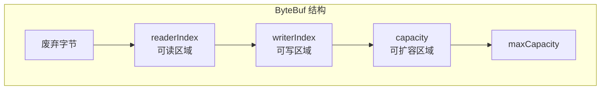

# ByteBuf 缓冲区

ByteBuf 是 Netty 对 JDK ByteBuffer 的替代品，提供了更灵活、更高效的字节缓冲区实现。

## JDK ByteBuffer 的痛点

::: danger JDK ByteBuffer 的问题
1. **长度固定**：分配后不能动态扩容
2. **API 复杂**：读写模式切换需要 `flip()` 操作
3. **功能有限**：不支持池化、引用计数、复合缓冲区
4. **只有一个位置指针**：读写共用 `position`，使用不便
:::

## ByteBuf 的设计优势



**ByteBuf 有独立的读指针和写指针**，读写模式切换不需要 flip()。

| 区域 | 范围 | 含义 |
|------|------|------|
| 废弃字节 | [0, readerIndex) | 已读过的数据 |
| 可读区域 | [readerIndex, writerIndex) | 可以读取的数据 |
| 可写区域 | [writerIndex, capacity) | 可以写入的空间 |
| 可扩容 | [capacity, maxCapacity) | 可扩展的容量 |

## ByteBuf 的三种类型

```java
// 1. 堆内存 ByteBuf
ByteBuf heapBuf = Unpooled.buffer(1024);
// 数据存储在 JVM 堆中，受 GC 管理

// 2. 直接内存 ByteBuf
ByteBuf directBuf = Unpooled.directBuffer(1024);
// 数据存储在堆外内存，零拷贝，适合网络传输

// 3. 复合 ByteBuf
CompositeByteBuf compBuf = Unpooled.compositeBuffer();
compBuf.addComponent(headerBuf);
compBuf.addComponent(bodyBuf);
// 将多个 ByteBuf 逻辑合并，零拷贝
```

### 堆内存 vs 直接内存

| 对比 | Heap ByteBuf | Direct ByteBuf |
|------|-------------|----------------|
| 内存位置 | JVM 堆 | 堆外内存 |
| GC 管理 | ✅ | ❌（需要手动释放） |
| 网络 IO | 需要额外拷贝 | 零拷贝 |
| 业务处理 | 快 | 较慢（需拷贝到堆） |
| 推荐场景 | 后端业务处理 | 网络传输层 |

## ByteBuf 的分配

```java
// 方式1：使用 PooledByteBufAllocator（推荐）
ByteBuf pooledBuf = PooledByteBufAllocator.DEFAULT.buffer(1024);
// 池化分配，复用内存，减少 GC 压力

// 方式2：使用 Unpooled（不推荐用于生产环境）
ByteBuf unpooledBuf = Unpooled.buffer(1024);
// 非池化，每次分配新内存

// 方式3：通过 ChannelHandlerContext（最常用）
// ctx.alloc().buffer(1024);
```

::: tip 推荐实践
生产环境使用 `PooledByteBufAllocator`，配合 `ctx.alloc()` 自动获取分配器。Netty 4.1+ 默认使用池化分配。
:::

## 常用 API

```java
ByteBuf buf = Unpooled.buffer(256);

// === 写操作 ===
buf.writeByte(1);
buf.writeInt(100);
buf.writeBytes("hello".getBytes());
buf.writeCharSequence("你好", CharsetUtil.UTF_8);

// === 读操作 ===
byte b = buf.readByte();
int i = buf.readInt();
System.out.println(buf.toString(CharsetUtil.UTF_8));

// === 查询操作（不移动 readerIndex）===
int index = buf.indexOf(0, buf.writerIndex(), (byte) '\n');

// === 标记与重置 ===
buf.markReaderIndex();
// ... 读取数据 ...
buf.resetReaderIndex();  // 回到标记位置

// === 清理 ===
buf.discardReadBytes();  // 丢弃已读字节

// === 零拷贝 API ===
ByteBuf sliceBuf = buf.slice(index, length);  // 切片
ByteBuf copyBuf = buf.copy();                 // 深拷贝（有性能开销）
buf.retain();  // 引用计数 +1
buf.release(); // 引用计数 -1，为 0 时回收
```

## 引用计数与内存泄漏

ByteBuf 通过**引用计数**管理生命周期：

```java
ByteBuf buf = ctx.alloc().buffer();
buf.retain();   // refCnt = 2
buf.release();  // refCnt = 1
buf.release();  // refCnt = 0 → 回收内存
```

::: warning 注意
- `release()` 要成对调用，否则造成**内存泄漏**
- 通常 Handler 读到的 ByteBuf 用完需要手动 release
- Netty 提供 `ResourceLeakDetector` 帮你检测泄漏
:::

## 零拷贝机制

Netty 的零拷贝体现在多个层面：

| 技术 | 说明 |
|------|------|
| `CompositeByteBuf` | 将多个 ByteBuf 合并为一个，不产生数据拷贝 |
| `slice()` | 切片操作，共享同一块内存 |
| `FileRegion` | 使用 `transferTo()` 实现文件传输零拷贝 |
| Unpooled.wrappedBuffer | 包装现有 byte[] 为 ByteBuf |
