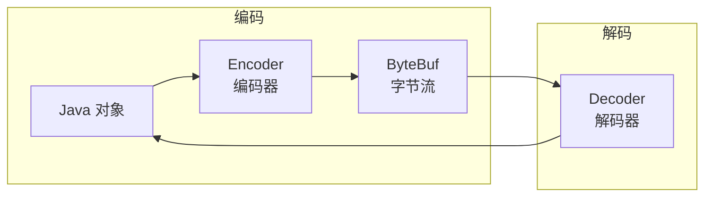

# 编解码器

在 Netty 中，编解码器（Codec）是网络通信的核心组件，负责将 Java 对象与字节流相互转换。

## 编解码器架构



**Codec = Encoder + Decoder**

## 解码器（Decoder）

解码器处理入站数据（Inbound），将字节转换为对象。

### 常用解码器

```java
// 1. ByteToMessageDecoder — 最基础的解码器
public class MyDecoder extends ByteToMessageDecoder {
    @Override
    protected void decode(ChannelHandlerContext ctx, ByteBuf in,
                          List<Object> out) {
        if (in.readableBytes() >= 4) {
            out.add(in.readInt());  // 解码出一个 int
        }
    }
}

// 2. ReplayingDecoder — 简化版本，自动扩展可读字节
public class MyReplayingDecoder extends ReplayingDecoder<Void> {
    @Override
    protected void decode(ChannelHandlerContext ctx, ByteBuf in,
                          List<Object> out) {
        // 无需检查可读字节，框架自动处理
        out.add(in.readInt());
    }
}

// 3. MessageToMessageDecoder — 对象到对象的解码
public class MyMsgDecoder extends MessageToMessageDecoder<ByteBuf> {
    @Override
    protected void decode(ChannelHandlerContext ctx, ByteBuf msg,
                          List<Object> out) {
        String json = msg.toString(CharsetUtil.UTF_8);
        out.add(JSON.parseObject(json, User.class));
    }
}
```

| 解码器 | 输入类型 | 输出类型 | 适用场景 |
|--------|----------|----------|----------|
| `ByteToMessageDecoder` | ByteBuf | Object | 自定义协议解码 |
| `ReplayingDecoder` | ByteBuf | Object | 简化版，不考虑 buffer 长度 |
| `MessageToMessageDecoder` | Object | Object | 对象转换 |

## 编码器（Encoder）

编码器处理出站数据（Outbound），将对象转换为字节。

```java
// 1. MessageToByteEncoder — 最常用的编码器
public class MyEncoder extends MessageToByteEncoder<Integer> {
    @Override
    protected void encode(ChannelHandlerContext ctx, Integer msg,
                          ByteBuf out) {
        out.writeInt(msg);  // 将 int 编码为 4 字节
    }
}

// 2. MessageToMessageEncoder — 对象到对象的编码
public class MyMsgEncoder extends MessageToMessageEncoder<User> {
    @Override
    protected void encode(ChannelHandlerContext ctx, User msg,
                          List<Object> out) {
        String json = JSON.toJSONString(msg);
        out.add(Unpooled.copiedBuffer(json, CharsetUtil.UTF_8));
    }
}
```

## 编解码器链

Pipeline 中的编解码器顺序非常重要：

```java
ch.pipeline()
  // === 入站方向 ===
  .addLast(new LengthFieldBasedFrameDecoder(...))   // 1. 帧解码(拆包)
  .addLast(new MyDecoder())                          // 2. 字节→对象
  .addLast(new MyBusinessHandler())                  // 3. 业务处理

  // === 出站方向 ===
  .addLast(new MyEncoder());                         // 4. 对象→字节
```

::: danger 顺序很重要
入站处理从上到下，出站处理从下到上。编解码器放错位置会导致数据格式不正确。
:::

## 内置编解码器

Netty 内置了大量成熟的编解码器：

| 编解码器 | 协议 | 说明 |
|----------|------|------|
| `HttpServerCodec` | HTTP | HTTP 协议的编解码 |
| `HttpClientCodec` | HTTP | HTTP 客户端编解码 |
| `SslHandler` | SSL/TLS | 支持 SSL 加密 |
| `WebSocketServerProtocolHandler` | WebSocket | WebSocket 握手 |
| `ProtobufDecoder` / `ProtobufEncoder` | Protobuf | Google Protobuf 编解码 |
| `StringDecoder` / `StringEncoder` | String | 字符串编解码 |
| `ObjectDecoder` / `ObjectEncoder` | Java Serialize | Java 序列化（不推荐） |
| `LengthFieldBasedFrameDecoder` | — | 通用帧解码器 |

## Protobuf 实战示例

```java
// 1. 定义 .proto 文件
syntax = "proto3";
message User {
    int32 id = 1;
    string name = 2;
    int32 age = 3;
}

// 2. Netty Pipeline 配置
ch.pipeline()
  .addLast(new ProtobufVarint32FrameDecoder())           // 帧解码
  .addLast(new ProtobufDecoder(UserProto.User.getDefaultInstance()))  // 解码
  .addLast(new ProtobufVarint32LengthFieldPrepender())   // 帧编码
  .addLast(new ProtobufEncoder())                         // 编码
  .addLast(new MyBusinessHandler());
```

::: tip 为什么选择 Protobuf
- 跨语言支持（Java/C++/Python/Go 等）
- 序列化后体积小（比 JSON 小 3-10 倍）
- 解析速度快
- 向后兼容（字段可增删）
:::
