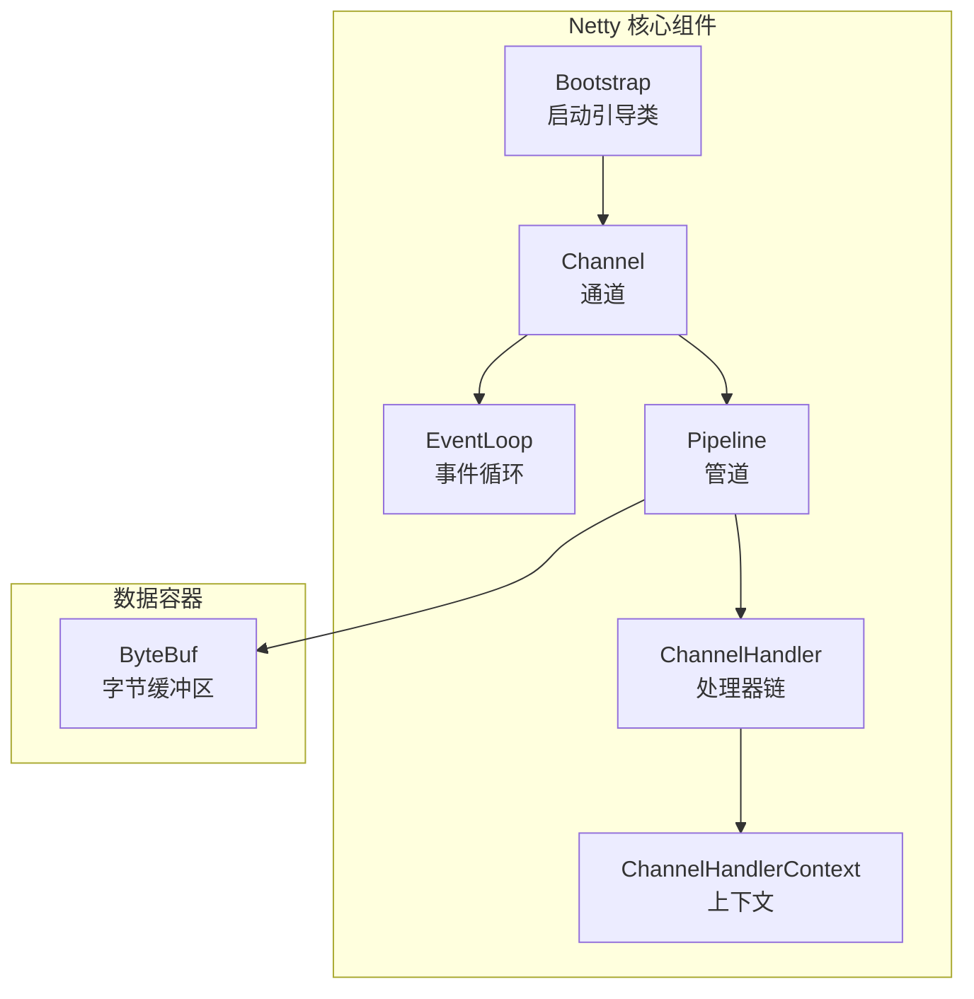
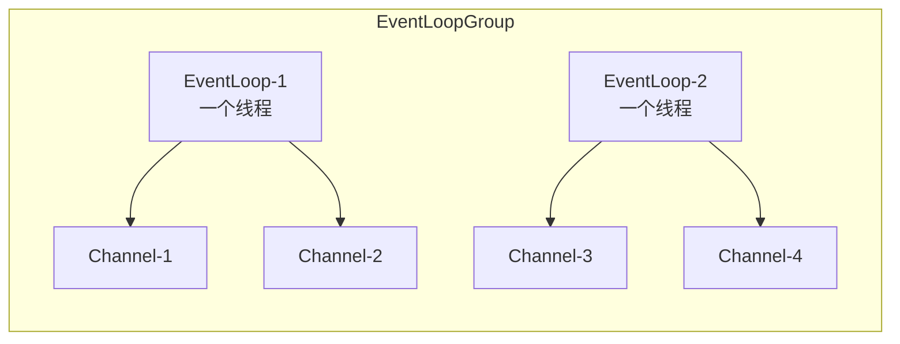
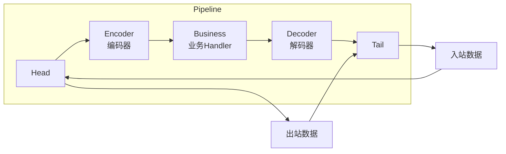

# 核心组件

Netty 的核心组件构成了整个框架的骨架。理解这些组件之间的关系是学好 Netty 的关键。

## 组件全景图



## Channel — 通道

Channel 代表一个网络连接，所有 IO 操作都通过它进行。

```java
// Channel 的基本操作
Channel channel = ...;

channel.writeAndFlush(msg);           // 写数据
channel.close();                       // 关闭连接
channel.isActive();                    // 是否活跃
channel.remoteAddress();               // 获取远程地址
```

### Channel 类型

| 实现类 | 协议 | 用途 |
|--------|------|------|
| `NioSocketChannel` | TCP | 客户端连接 |
| `NioServerSocketChannel` | TCP | 服务端监听 |
| `NioDatagramChannel` | UDP | UDP 通信 |
| `NioSctpChannel` | SCTP | SCTP 通信 |
| `EpollSocketChannel` | TCP | Linux Epoll 优化版 |

## EventLoop — 事件循环

EventLoop 是 Netty 的**事件执行引擎**。



**核心特点**：
- 一个 EventLoop 绑定一个线程，Channel 创建时注册到固定的 EventLoop
- Channel 的所有操作由同一个线程执行，**无需同步**
- EventLoop 负责 Channel 整个生命周期的所有事件

```java
// EventLoop 保证线程安全
// 所有添加到同一个 Channel 的数据处理 Handler 都是单线程执行
ch.pipeline().addLast(new SimpleChannelInboundHandler<String>() {
    @Override
    protected void channelRead0(ChannelHandlerContext ctx, String msg) {
        // 这个方法始终由同一个线程调用，无需担心并发
    }
});
```

## Pipeline — 管道

Pipeline 是一个**双向链表**，由一系列 ChannelHandler 组成。



### 入站与出站

| 方向 | 触发方式 | 典型 Handler |
|------|----------|-------------|
| **入站 (Inbound)** | 从 Socket 读取数据 | Decoder、业务 Handler |
| **出站 (Outbound)** | 往 Socket 写入数据 | Encoder |

## ChannelHandler — 处理器

```java
// 常用的 Handler 类型

// 入站处理器
public class MyInboundHandler extends ChannelInboundHandlerAdapter {
    @Override
    public void channelRead(ChannelHandlerContext ctx, Object msg) {
        // 读取数据
        ctx.fireChannelRead(msg);  // 传递给下一个 Handler
    }
}

// 出站处理器
public class MyOutboundHandler extends ChannelOutboundHandlerAdapter {
    @Override
    public void write(ChannelHandlerContext ctx, Object msg,
                      ChannelPromise promise) {
        // 写入数据
        ctx.write(msg, promise);   // 传递给下一个 Handler
    }
}
```

### 事件传播方向

| 事件类型 | 传播方向 | 方法 |
|----------|----------|------|
| channelRegistered | Inbound | Head → Tail |
| channelActive | Inbound | Head → Tail |
| channelRead | Inbound | Head → Tail |
| channelReadComplete | Inbound | Head → Tail |
| write | Outbound | Tail → Head |
| flush | Outbound | Tail → Head |
| close | Outbound | Tail → Head |

## Bootstrap — 引导类

Bootstrap 是 Netty 的启动器，负责配置和启动客户端/服务端。

```java
// 客户端引导
Bootstrap client = new Bootstrap();
client.group(new NioEventLoopGroup())
      .channel(NioSocketChannel.class)
      .handler(new ChannelInitializer<SocketChannel>() {
          @Override
          protected void initChannel(SocketChannel ch) {
              ch.pipeline().addLast(new MyHandler());
          }
      });
ChannelFuture f = client.connect("localhost", 8080).sync();

// 服务端引导
ServerBootstrap server = new ServerBootstrap();
server.group(bossGroup, workerGroup)    // 相比客户端多了 workerGroup
      .channel(NioServerSocketChannel.class)
      .childHandler(new ChannelInitializer<SocketChannel>() {
          @Override
          protected void initChannel(SocketChannel ch) {
              ch.pipeline().addLast(new MyHandler());
          }
      });
ChannelFuture f = server.bind(8080).sync();
```

### Bootstrap vs ServerBootstrap

| 对比 | Bootstrap | ServerBootstrap |
|------|-----------|-----------------|
| 用途 | 客户端启动 | 服务端启动 |
| EventLoopGroup | 1 个 | 2 个（Boss + Worker） |
| channel() | NioSocketChannel | NioServerSocketChannel |
| handler() | ✅ 添加客户端 Handler | ✅ 添加 Boss 组 Handler |
| childHandler() | ❌ | ✅ 添加 Worker 组 Handler |

## ChannelFuture — 异步结果

Netty 中的所有 IO 操作都是异步的，返回 `ChannelFuture`。

```java
ChannelFuture future = channel.writeAndFlush(msg);

// 方式1：添加监听器
future.addListener((ChannelFutureListener) f -> {
    if (f.isSuccess()) {
        System.out.println("写入成功");
    } else {
        f.cause().printStackTrace();
    }
});

// 方式2：同步等待
future.sync();  // 阻塞直到完成
```
