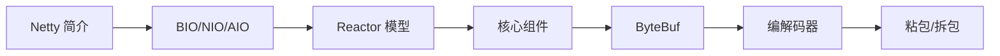

# 基础知识概述

欢迎来到 Netty 基础知识章节。在这一部分，我们将从零开始，系统学习 Netty 框架的核心概念和基础知识。

## 学习路线

## 章节介绍

| 章节 | 内容 | 目标 |
|------|------|------|
| Netty 简介 | Netty 是什么、为什么选择 Netty、应用场景 | 建立宏观认识 |
| BIO/NIO/AIO | 三种 IO 模型对比、Java NIO 基础 | 理解 Netty 的底层基础 |
| Reactor 模型 | 单线程/多线程/主从 Reactor | 理解 Netty 的线程模型 |
| 核心组件 | Channel、Pipeline、EventLoop、Future | 掌握 Netty 核心 API |
| ByteBuf | 缓冲区原理、使用方式、零拷贝 | 理解 Netty 内存模型 |
| 编解码器 | Encoder/Decoder、Protobuf 等 | 掌握数据序列化方式 |
| 粘包/拆包 | 产生原因、解决方案 | 解决 TCP 常见问题 |

## 前置知识

在学习 Netty 之前，建议你具备以下基础：

- Java 编程基础（多线程、集合、泛型）
- 基本的网络编程概念（TCP/IP、Socket）
- Java NIO 基础知识（了解即可，本教程会系统讲解）
