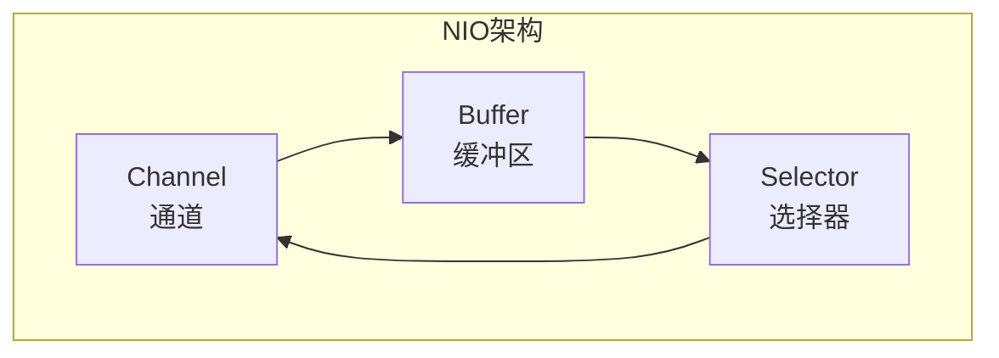

# BIO/NIO/AIO 模型

## IO 模型概述

在 Java 中，主要有三种 IO 模型：

- **BIO（Blocking IO）**：同步阻塞 IO
- **NIO（Non-Blocking IO）**：同步非阻塞 IO
- **AIO（Asynchronous IO）**：异步非阻塞 IO

## BIO 模型

### 工作原理

BIO 是一请求一应答的模型：服务端为每个客户端请求创建一个线程进行处理。

```java
// BIO 服务端示例
public class BioServer {
    public static void main(String[] args) throws Exception {
        ServerSocket serverSocket = new ServerSocket(8080);
        while (true) {
            // 阻塞等待连接
            Socket socket = serverSocket.accept();
            // 每个连接创建新线程
            new Thread(() -> {
                try (InputStream in = socket.getInputStream()) {
                    byte[] buffer = new byte[1024];
                    int len;
                    while ((len = in.read(buffer)) != -1) {
                        System.out.println(new String(buffer, 0, len));
                    }
                } catch (Exception e) {
                    e.printStackTrace();
                }
            }).start();
        }
    }
}
```

### 优缺点

| 优点 | 缺点 |
|------|------|
| 编程简单 | 线程开销大（1:1 线程连接比） |
| 适合连接数少的场景 | 线程上下文切换开销大 |
| | 资源浪费（大量线程阻塞等待） |

## NIO 模型

### 核心组件

NIO 有三大核心组件：



| 组件 | 作用 | 比喻 |
|------|------|------|
| **Channel** | 双向数据传输通道，取代 Stream | 铁路轨道 |
| **Buffer** | 数据缓冲区，所有数据通过 Buffer 读写 | 火车车厢 |
| **Selector** | 多路复用器，一个线程管理多个 Channel | 调度中心 |

### NIO 服务端示例

```java
public class NioServer {
    public static void main(String[] args) throws Exception {
        ServerSocketChannel serverChannel = ServerSocketChannel.open();
        serverChannel.bind(new InetSocketAddress(8080));
        serverChannel.configureBlocking(false);  // 设置非阻塞

        Selector selector = Selector.open();
        serverChannel.register(selector, SelectionKey.OP_ACCEPT);

        while (true) {
            selector.select();  // 阻塞等待就绪事件
            Iterator<SelectionKey> it = selector.selectedKeys().iterator();
            while (it.hasNext()) {
                SelectionKey key = it.next();
                if (key.isAcceptable()) {
                    // 处理新连接
                    SocketChannel client = serverChannel.accept();
                    client.configureBlocking(false);
                    client.register(selector, SelectionKey.OP_READ);
                } else if (key.isReadable()) {
                    // 处理读取事件
                    SocketChannel client = (SocketChannel) key.channel();
                    ByteBuffer buffer = ByteBuffer.allocate(1024);
                    client.read(buffer);
                    buffer.flip();
                    // 处理数据...
                }
                it.remove();
            }
        }
    }
}
```

::: warning NIO 的问题
1. JDK NIO 的 epoll 存在空轮询 bug，Selector 即使没有事件也会被唤醒，造成 CPU 100%
2. API 复杂，Buffer 的 flip/clear 等操作容易出错
3. 需要自行处理很多边界情况
:::

## AIO 模型

AIO 是真正的异步非阻塞 IO。当进行读写操作时，调用 API 的 `read/write` 方法后会立即返回，由操作系统完成后通知应用程序。

```java
// AIO 服务端示例
public class AioServer {
    public static void main(String[] args) throws Exception {
        AsynchronousServerSocketChannel server =
            AsynchronousServerSocketChannel.open().bind(
                new InetSocketAddress(8080));

        server.accept(null, new CompletionHandler<>() {
            @Override
            public void completed(AsynchronousSocketChannel client, Object attachment) {
                server.accept(null, this);  // 继续接收
                ByteBuffer buffer = ByteBuffer.allocate(1024);
                client.read(buffer, buffer, new CompletionHandler<>() {
                    @Override
                    public void completed(Integer result, ByteBuffer buf) {
                        buf.flip();
                        client.write(buf);  // 回显
                    }
                    @Override
                    public void failed(Throwable exc, ByteBuffer buf) {
                        exc.printStackTrace();
                    }
                });
            }
            @Override
            public void failed(Throwable exc, Object attachment) {
                exc.printStackTrace();
            }
        });
        Thread.currentThread().join();  // 防止退出
    }
}
```

## 三种 IO 模型对比

| 对比维度 | BIO | NIO | AIO |
|----------|-----|-----|-----|
| **IO 模式** | 同步阻塞 | 同步非阻塞 | 异步非阻塞 |
| **线程模型** | 1连接:1线程 | 1线程:N连接 | 回调/Proactor |
| **阻塞点** | accept/read/write 全阻塞 | 仅 select() 阻塞 | 无阻塞 |
| **并发能力** | 低 | 高 | 高 |
| **编程难度** | 简单 | 中等 | 中等 |
| **可靠性** | 一般 | 好 | 好 |
| **适用场景** | 少量长连接 | 高并发连接 | 大量IO操作 |

::: tip Netty 的选择
Netty 选择了 **NIO** 模型，并在此基础上封装了 Reactor 线程模型，既保留了 NIO 的高性能特性，又极大简化了编程复杂度。
:::
