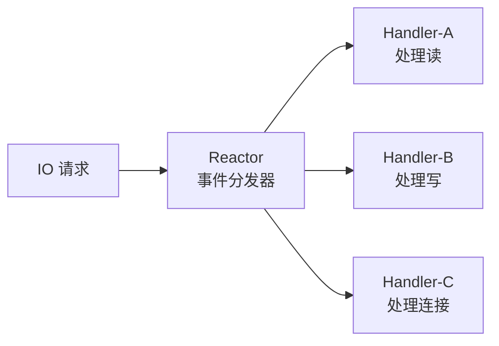
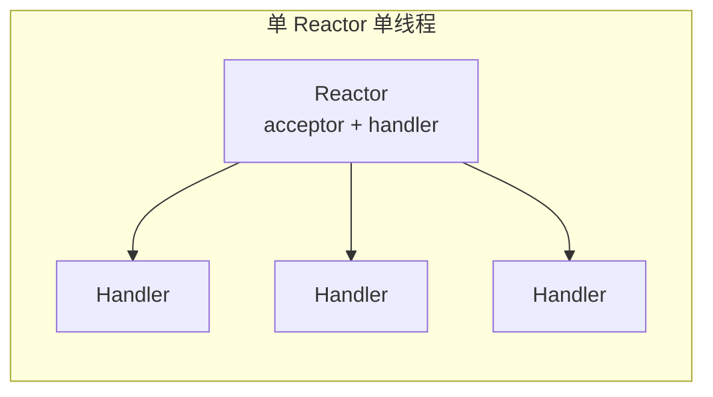
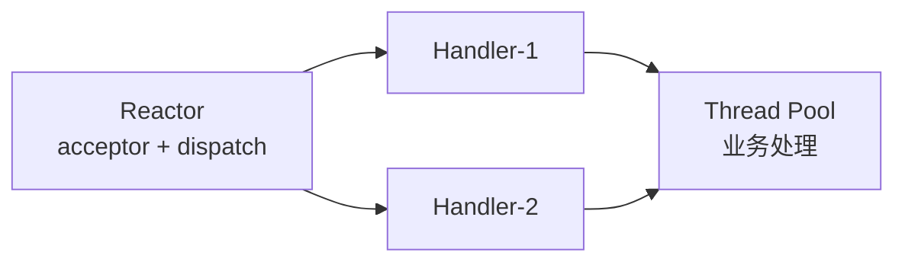
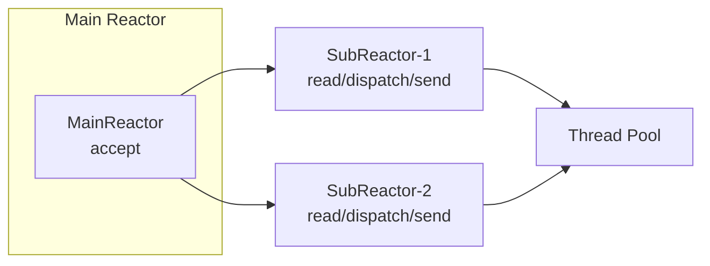
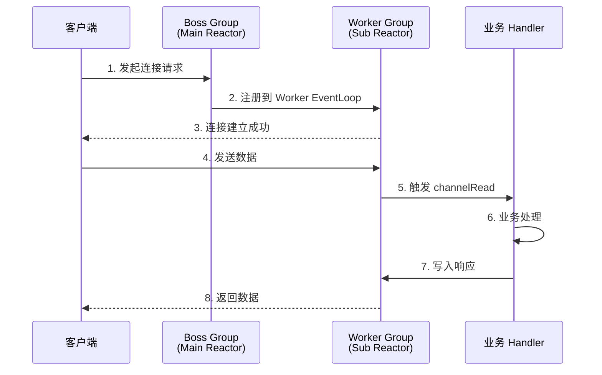

# Reactor 线程模型

## 什么是 Reactor 模型

Reactor 模型是一种**基于事件驱动的并发编程模型**，核心思想是：

- 将 IO 请求分发给一个或多个 **Reactor 线程**
- Reactor 线程负责监听、分发事件给对应的 **Handler** 处理



## 三种 Reactor 模型

### 1. 单 Reactor 单线程



**特点**：一个 NIO 线程完成所有操作（accept、read、decode、process、encode、send）

| 优点 | 缺点 |
|------|------|
| 简单，无多线程开销 | 无法利用多核 CPU |
| | 一个 handler 阻塞会影响全部连接 |

### 2. 单 Reactor 多线程



**特点**：业务处理交给线程池，Reactor 线程只负责分发

::: warning 缺陷
Reactor 线程承担所有事件的监听和响应（accept、read、send），在百万连接场景下可能成为瓶颈。
:::

### 3. 主从 Reactor 多线程



**最佳模型！Netty 采用此模型：**

- **Main Reactor**（Boss Group）：处理客户端连接请求
- **Sub Reactor**（Worker Group）：处理已建立连接的 IO 读写
- **Thread Pool**：处理耗时业务逻辑

## Netty 中的 Reactor 实现

```java
// Netty 主从 Reactor 模型配置
EventLoopGroup bossGroup = new NioEventLoopGroup(1);     // Main Reactor
EventLoopGroup workerGroup = new NioEventLoopGroup();    // Sub Reactor（默认CPU核数×2）

ServerBootstrap bootstrap = new ServerBootstrap();
bootstrap.group(bossGroup, workerGroup)
         .channel(NioServerSocketChannel.class)
         .childHandler(new ChannelInitializer<SocketChannel>() {
             @Override
             protected void initChannel(SocketChannel ch) {
                 ch.pipeline().addLast(new MyHandler());  // Handler
             }
         });

ChannelFuture future = bootstrap.bind(8080).sync();
```



## 配置建议

| 场景 | Boss Group 线程数 | Worker Group 线程数 |
|------|-------------------|---------------------|
| 一般并发 | 1 | CPU 核数 × 2 |
| 高并发短连接 | 1 | CPU 核数 × 2 |
| 长连接 + 低流量 | 1 | CPU 核数 |
| 海量连接 | 2~4 | CPU 核数 × 2 |

::: tip
EventLoopGroup 默认线程数是 `CPU核数 × 2`，通过 `io.netty.eventLoopThreads` 系统属性或构造函数参数可以自定义。
:::
