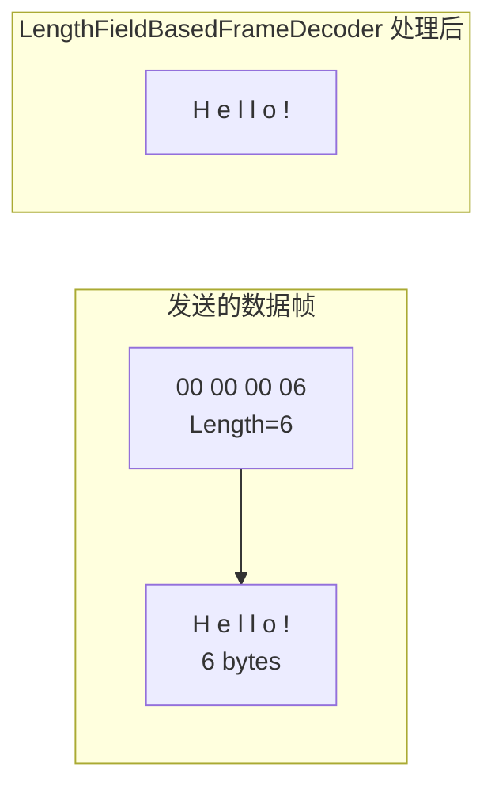

# 粘包与拆包

TCP 是一个面向流的协议，数据像水流一样没有边界。这导致在实际通信中会出现**粘包**和**拆包**问题。

## 什么是粘包与拆包

```mermaid
flowchart LR
    subgraph "发送端"
        A[Packet-1<br/>ABC] --> S[发送]
        B[Packet-2<br/>DEF] --> S
    end

    subgraph "接收端可能出现的情况"
        R1[Case 1:<br/>ABC | DEF — 正常]
        R2[Case 2:<br/>ABCDEF — 粘包]
        R3[Case 3:<br/>AB | CDEF — 拆包+粘包]
        R4[Case 4:<br/>ABCD | EF — 粘包+拆包]
    end

    S --> R1
```

| 现象 | 接收端读取 | 原因 |
|------|-----------|------|
| 正常 | Packet-1 → ABC, Packet-2 → DEF | 理想情况 |
| **粘包** | ABCDEF | 多个包被合并成一个包 |
| **拆包** | Packet-1 被拆成 AB 和 C 两次收到 | 一个包被分成多个接收 |

## 为什么会出现粘包/拆包

1. **发送端缓存**：发送方为了效率，会将多个小包合并后再发送（Nagle 算法）
2. **接收端缓存**：接收方读取速度不够快时，来不及处理的包堆积在 socket 缓冲区
3. **TCP 缓冲区大小限制**：一次发送的数据超过 MTU（最大传输单元 1500 字节）会被分片
4. **MSS 限制**：TCP 的 MSS（最大报文段长度）限制

## Netty 的解决方案

Netty 提供了多种帧解码器来解决粘包/拆包问题：

### 1. 固定长度解码器 (FixedLengthFrameDecoder)

```java
// 所有数据包固定 8 字节
ch.pipeline().addLast(new FixedLengthFrameDecoder(8));
ch.pipeline().addLast(new StringDecoder());
ch.pipeline().addLast(new MyHandler());
```

| 输入 | FixedLengthFrameDecoder 输出 |
|------|------------------------------|
| `ABCDEFGHIJKLMNOP` | `ABCDEFGH` → `IJKLMNOP` |

::: warning 缺点
灵活性差，数据不足固定长度时需要填充。
:::

### 2. 分隔符解码器 (DelimiterBasedFrameDecoder)

```java
// 使用自定义分隔符 (如 $)
ByteBuf delimiter = Unpooled.copiedBuffer("$".getBytes());
ch.pipeline().addLast(
    new DelimiterBasedFrameDecoder(1024, delimiter));
```

| 输入 | 输出 |
|------|------|
| `ABC$DEF$GHI$` | `ABC` → `DEF` → `GHI` |

### 3. 固定长度头部 + 消息体 (LengthFieldBasedFrameDecoder)

**这是最常用的方案**，几乎所有自定义协议都采用此模式。

```
+----------+------------------+
|  Length  |  Body (N bytes)  |     Length = Body 的长度
+----------+------------------+
   4 bytes       N bytes
```

```java
// 配置参数说明
ch.pipeline().addLast(new LengthFieldBasedFrameDecoder(
    1024 * 1024,  // maxFrameLength: 最大帧长度 1MB
    0,            // lengthFieldOffset: Length 字段偏移 0
    4,            // lengthFieldLength: Length 字段占用 4 字节
    0,            // lengthAdjustment: 调整值
    4             // initialBytesToStrip: 丢弃前 4 字节（丢弃 Length 字段）
));
```



#### 参数详解

| 参数 | 含义 | 常用值 |
|------|------|--------|
| maxFrameLength | 最大帧长度，超长则抛出异常 | 1024 * 1024 |
| lengthFieldOffset | Length 字段的偏移量 | 0 |
| lengthFieldLength | Length 字段自身长度 | 2 或 4 |
| lengthAdjustment | 调整值（Length 包含或不包含 header） | 0 |
| initialBytesToStrip | 解码后丢弃的前导字节数 | lengthFieldOffset + lengthFieldLength |

### 4. 行解码器 (LineBasedFrameDecoder)

```java
// 按换行符分割，常用于文本协议（如 Redis 协议）
ch.pipeline().addLast(new LineBasedFrameDecoder(1024));
ch.pipeline().addLast(new StringDecoder());
```

| 输入 | 输出 |
|------|------|
| `Hello\nWorld\n` | `Hello` → `World` |

## 各方案对比

| 方案 | 适用场景 | 优点 | 缺点 |
|------|----------|------|------|
| 固定长度 | 固定长度数据包 | 实现最简单 | 空间浪费 |
| 分隔符 | 文本协议 | 简单直观 | 需要转义 |
| LengthField | **几乎所有场景** | 灵活通用 | 配置稍复杂 |
| 行分隔符 | 命令行/Telnet | 使用方便 | 仅限文本 |

::: tip 推荐
对于大多数自定义二进制协议，**LengthFieldBasedFrameDecoder** 是最佳选择。几乎所有生产级 Netty 应用都使用它。
:::
