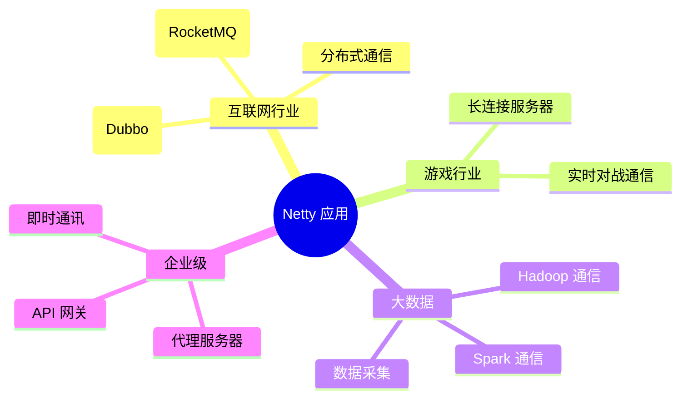

# Netty 简介

## 什么是 Netty

Netty 是由 **JBoss** 提供的一个 **异步的、基于事件驱动的网络应用框架**，用于快速开发高性能、高可靠性的网络 IO 程序。

Netty 本质是一个 **NIO 框架**，它对 JDK 自带的 NIO API 进行了良好的封装，解决了原生 NIO 使用复杂、bug 多、API 不友好等问题。

## 为什么选择 Netty

### 原生 Java NIO 的痛点

::: danger 原生 NIO 的问题
1. **API 复杂**：Buffer、Channel、Selector 等 API 使用门槛高
2. **epoll bug**：JDK NIO 存在著名的 epoll 空轮询 bug，导致 CPU 100%
3. **编程难度大**：需要自行处理断连重连、粘包拆包、编解码等
4. **生态不完善**：缺少成熟的协议支持和扩展机制
:::

### Netty 的优势

| 特性 | 说明 |
|------|------|
| 高性能 | 基于 NIO，支持零拷贝，比传统 BIO 吞吐量高数十倍 |
| 异步非阻塞 | 基于 Reactor 模型，一个线程处理多个连接 |
| 事件驱动 | 链式处理，方便拦截和处理 IO 事件 |
| 可扩展 | Pipeline 责任链模式，灵活添加 Handler |
| 协议丰富 | 内置 HTTP、WebSocket、SSL、Protobuf 等编解码器 |
| 社区活跃 | Netflix、Twitter、阿里巴巴等大厂广泛使用 |

## Netty 的应用场景

## Netty 版本说明

| 版本分支 | 说明 | 推荐 |
|----------|------|------|
| 3.x | 已停止维护 | ❌ |
| 4.x | 主流稳定版本，广泛使用 | ✅ 推荐 |
| 5.x | 已被废弃(2015) | ❌ |

::: tip 当前推荐版本
本教程基于 **Netty 4.1.x** 版本进行讲解，这是目前生产环境中最广泛使用的版本。
:::
