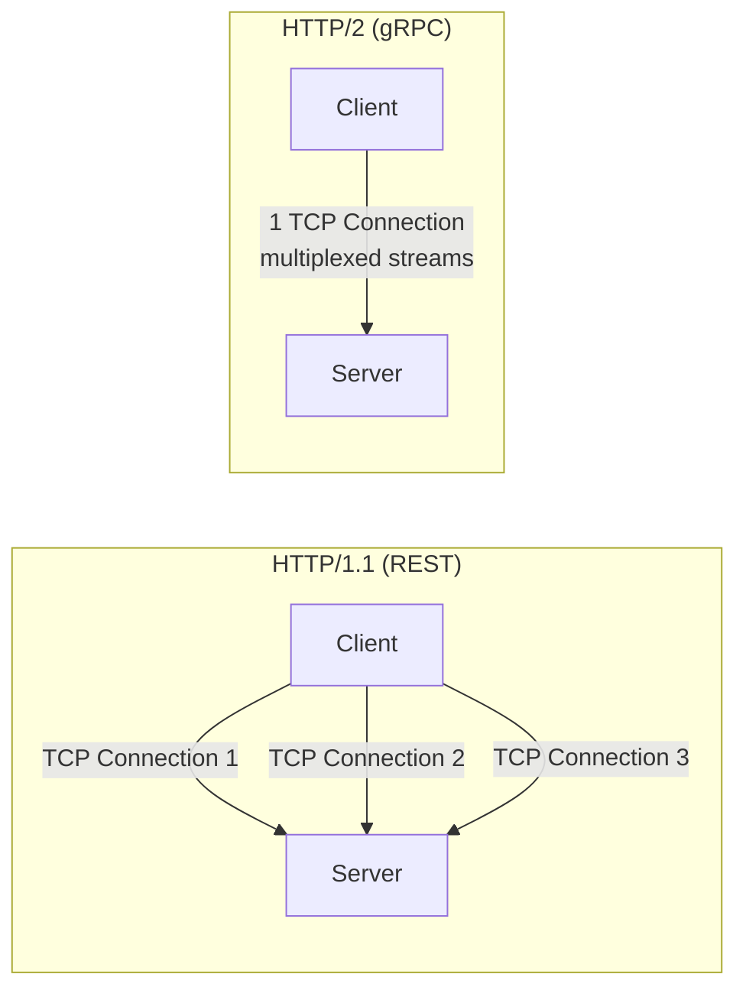
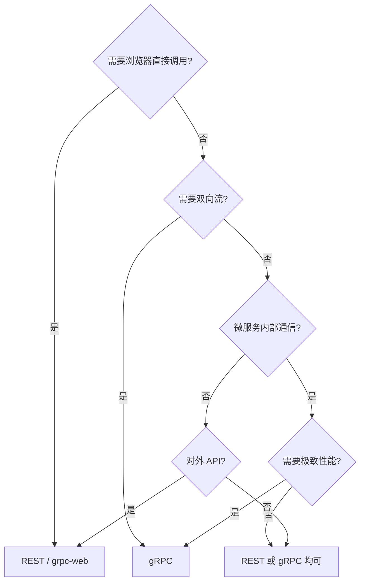

# gRPC vs REST

## 核心差异

| 对比维度 | gRPC | REST |
|----------|------|------|
| **协议** | HTTP/2 | HTTP/1.1 或 HTTP/2 |
| **序列化** | Protobuf (二进制) | JSON (文本) |
| **接口定义** | `.proto` 文件 (强类型) | OpenAPI/Swagger (可选) |
| **代码生成** | 自动生成客户端/服务端 | 手写或第三方生成 |
| **流式** | 原生支持 4 种模式 | WebSocket/SSE 额外支持 |
| **浏览器支持** | 需 grpc-web | 原生支持 |
| **调试** | 需 grpcurl/BloomRPC | curl/Postman 直接调试 |
| **可读性** | 二进制不可读 | JSON 人类可读 |

## 性能对比

```
场景: 1000 条订单数据传输

gRPC (Protobuf):
  Payload:  120 KB
  Time:     85 ms
  CPU:      12%

REST (JSON):
  Payload:  450 KB         ← 3.75x 更大
  Time:     280 ms          ← 3.3x 更慢
  CPU:      38%             ← 3.2x CPU 更多
```

## HTTP/2 vs HTTP/1.1



| 特性 | HTTP/1.1 | HTTP/2 |
|------|----------|--------|
| 连接数 | 每次请求一个连接 (或 keep-alive) | 单连接多路复用 |
| 头部压缩 | 无 | HPACK 压缩 |
| Server Push | 不支持 | 支持 |
| 流优先级 | 无 | 支持 |
| 帧 | 纯文本 | 二进制帧 |

## 选型决策树



## 适用场景总结

### 用 gRPC 的场景

- 微服务间高性能通信
- 需要流式传输（实时推送、文件上传）
- 多语言服务互调
- 强类型接口（proto 即文档）
- 移动端与后端通信（低带宽优势）

### 用 REST 的场景

- 浏览器直接调用的 Web API
- 第三方开放平台（curl/Postman 友好）
- 简单的 CRUD 操作
- 团队不熟悉 Protobuf
- 需要 HTTP 缓存（CDN 缓存）

::: tip
实际项目中，**对外用 REST/GraphQL，内部微服务用 gRPC** 是常见的混合架构。
:::
