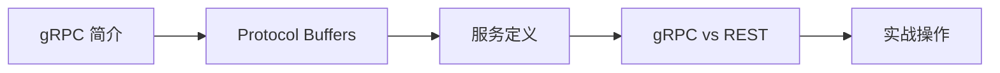

# gRPC 基础知识概述

欢迎来到 gRPC 基础知识章节。在这一部分，我们将系统学习 gRPC 框架的核心概念和通信模型。

## 学习路线

## 章节介绍

| 章节 | 内容 | 目标 |
|------|------|------|
| gRPC 简介 | 什么是 gRPC、核心特性、应用场景 | 建立宏观认识 |
| Protocol Buffers | proto 语法、代码生成、序列化原理 | 掌握 gRPC 的接口定义语言 |
| 服务定义 | Unary/Server Streaming/Client Streaming/Bidi | 理解四种调用模式 |
| gRPC vs REST | 性能对比、选型建议 | 知道什么时候用 gRPC |

## 前置知识

- Java 编程基础
- HTTP/2 基本概念（了解即可，后续会讲）
- Maven/Gradle 构建工具基础
