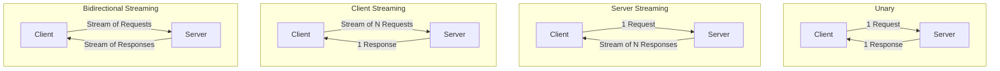

# gRPC 服务定义

## 四种调用模式



## Proto 定义

```protobuf
service DataService {
    // 1. Unary — 简单请求/响应
    rpc GetUser (GetUserRequest) returns (GetUserResponse);

    // 2. Server Streaming — 客户端发一次，服务端持续推送
    rpc SubscribeUpdates (SubscribeRequest) returns (stream Update);

    // 3. Client Streaming — 客户端持续发送，服务端汇总响应
    rpc UploadFile (stream FileChunk) returns (UploadResult);

    // 4. Bidirectional Streaming — 双向独立读写
    rpc Chat (stream ChatMessage) returns (stream ChatMessage);
}
```

## 生成的 Java Stub

编译 `.proto` 后，`protoc-gen-grpc-java` 为每个 Service 生成三种 Stub：

```java
// GreeterGrpc.java (自动生成)

// 1. 阻塞 Stub — 同步调用
public static final class GreeterBlockingStub { ... }

// 2. 异步 Stub — 基于 StreamObserver 回调
public static final class GreeterStub { ... }

// 3. Future Stub — 基于 ListenableFuture (Guava)
public static final class GreeterFutureStub { ... }
```

## Stub 对比与使用

| Stub | 调用方式 | 适用场景 | 流式支持 |
|------|----------|----------|----------|
| `BlockingStub` | 同步阻塞 | 简单 RPC、测试 | 仅 Unary |
| `Stub (Async)` | StreamObserver 回调 | 生产环境推荐 | 全部 |
| `FutureStub` | ListenableFuture | 组合异步操作 | 仅 Unary |

```java
// 创建 Stub
ManagedChannel channel = ManagedChannelBuilder
    .forAddress("localhost", 8080)
    .usePlaintext()
    .build();

// 阻塞 Stub
GreeterGrpc.GreeterBlockingStub blockingStub = GreeterGrpc.newBlockingStub(channel);
HelloResponse response = blockingStub.sayHello(request);

// 异步 Stub
GreeterGrpc.GreeterStub asyncStub = GreeterGrpc.newStub(channel);
asyncStub.sayHello(request, new StreamObserver<HelloResponse>() {
    @Override public void onNext(HelloResponse value) { /* 处理响应 */ }
    @Override public void onError(Throwable t) { /* 错误处理 */ }
    @Override public void onCompleted() { /* 完成 */ }
});

// Future Stub
GreeterGrpc.GreeterFutureStub futureStub = GreeterGrpc.newFutureStub(channel);
ListenableFuture<HelloResponse> future = futureStub.sayHello(request);
Futures.addCallback(future, new FutureCallback<>() {
    @Override public void onSuccess(HelloResponse result) { /* 成功 */ }
    @Override public void onFailure(Throwable t) { /* 失败 */ }
}, executor);
```

## 服务端实现基类

```java
// proto 定义的 Service 生成一个抽象基类
public abstract class GreeterGrpc.GreeterImplBase {
    // 默认实现返回 UNIMPLEMENTED，需要覆盖
    public void sayHello(HelloRequest request, 
                         StreamObserver<HelloResponse> responseObserver) {
        // 默认实现: 返回 UNIMPLEMENTED 状态
    }
}
```

## 统一的服务端回调模型

无论哪种调用模式，服务端都使用 `StreamObserver` 回写响应：

```java
// service Greeter {
//     rpc SayHello (HelloRequest) returns (HelloResponse);
// }

// 服务端实现
@Override
public void sayHello(HelloRequest request, 
                     StreamObserver<HelloResponse> responseObserver) {
    // 1. 构建响应
    HelloResponse response = HelloResponse.newBuilder()
        .setMessage("Hello " + request.getName())
        .build();
    
    // 2. 发送响应
    responseObserver.onNext(response);
    
    // 3. 结束 RPC
    responseObserver.onCompleted();
}
```

| StreamObserver 方法 | 含义 |
|--------------------|------|
| `onNext(T value)` | 发送一个响应消息 |
| `onError(Throwable t)` | 异常终止 RPC |
| `onCompleted()` | 正常结束 RPC |

::: tip
`onCompleted()` 和 `onError()` 是**互斥**的，调用后不能再调用 `onNext()`。
:::
