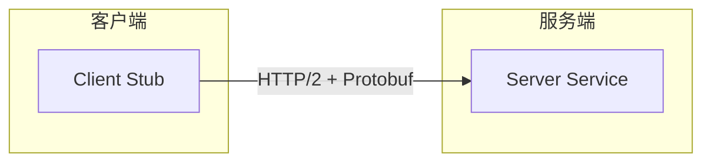
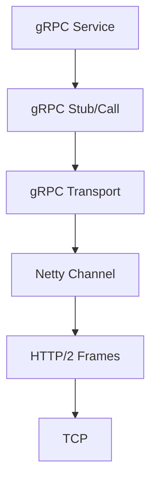
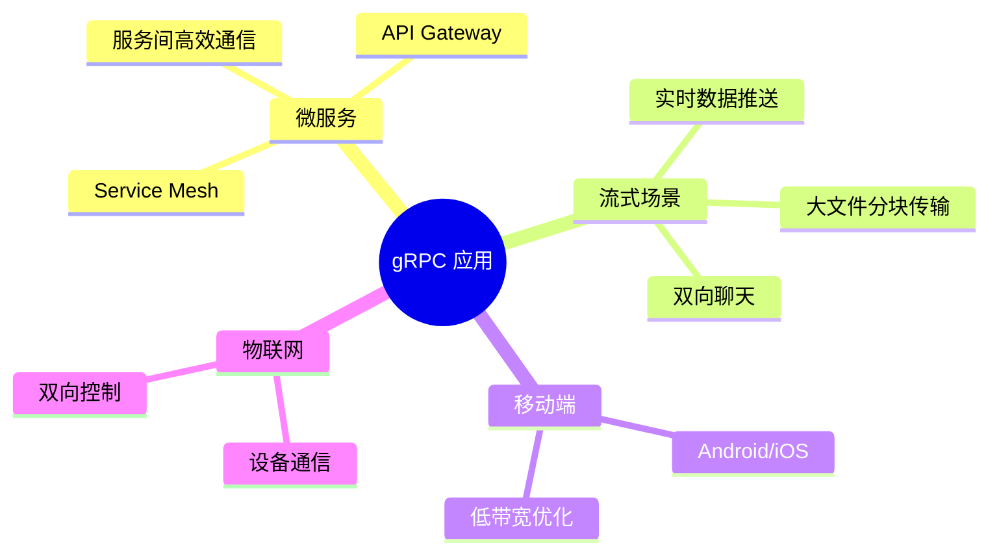
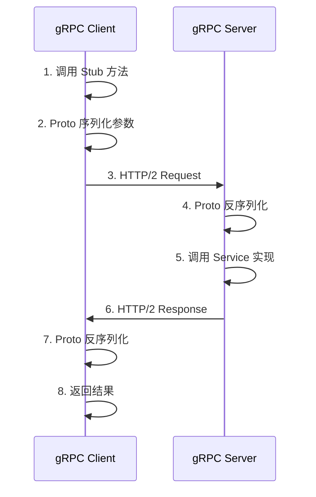

# gRPC 简介

## 什么是 gRPC

gRPC 是由 **Google** 开源的**高性能、开源的通用 RPC 框架**。

- **g** → gRPC (每年 Google 发布一个新字母)
- **RPC** → Remote Procedure Call (远程过程调用)

> 让调用远程服务像调用本地方法一样简单。

## 核心特性

| 特性 | 说明 |
|------|------|
| **多语言** | Java、Go、C++、Python、Node.js 等 12+ 语言 |
| **IDL** | 使用 Protocol Buffers 定义接口，强类型 |
| **HTTP/2** | 支持多路复用、双向流、头部压缩 |
| **四种模式** | Unary、Server Streaming、Client Streaming、Bidi |
| **插件生态** | 拦截器、负载均衡、健康检查、认证 |
| **流式** | 原生支持 streaming，比 REST + WebSocket 更简单 |
| **代码生成** | 从 .proto 自动生成客户端/服务端代码 |

## gRPC 与 Netty 的关系

gRPC-Java 底层使用 **Netty** 作为默认传输层：

## gRPC 的四种调用模式

| 模式 | HTTP/2 流 | 典型场景 |
|------|----------|----------|
| **Unary** | 单请求 → 单响应 | CRUD 操作 |
| **Server Streaming** | 单请求 → 流式响应 | 日志订阅、数据推送 |
| **Client Streaming** | 流式请求 → 单响应 | 文件上传、批量操作 |
| **Bidirectional Streaming** | 双向流 | 聊天、实时协作 |

## 应用场景

## 基本通信流程

::: tip
gRPC 让你只需写一次 `.proto` 文件，自动生成 12+ 种语言的客户端和服务端代码。
:::
