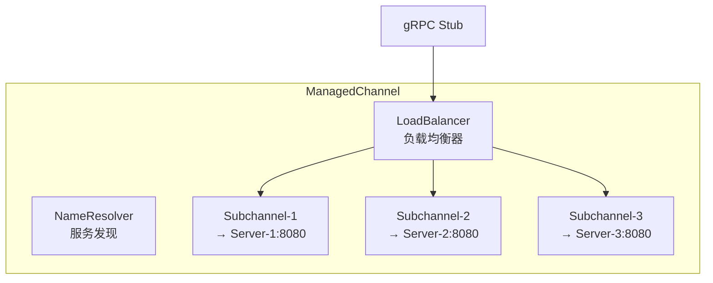
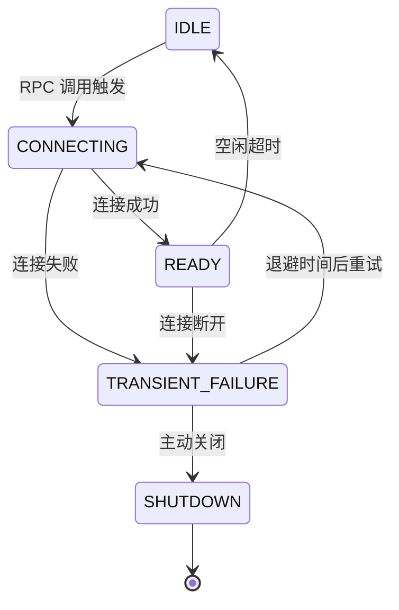

# Channel 连接管理

## ManagedChannel

`ManagedChannel` 是 gRPC 客户端的核心抽象，封装了一个到 gRPC 服务端的**连接池**。



### 创建 Channel

```java
// 1. 直连模式
ManagedChannel channel = ManagedChannelBuilder
    .forAddress("localhost", 8080)
    .usePlaintext()           // 明文传输（生产用 TLS）
    .build();

// 2. 目标地址模式
ManagedChannel channel = ManagedChannelBuilder
    .forTarget("dns:///my-service:8080")  // DNS 解析
    .usePlaintext()
    .build();

// 3. 生产配置
ManagedChannel channel = ManagedChannelBuilder
    .forTarget("dns:///my-grpc-service")
    .defaultLoadBalancingPolicy("round_robin")
    .enableRetry()
    .maxRetryAttempts(3)
    .keepAliveTime(30, TimeUnit.SECONDS)
    .keepAliveTimeout(10, TimeUnit.SECONDS)
    .keepAliveWithoutCalls(true)
    .maxInboundMessageSize(10 * 1024 * 1024)   // 10MB
    .maxInboundMetadataSize(8192)               // 8KB header
    .build();
```

### Channel 关键配置

| 配置 | 默认 | 说明 |
|------|------|------|
| `keepAliveTime` | 无限 | 空闲时发送 PING 间隔 |
| `keepAliveTimeout` | 20s | PING 超时时间 |
| `keepAliveWithoutCalls` | false | 无活跃 RPC 时也发 PING |
| `maxInboundMessageSize` | 4MB | 最大接收消息大小 |
| `maxRetryAttempts` | 5 | 最大重试次数 |
| `defaultLoadBalancingPolicy` | pick_first | 负载均衡策略 |

## NameResolver (服务发现)

NameResolver 将逻辑地址解析为实际的 IP 列表：

```java
// gRPC 内置的 NameResolver
// dns:/// → DNS 解析
// static:/// → 静态 IP 列表
// kubernetes:/// → K8s Service 发现 (需额外依赖)

// 自定义 NameResolver
@Grpc.GlobalInterceptor
public class MyNameResolver extends NameResolver {
    @Override
    public void start(Listener2 listener) {
        // 从注册中心获取服务实例列表
        List<Instance> instances = registry.discover("my-service");
        List<EquivalentAddressGroup> addresses = instances.stream()
            .map(i -> new EquivalentAddressGroup(
                new InetSocketAddress(i.getHost(), i.getPort())))
            .collect(Collectors.toList());
        
        listener.onResult(ResolutionResult.newBuilder()
            .setAddresses(addresses)
            .build());
    }
}
```

## Subchannel 与连接池

```
ManagedChannel
├── Subchannel → [192.168.1.1:8080]  ← 1 个 TCP 连接
├── Subchannel → [192.168.1.2:8080]
└── Subchannel → [192.168.1.3:8080]
```

- 每个 Subchannel 对应一个底层 TCP 连接
- gRPC 自动管理连接的健康和重建
- 同一 Subchannel 上可以复用多个 RPC Stream

## Channel 状态



```java
// 监听 Channel 状态
channel.notifyWhenStateChanged(ConnectivityState.IDLE, () -> {
    ConnectivityState state = channel.getState(false);
    System.out.println("连接状态变为: " + state);
});
```

## Channel 复用

::: tip 最佳实践
**不要为每个 RPC 创建新的 Channel**。Channel 是重量级对象（关联多个 TCP 连接），应该复用。同一个 Channel 可以承载任意数量的并发 RPC 调用。
:::

```java
// ✅ 正确: 全局单例
@Bean(destroyMethod = "shutdown")
public ManagedChannel grpcChannel() {
    return ManagedChannelBuilder
        .forTarget("dns:///order-service")
        .usePlaintext()
        .build();
}

// ❌ 错误: 每次创建
public Order getOrder(int id) {
    ManagedChannel channel = ManagedChannelBuilder
        .forAddress("localhost", 8080).usePlaintext().build();  // 用完不关闭，泄漏
    // ...
}
```

## 服务端

```java
Server server = ServerBuilder
    .forPort(8080)
    .addService(new GreeterImpl())     // 注册服务实现
    .maxInboundMessageSize(10 << 20)   // 10MB
    .maxConnectionAge(30, TimeUnit.MINUTES)        // 连接最大存活时间
    .maxConnectionAgeGrace(5, TimeUnit.MINUTES)    // 优雅关闭等待
    .keepAliveTime(60, TimeUnit.SECONDS)           // 给客户端发 PING
    .keepAliveTimeout(20, TimeUnit.SECONDS)        // PING 超时
    .permitKeepAliveTime(10, TimeUnit.SECONDS)     // 允许客户端发 PING 的最小间隔
    .build()
    .start();
```
