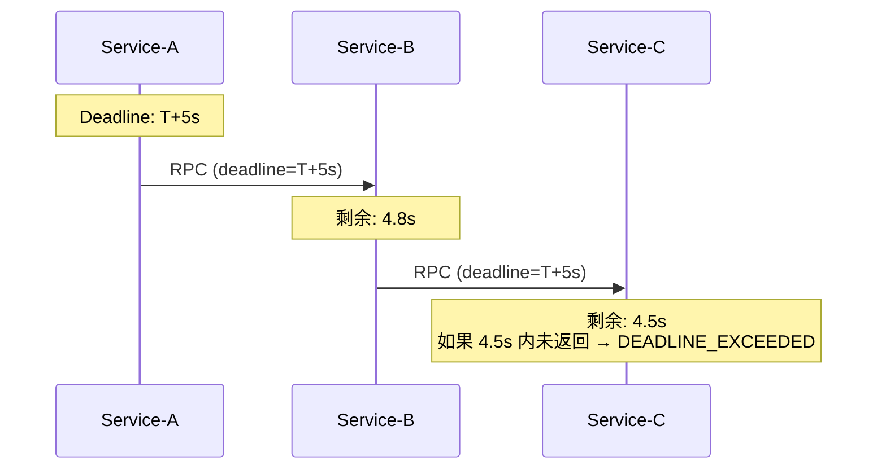

# Deadline 与重试

## Deadline (截止时间)

Deadline 是 gRPC 最重要的可靠性机制之一——**每个 RPC 都应该设置 Deadline**。

```java
// 设置 Deadline: 5 秒超时
GreeterGrpc.GreeterBlockingStub stub = GreeterGrpc.newBlockingStub(channel)
    .withDeadline(Deadline.after(5, TimeUnit.SECONDS));

HelloResponse response = stub.sayHello(request);

// 超时异常
catch (StatusRuntimeException e) {
    if (e.getStatus().getCode() == Status.Code.DEADLINE_EXCEEDED) {
        // 5 秒内服务端未返回 → 超时
        log.error("调用超时", e);
    }
}
```

## Deadline 传播



- Deadline 会自动在 RPC 链中传播
- 下游服务收到原始 Deadline（不是剩余时间）
- 下游服务自己判断是否还有足够时间处理

## Deadline 的两种形式

```java
// 1. 相对时间
stub.withDeadline(Deadline.after(5, TimeUnit.SECONDS));

// 2. 绝对时间
stub.withDeadline(Deadline.after(System.currentTimeMillis() + 5000,
    TimeUnit.MILLISECONDS));

// 3. 从上游 RPC 继承
// 服务端收到请求后，可以获取客户端设置的 deadline
@Override
public void sayHello(HelloRequest request,
                     StreamObserver<HelloResponse> responseObserver) {
    Deadline deadline = Context.current().getDeadline();
    if (deadline != null && deadline.timeRemaining(TimeUnit.MILLISECONDS) < 100) {
        responseObserver.onError(
            Status.DEADLINE_EXCEEDED
                .withDescription("来不及处理了")
                .asRuntimeException());
        return;
    }
    // 正常处理...
}
```

## 重试策略

### 自动重试

```java
Map<String, Object> retryPolicy = new HashMap<>();
retryPolicy.put("maxAttempts", 3D);          // 最多 3 次
retryPolicy.put("initialBackoff", "1s");      // 初始退避
retryPolicy.put("maxBackoff", "30s");         // 最大退避
retryPolicy.put("backoffMultiplier", 2D);     // 退避倍数
retryPolicy.put("retryableStatusCodes",       // 可重试的状态码
    Arrays.asList("UNAVAILABLE", "RESOURCE_EXHAUSTED"));

Map<String, Object> methodConfig = new HashMap<>();
methodConfig.put("retryPolicy", retryPolicy);

// 通过 Service Config 启用
ManagedChannel channel = ManagedChannelBuilder
    .forTarget("dns:///my-service")
    .defaultServiceConfig(methodConfig)
    .enableRetry()
    .build();
```

### 重试 vs Hedging

| 策略 | 原理 | 延迟 | 适用场景 |
|------|------|------|----------|
| **Retry** | 失败后重试 | 会增加延迟 | 硬错误 (UNAVAILABLE) |
| **Hedging** | 同时发多个请求，取第一个成功 | 延迟小 | 延迟敏感 + 有冗余资源 |

```java
// Hedging 策略: 同时发 3 个请求，最快响应者胜
Map<String, Object> hedgingPolicy = new HashMap<>();
hedgingPolicy.put("maxAttempts", 3D);
hedgingPolicy.put("hedgingDelay", "500ms");  // 500ms 后启动第二个请求
```

## 幂等性约束

::: danger 重试的前提：幂等
非幂等的操作不能重试！RPC 失败时客户端不知道服务端到底执行了没有。

```
客户端发送 "扣款100元" → 网络超时 → 重试 "扣款100元" → 扣了200元!
```
:::

```java
// 标记方法为幂等（允许重试）
// 在 .proto 中:
service PaymentService {
    rpc GetBalance (GetBalanceRequest) returns (Balance) {
        option idempotency_level = NO_SIDE_EFFECTS;  // 无副作用，尽管重试
    }
    
    rpc CreatePayment (CreatePaymentRequest) returns (Payment) {
        option idempotency_level = IDEMPOTENT;         // 幂等，可重试
    }
    
    rpc DeductBalance (DeductRequest) returns (DeductResponse) {
        option idempotency_level = IDEMPOTENCY_UNKNOWN; // 不可重试!
    }
}
```

## 最佳实践

| 实践 | 说明 |
|------|------|
| **每个 RPC 设 Deadline** | 防止雪崩效应 |
| **Deadline 不宜过长** | 5s 是一个合理的起点 |
| **非幂等操作用幂等 key** | 如订单号、去重 ID |
| **重试必须有指数退避** | 避免惊群效应 |
| **监控重试比例** | 高重试率说明服务有问题 |
| **从 Context 获取 Deadline** | 判断是否还有剩余时间 |

## 完整的健壮调用

```java
public HelloResponse callWithResilience(HelloRequest request) {
    GreeterGrpc.GreeterBlockingStub stub = GreeterGrpc
        .newBlockingStub(channel)
        .withDeadline(Deadline.after(3, TimeUnit.SECONDS));  // 先设超时

    try {
        return stub.sayHello(request);
    } catch (StatusRuntimeException e) {
        switch (e.getStatus().getCode()) {
            case DEADLINE_EXCEEDED:
                // 超时 → 记录日志、告警
                log.warn("gRPC 调用超时: {}", request);
                return fallbackResponse(request);
            case UNAVAILABLE:
                // 服务不可用 → 重试或降级
                log.error("gRPC 服务不可用");
                return retryWithBackoff(request);
            default:
                throw e;
        }
    }
}
```

::: tip
gRPC 的 `DEADLINE_EXCEEDED` 在被取消后会传播整条链路，比 HTTP 的超时机制更可靠。
:::
