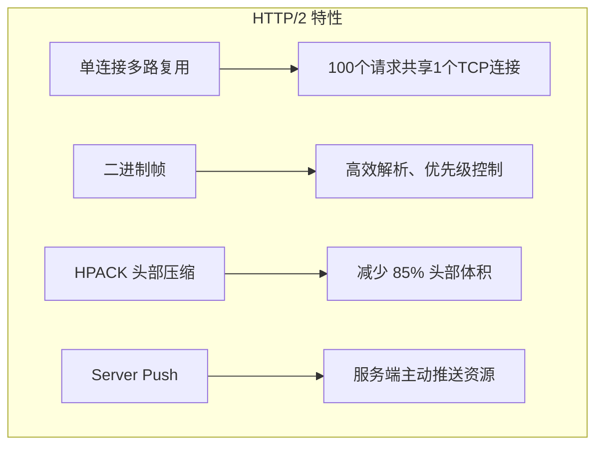
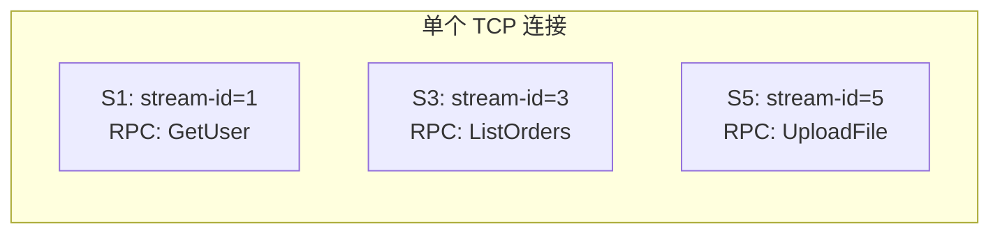

# HTTP/2 基础

gRPC 构建在 HTTP/2 之上，理解 HTTP/2 是理解 gRPC 高性能的关键。

## HTTP/2 核心特性



## 帧 (Frame) 结构

HTTP/2 最小的通信单元是**帧**：

```
+------------------------------------+
|  Length (24)  |  Type (8)  | Flags |
+------------------------------------+
|          Stream ID (31)            |
+------------------------------------+
|          Frame Payload             |
+------------------------------------+
```

| 帧类型 | 作用 | gRPC 中使用 |
|--------|------|------------|
| **HEADERS** | 打开流 + 发送头部 | 每次 RPC 调用 |
| **DATA** | 传输请求/响应体 | Protobuf 二进制数据 |
| **SETTINGS** | 连接参数协商 | 初始握手 |
| **PING** | 心跳检测 | Keepalive |
| **GOAWAY** | 优雅关闭连接 | 关闭连接 |
| **RST_STREAM** | 立即终止流 | 取消 RPC / 错误 |

## Stream (流)



- 每个 gRPC 调用对应一个 HTTP/2 Stream
- 同一个 TCP 连接上可以并发多个 Stream
- Stream ID 由发起方分配（客户端奇数，服务端偶数）

## gRPC 在 HTTP/2 上的映射

```
gRPC Unary RPC:
  Client → Server: HEADERS (path=/Service/Method) + DATA (request)
  Server → Client: HEADERS (:status=200) + DATA (response) + HEADERS (END_STREAM)

gRPC Server Streaming:
  Client → Server: HEADERS + DATA
  Server → Client: HEADERS + DATA + DATA + DATA + HEADERS (END_STREAM)

gRPC Bidirectional Streaming:
  Client → Server: HEADERS + DATA + DATA + ... + DATA (END_STREAM)
  Server → Client: HEADERS + DATA + DATA + ... + HEADERS (END_STREAM)
```

## HPACK 头部压缩

HTTP/1.1 每次请求都发送完整头部（可能 500-800 字节）。HPACK 使用**静态表 + 动态表**压缩：

```
第1次请求:
  :method: POST     (索引 2, 1 字节)
  :scheme: https    (索引 7, 1 字节)
  :path: /hello     (字面量, 6 字节)
  user-agent: grpc-java-netty  → 加入动态表

第2次请求:
  :method: POST     (1 字节)
  :scheme: https    (1 字节)
  :path: /world     (6 字节)
  user-agent: ...   (索引 62, 1 字节!)  ← 从动态表取
```

| 对比 | HTTP/1.1 | HTTP/2 (HPACK) |
|------|----------|----------------|
| 首次请求头部 | ~500 字节 | ~20 字节 |
| 后续请求头部 | ~500 字节 | ~5-10 字节 |
| 压缩率 | 0% | **95%+** |

## 多路复用的威力

```java
// 同一个 ManagedChannel 上并发发起 100 个 RPC
ManagedChannel channel = ManagedChannelBuilder
    .forAddress("localhost", 8080)
    .usePlaintext()
    .build();

GreeterGrpc.GreeterStub stub = GreeterGrpc.newStub(channel);

// 这 100 个调用共享 1 个 TCP 连接！
for (int i = 0; i < 100; i++) {
    stub.sayHello(request, new StreamObserver<HelloResponse>() {
        @Override public void onNext(HelloResponse value) { ... }
        @Override public void onError(Throwable t) { ... }
        @Override public void onCompleted() { ... }
    });
}
```

::: tip HTTP/2 流控制
HTTP/2 有流控制机制。如果接收方处理不过来，会通过 WINDOW_UPDATE 帧告知发送方减速。生产环境需要合理配置流控制窗口。
:::
