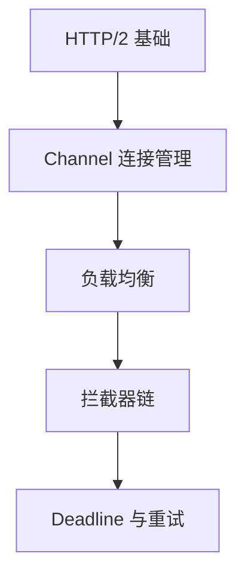

# gRPC 核心原理概述

本章节深入 gRPC 内部机制，理解其高性能设计。

::: info 阅读前提
建议先完成**基础知识**章节的学习。
:::

## 分析路线

## 各模块要点

| 模块 | 核心问题 | 学完你将理解 |
|------|----------|-------------|
| HTTP/2 | gRPC 为什么快？ | 多路复用、帧结构、HPACK |
| Channel | 连接如何管理？ | ManagedChannel、连接池、NameResolver |
| 负载均衡 | 请求如何分发？ | 客户端/服务端 LB、pick/pick-first/round-robin |
| 拦截器 | 如何统一处理横切关注点？ | 认证、日志、监控、Header 透传 |
| Deadline | 如何防止请求无限等待？ | 超时传播、重试策略、幂等约束 |
