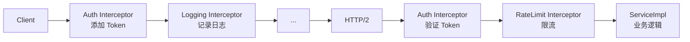

# 拦截器链

拦截器 (Interceptor) 是 gRPC 的中间件机制，用于在 RPC 调用的前后统一处理横切关注点。

## 拦截器模型



## ClientInterceptor

```java
public class AuthClientInterceptor implements ClientInterceptor {

    @Override
    public <ReqT, RespT> ClientCall<ReqT, RespT> interceptCall(
            MethodDescriptor<ReqT, RespT> method,
            CallOptions callOptions,
            Channel next) {

        return new ForwardingClientCall.SimpleForwardingClientCall<>(
            next.newCall(method, callOptions)) {

            @Override
            public void start(Listener<RespT> responseListener, Metadata headers) {
                // 注入认证 Token
                headers.put(
                    Metadata.Key.of("Authorization", 
                        Metadata.ASCII_STRING_MARSHALLER),
                    "Bearer " + getToken()
                );
                super.start(responseListener, headers);
            }
        };
    }
}
```

## ServerInterceptor

```java
public class AuthServerInterceptor implements ServerInterceptor {

    @Override
    public <ReqT, RespT> ServerCall.Listener<ReqT> interceptCall(
            ServerCall<ReqT, RespT> call,
            Metadata headers,
            ServerCallHandler<ReqT, RespT> next) {

        // 从 Header 中提取并验证 Token
        String token = headers.get(
            Metadata.Key.of("Authorization", Metadata.ASCII_STRING_MARSHALLER));

        if (!isValidToken(token)) {
            call.close(Status.UNAUTHENTICATED
                .withDescription("无效的认证凭证"), new Metadata());
            return new ServerCall.Listener<>() {};  // 空 Listener，忽略请求
        }

        // 提取用户信息存入 Context
        Context ctx = Context.current()
            .withValue(USER_CONTEXT_KEY, extractUser(token));

        return Contexts.interceptCall(ctx, call, headers, next);
    }
}
```

## 注册拦截器

```java
// 客户端注册
ManagedChannel channel = ManagedChannelBuilder
    .forAddress("localhost", 8080)
    .usePlaintext()
    .intercept(new AuthClientInterceptor())   // 先添加的先执行
    .intercept(new LoggingClientInterceptor())
    .intercept(new MonitoringClientInterceptor())
    .build();

// 服务端注册
Server server = ServerBuilder
    .forPort(8080)
    .addService(ServerInterceptors.intercept(
        new GreeterImpl(),
        new AuthServerInterceptor(),
        new RateLimitServerInterceptor(),
        new LoggingServerInterceptor()))
    .build()
    .start();
```

## 常用拦截器实战

### 日志拦截器

```java
public class LoggingServerInterceptor implements ServerInterceptor {
    private static final Logger log = LoggerFactory.getLogger(LoggingServerInterceptor.class);

    @Override
    public <ReqT, RespT> ServerCall.Listener<ReqT> interceptCall(
            ServerCall<ReqT, RespT> call,
            Metadata headers,
            ServerCallHandler<ReqT, RespT> next) {

        long startTime = System.currentTimeMillis();
        String method = call.getMethodDescriptor().getFullMethodName();

        ServerCall.Listener<ReqT> listener = next.startCall(
            new ForwardingServerCall.SimpleForwardingServerCall<>(call) {
                @Override
                public void close(com.google.rpc.Status status, Metadata trailers) {
                    long duration = System.currentTimeMillis() - startTime;
                    log.info("gRPC {} | status={} | duration={}ms",
                        method, status.getCode(), duration);
                    super.close(status, trailers);
                }
            }, headers);

        return listener;
    }
}
```

### 限流拦截器

```java
public class RateLimitServerInterceptor implements ServerInterceptor {
    private final RateLimiter rateLimiter = RateLimiter.create(100.0);  // 100 QPS

    @Override
    public <ReqT, RespT> ServerCall.Listener<ReqT> interceptCall(
            ServerCall<ReqT, RespT> call,
            Metadata headers,
            ServerCallHandler<ReqT, RespT> next) {

        if (!rateLimiter.tryAcquire()) {
            call.close(Status.RESOURCE_EXHAUSTED
                .withDescription("请求频率过高，请稍后重试"), new Metadata());
            return new ServerCall.Listener<>() {};
        }

        return next.startCall(call, headers);
    }
}
```

### 超时拦截器

```java
public class DeadlineClientInterceptor implements ClientInterceptor {

    @Override
    public <ReqT, RespT> ClientCall<ReqT, RespT> interceptCall(
            MethodDescriptor<ReqT, RespT> method,
            CallOptions callOptions,
            Channel next) {

        // 如果调用方没设 deadline，设置默认 5s 超时
        if (callOptions.getDeadline() == null) {
            callOptions = callOptions
                .withDeadline(Deadline.after(5, TimeUnit.SECONDS));
        }

        return next.newCall(method, callOptions);
    }
}
```

## 拦截器执行顺序

```
客户端拦截器 (先进先执行):
  interceptor A → interceptor B → interceptor C → HTTP/2

服务端拦截器 (先进先执行):
  HTTP/2 → interceptor A → interceptor B → interceptor C → ServiceImpl
```

## gRPC Context

gRPC 的 Context 类似于 ThreadLocal，但可以跨线程传递（配合 `Contexts`）：

```java
// 定义 Context Key
public static final Context.Key<String> USER_ID_KEY = 
    Context.key("user-id");

// 服务端：从拦截器写入
Context ctx = Context.current().withValue(USER_ID_KEY, userId);

// 业务代码：读取
String userId = USER_ID_KEY.get();

// Context 跨线程传递
Context ctx = Context.current().withValue(USER_ID_KEY, "user-123");
ctx.run(() -> {
    // 这里能读到 USER_ID_KEY
    stub.sayHello(request, new StreamObserver<HelloResponse>() {
        @Override
        public void onNext(HelloResponse response) {
            String uid = USER_ID_KEY.get();  // 也能读到!
        }
        // ...
    });
});
```

::: tip
`Context` 是 gRPC 中传递元数据（如 traceId, userId）的标准方式，比修改方法签名优雅得多。
:::
