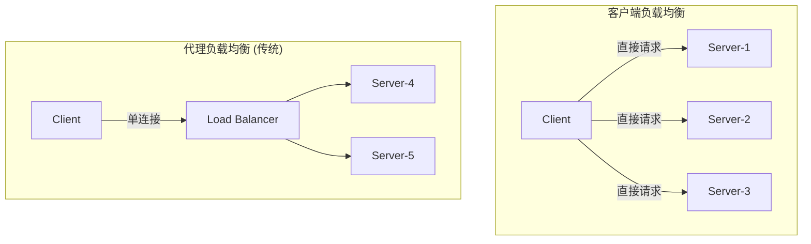
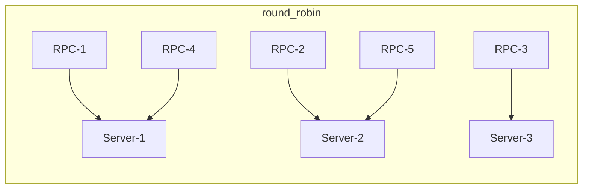
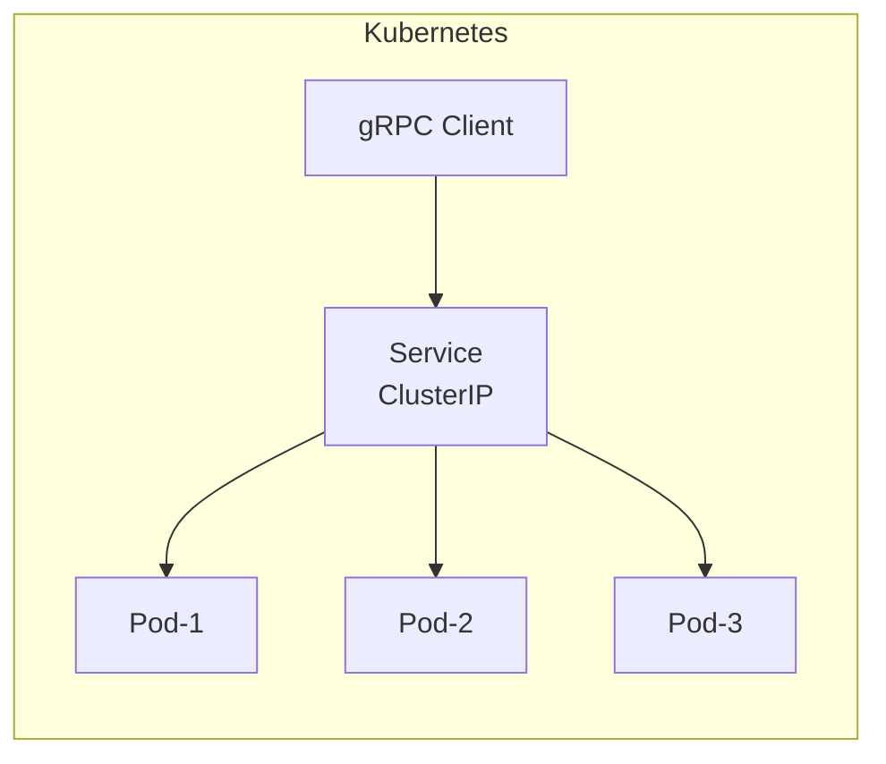

# gRPC 负载均衡

## 两种负载均衡模式



| 模式 | 原理 | 优点 | 缺点 |
|------|------|------|------|
| **客户端 LB** | Client 直连多 Server | 无中间节点，延迟低 | Client 需要感知所有 Server |
| **代理 LB** | 流量经 LB 转发 | 集中管理，安全 | 多一跳，LB 可能瓶颈 |

gRPC 默认使用**客户端负载均衡**。

## 负载均衡策略

### pick_first (默认)

```java
ManagedChannel channel = ManagedChannelBuilder
    .forTarget("dns:///my-service")
    .defaultLoadBalancingPolicy("pick_first")
    .build();
// 行为: 选择第一个可用的地址，不使用其他地址
// 适合: 单地址场景
```

### round_robin

```java
ManagedChannel channel = ManagedChannelBuilder
    .forTarget("dns:///my-service")
    .defaultLoadBalancingPolicy("round_robin")
    .build();
// 行为: 轮询分发到所有可用地址
// 适合: 无状态服务的常规场景
```



### 自定义 LB 策略

```java
// 1. 实现 LoadBalancerProvider
public class ConsistentHashLoadBalancer extends LoadBalancer {
    private final Helper helper;
    
    @Override
    public void handleResolvedAddresses(ResolvedAddresses resolvedAddresses) {
        List<Subchannel> subchannels = new ArrayList<>();
        for (EquivalentAddressGroup addr : resolvedAddresses.getAddresses()) {
            subchannels.add(helper.createSubchannel(
                CreateSubchannelArgs.newBuilder().setAddresses(addr).build()));
        }
        helper.updateBalancingState(
            ConnectivityState.READY, 
            new ConsistentHashPicker(subchannels));
    }

    // Picker 是 LB 的核心 — 每次 RPC 选择 Subchannel
    class ConsistentHashPicker extends SubchannelPicker {
        private final List<Subchannel> subchannels;
        private int index = 0;

        @Override
        public PickResult pickSubchannel(PickSubchannelArgs args) {
            // 一致性哈希逻辑：根据 RPC 参数 Hash 选择
            String key = args.getHeaders()
                .get(Metadata.Key.of("user-id", Metadata.ASCII_STRING_MARSHALLER));
            if (key != null) {
                int hash = Math.abs(key.hashCode()) % subchannels.size();
                return PickResult.withSubchannel(subchannels.get(hash));
            }
            // 无 key: round-robin
            return PickResult.withSubchannel(
                subchannels.get(index++ % subchannels.size()));
        }
    }
}
```

## 与服务发现结合

```yaml
# DNS 服务发现 (K8s headless service)
grpc.dns:///order-service.default.svc.cluster.local:8080
  → 解析 DNS A 记录
  → [10.0.1.1, 10.0.1.2, 10.0.1.3]
  → round_robin 分发

# 结合 Eureka/Consul 等注册中心
→ 自定义 NameResolver 拉取服务列表
→ NameResolver 通知 LB 更新地址
```

## 服务端负载均衡（K8s 场景）



gRPC 客户端 LB 直接绕过了 K8s Service 的负载均衡。如需 K8s 层 LB，需要：
- 使用 **Service Mesh**（如 Istio）注入 Sidecar
- 或使用 **Headless Service** + 客户端 `round_robin`

## 生产建议

| 场景 | 推荐策略 | 原因 |
|------|----------|------|
| 单实例 | `pick_first` | 不需要负载均衡 |
| 一般微服务 | `round_robin` | 均衡分发 |
| 有状态服务 | 一致性哈希 | 相同 key 到同一节点 |
| K8s 内 | `round_robin` + Headless Service | 绕过 iptables LB |
