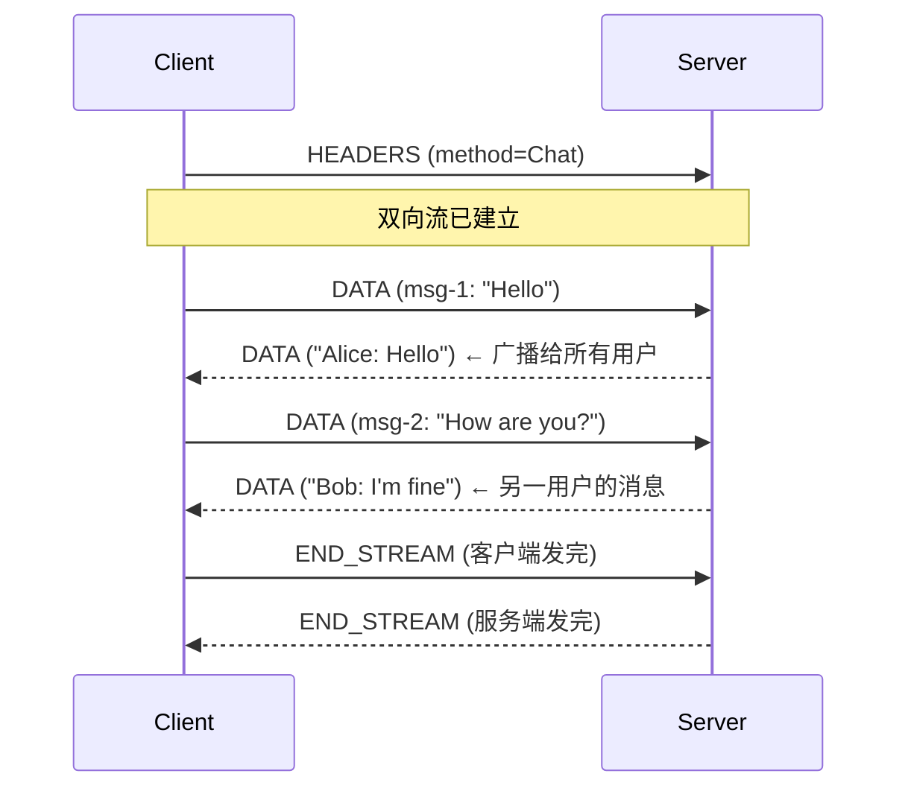

# 双向流式

双向流式是最灵活的模式，**客户端和服务端独立读写**，适合实时双向通信场景。

## Proto 定义

```protobuf
service ChatService {
    // 双向流式 — 实时聊天
    rpc Chat (stream ChatMessage) returns (stream ChatMessage);
}

message ChatMessage {
    string user_id = 1;
    string username = 2;
    string content = 3;
    int64 timestamp = 4;
}
```

## 服务端实现

```java
public class ChatServiceImpl extends ChatServiceGrpc.ChatServiceImplBase {

    // 管理所有在线用户的 StreamObserver
    private static final Set<StreamObserver<ChatMessage>> onlineUsers =
        ConcurrentHashMap.newKeySet();

    @Override
    public StreamObserver<ChatMessage> chat(
            StreamObserver<ChatMessage> responseObserver) {

        onlineUsers.add(responseObserver);
        System.out.println("用户上线，当前在线: " + onlineUsers.size());

        return new StreamObserver<ChatMessage>() {
            private String username;

            @Override
            public void onNext(ChatMessage message) {
                username = message.getUsername();
                System.out.printf("[%s]: %s%n", username, message.getContent());

                // 广播给所有在线用户（包括发送者自己）
                for (StreamObserver<ChatMessage> user : onlineUsers) {
                    try {
                        user.onNext(message);  // 推送消息
                    } catch (Exception e) {
                        // 用户可能已断线，稍后在 onError 中清理
                        onlineUsers.remove(user);
                    }
                }
            }

            @Override
            public void onError(Throwable t) {
                System.err.println(username + " 异常断线: " + t.getMessage());
                onlineUsers.remove(responseObserver);
            }

            @Override
            public void onCompleted() {
                System.out.println(username + " 离开聊天室");
                onlineUsers.remove(responseObserver);

                // 通知其他用户
                ChatMessage leaveMsg = ChatMessage.newBuilder()
                    .setUsername("系统")
                    .setContent(username + " 离开了聊天室")
                    .setTimestamp(System.currentTimeMillis())
                    .build();
                for (StreamObserver<ChatMessage> user : onlineUsers) {
                    user.onNext(leaveMsg);
                }

                responseObserver.onCompleted();
            }
        };
    }
}
```

## 客户端实现

```java
public class ChatClient {

    public static void main(String[] args) throws InterruptedException {
        ManagedChannel channel = ManagedChannelBuilder
            .forAddress("localhost", 8080)
            .usePlaintext()
            .build();

        ChatServiceGrpc.ChatServiceStub asyncStub = ChatServiceGrpc.newStub(channel);

        CountDownLatch finishLatch = new CountDownLatch(1);

        // 获取 StreamObserver（用于发送消息）
        StreamObserver<ChatMessage> chatStream = asyncStub.chat(
            new StreamObserver<ChatMessage>() {
                @Override
                public void onNext(ChatMessage message) {
                    // 收到来自服务端推送的消息（广播）
                    System.out.printf("[%s]: %s%n",
                        message.getUsername(), message.getContent());
                }

                @Override
                public void onError(Throwable t) {
                    System.err.println("连接异常: " + t.getMessage());
                    finishLatch.countDown();
                }

                @Override
                public void onCompleted() {
                    System.out.println("聊天结束");
                    finishLatch.countDown();
                }
            });

        // 读取用户输入，发送消息
        Scanner scanner = new Scanner(System.in);
        System.out.print("请输入用户名: ");
        String username = scanner.nextLine();

        System.out.println("开始聊天! (输入 /quit 退出)");
        while (scanner.hasNextLine()) {
            String line = scanner.nextLine();
            if ("/quit".equalsIgnoreCase(line)) {
                break;
            }

            ChatMessage message = ChatMessage.newBuilder()
                .setUsername(username)
                .setContent(line)
                .setTimestamp(System.currentTimeMillis())
                .build();

            chatStream.onNext(message);
        }

        // 结束会话
        chatStream.onCompleted();
        finishLatch.await(3, TimeUnit.SECONDS);
        channel.shutdown();
    }
}
```

## 双向流通信模型



## 完整聊天运行

```bash
# 终端1: 启动服务端
> ChatServer started on port 8080
> 用户上线，当前在线: 1
> [Alice]: Hello everyone!
> [Bob]: Hi Alice!

# 终端2: 客户端 - Alice
> 请输入用户名: Alice
> 开始聊天! (输入 /quit 退出)
> Hello everyone!
> [Bob]: Hi Alice!

# 终端3: 客户端 - Bob
> 请输入用户名: Bob
> [Alice]: Hello everyone!
> Hi Alice!
```

## 业务端限流

```java
public class ChatServiceImpl extends ChatServiceGrpc.ChatServiceImplBase {
    
    private static class UserSession {
        StreamObserver<ChatMessage> observer;
        RateLimiter rateLimiter = RateLimiter.create(5.0);  // 每秒 5 条
        
        UserSession(StreamObserver<ChatMessage> observer) {
            this.observer = observer;
        }
    }
    
    private final Map<String, UserSession> sessions = new ConcurrentHashMap<>();

    @Override
    public StreamObserver<ChatMessage> chat(
            StreamObserver<ChatMessage> responseObserver) {
        // ... 同上，增加限流逻辑
        return new StreamObserver<ChatMessage>() {
            @Override
            public void onNext(ChatMessage message) {
                UserSession session = sessions.computeIfAbsent(
                    message.getUserId(), 
                    id -> new UserSession(responseObserver));
                
                if (!session.rateLimiter.tryAcquire()) {
                    responseObserver.onError(
                        Status.RESOURCE_EXHAUSTED
                            .withDescription("发言太频繁")
                            .asRuntimeException());
                    return;
                }
                
                // 广播消息...
            }
            // ...
        };
    }
}
```

## 适用场景

| 场景 | 说明 |
|------|------|
| 实时聊天 | 双向消息推送 |
| 协同编辑 | 多人实时编辑文档 |
| 在线游戏 | 玩家状态实时同步 |
| 实时语音转文字 | 持续发送音频流，持续接收文字流 |
| 调试/诊断工具 | 双向命令-响应 |
