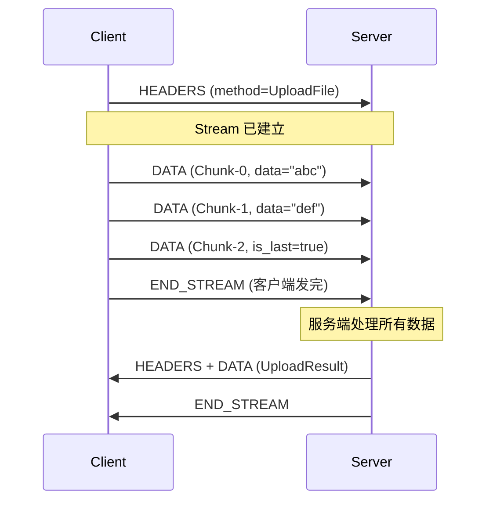

# 客户端流式

客户端流式适合**客户端持续发送数据，服务端汇总后返回一个响应**的场景。

## Proto 定义

```protobuf
service FileService {
    // 客户端流式上传，服务端返回上传结果
    rpc UploadFile (stream FileChunk) returns (UploadResult);
}

message FileChunk {
    string filename = 1;      // 文件名（只在第一个 chunk 中发送）
    bytes data = 2;           // 文件分块数据
    int32 chunk_index = 3;    // 当前块序号
    bool is_last = 4;         // 是否最后一块
}

message UploadResult {
    bool success = 1;
    string filename = 2;
    int64 total_bytes = 3;
    int32 total_chunks = 4;
    string message = 5;
}
```

## 服务端实现

```java
public class FileServiceImpl extends FileServiceGrpc.FileServiceImplBase {

    @Override
    public StreamObserver<FileChunk> uploadFile(
            StreamObserver<UploadResult> responseObserver) {

        return new StreamObserver<FileChunk>() {
            private String filename;
            private ByteArrayOutputStream fileData = new ByteArrayOutputStream();
            private int totalChunks = 0;

            @Override
            public void onNext(FileChunk chunk) {
                // 收集文件名
                if (!chunk.getFilename().isEmpty()) {
                    filename = chunk.getFilename();
                }

                // 累积文件数据
                try {
                    fileData.write(chunk.getData().toByteArray());
                } catch (IOException e) {
                    responseObserver.onError(e);
                }
                totalChunks++;

                System.out.printf("收到块: %s, size=%d bytes, chunk=%d%n",
                    filename, chunk.getData().size(), chunk.getChunkIndex());
            }

            @Override
            public void onError(Throwable t) {
                System.err.println("上传失败: " + t.getMessage());
            }

            @Override
            public void onCompleted() {
                // 客户端发送完所有 chunks，返回汇总结果
                byte[] totalFileData = fileData.toByteArray();

                // 实际项目中将数据写入磁盘或对象存储
                saveFile(filename, totalFileData);

                UploadResult result = UploadResult.newBuilder()
                    .setSuccess(true)
                    .setFilename(filename)
                    .setTotalBytes(totalFileData.length)
                    .setTotalChunks(totalChunks)
                    .setMessage("文件上传成功")
                    .build();

                responseObserver.onNext(result);
                responseObserver.onCompleted();
            }
        };
    }

    private void saveFile(String filename, byte[] data) {
        // 保存到磁盘 / 对象存储
        try (FileOutputStream fos = new FileOutputStream("/tmp/" + filename)) {
            fos.write(data);
        } catch (IOException e) {
            throw new UncheckedIOException(e);
        }
    }
}
```

## 客户端实现

```java
public class FileClient {

    public static void main(String[] args) throws Exception {
        ManagedChannel channel = ManagedChannelBuilder
            .forAddress("localhost", 8080)
            .usePlaintext()
            .build();

        FileServiceGrpc.FileServiceStub asyncStub = FileServiceGrpc.newStub(channel);

        uploadFile(asyncStub, "/path/to/large_file.bin");

        channel.shutdown();
    }

    public static void uploadFile(FileServiceGrpc.FileServiceStub stub,
                                   String filePath) throws Exception {
        // 客户端获得 StreamObserver，用于逐块发送数据
        StreamObserver<FileChunk> uploadStream = stub.uploadFile(
            new StreamObserver<UploadResult>() {
                @Override
                public void onNext(UploadResult result) {
                    // 服务端汇总响应
                    System.out.printf("上传完成: filename=%s, bytes=%d, chunks=%d%n",
                        result.getFilename(), result.getTotalBytes(),
                        result.getTotalChunks());
                }

                @Override
                public void onError(Throwable t) {
                    System.err.println("上传失败: " + t.getMessage());
                }

                @Override
                public void onCompleted() {
                    System.out.println("RPC 完成");
                }
            });

        // 分块读取文件，逐块发送
        File file = new File(filePath);
        String filename = file.getName();
        byte[] buffer = new byte[65536];  // 64KB per chunk
        int chunkIndex = 0;

        try (FileInputStream fis = new FileInputStream(file)) {
            int bytesRead;
            while ((bytesRead = fis.read(buffer)) > 0) {
                byte[] chunkData = new byte[bytesRead];
                System.arraycopy(buffer, 0, chunkData, 0, bytesRead);

                FileChunk chunk = FileChunk.newBuilder()
                    .setFilename(chunkIndex == 0 ? filename : "")  // 首块带文件名
                    .setData(ByteString.copyFrom(chunkData))
                    .setChunkIndex(chunkIndex)
                    .setIsLast(false)
                    .build();

                uploadStream.onNext(chunk);
                chunkIndex++;
                System.out.printf("发送块 %d: %d bytes%n", chunkIndex, bytesRead);

                // 模拟慢速网络
                Thread.sleep(100);
            }
        }

        // 发送最后一块（标记结束）
        FileChunk lastChunk = FileChunk.newBuilder()
            .setIsLast(true)
            .setChunkIndex(chunkIndex)
            .build();
        uploadStream.onNext(lastChunk);

        // 告诉服务端：我发完了
        uploadStream.onCompleted();
    }
}
```

## 客户端流模式的关键流程



## 适用场景

| 场景 | 说明 |
|------|------|
| 大文件上传 | 流式分块上传，节省内存 |
| 批量数据导入 | 逐条发送，服务端分批写入 |
| 传感器数据上报 | IoT 设备持续上报数据，服务端定期汇总 |
| 日志批量上报 | 客户端积攒一批日志后上报 |

::: tip
客户端流模式中，`StreamObserver` 由**服务端方法返回**。客户端拿到后用它 `onNext()` 发数据，`onCompleted()` 结束。
:::
