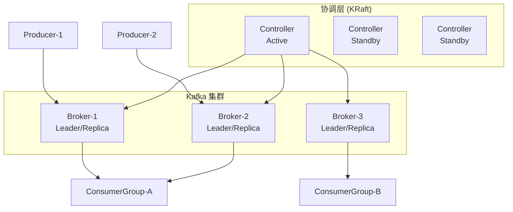
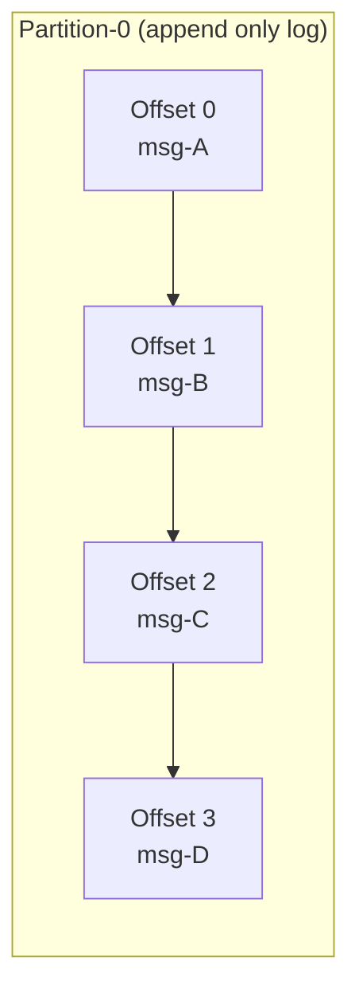
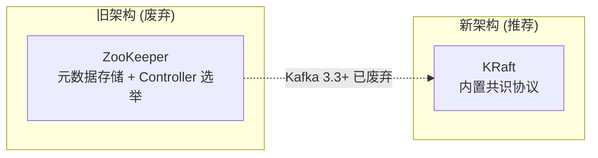
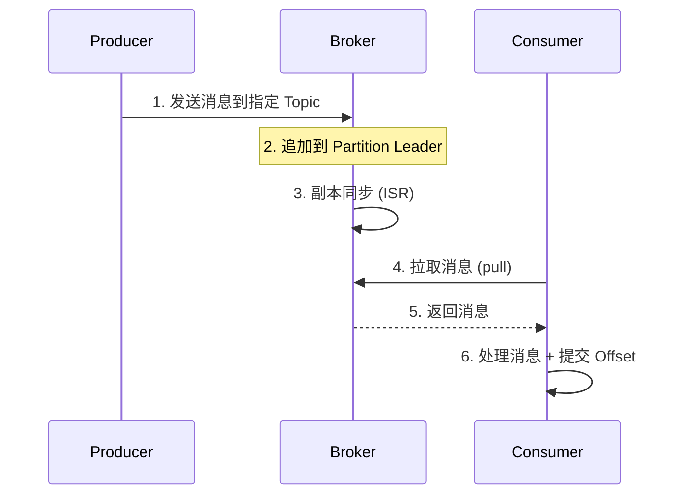

# Kafka 整体架构

## 架构全景图



## 核心组件

### Broker

Broker 是 Kafka 的**服务节点**，负责消息的存储与转发。

| 属性 | 说明 |
|------|------|
| 节点标识 | 每个 Broker 有唯一 ID (`broker.id`) |
| 无状态 | 消息不由 Broker 管理，由 Partition 管理 |
| 职责 | 接收生产者消息、响应消费者请求、副本同步 |
| 推荐配置 | 生产环境至少 3 个 Broker 保证高可用 |

### Topic（主题）

Topic 是消息的**逻辑分类**，类似数据库的"表"。

```
Topic: order-events
  ├── Partition-0 (Leader on Broker-1)
  ├── Partition-1 (Leader on Broker-2)
  └── Partition-2 (Leader on Broker-3)
```

- 同一个 Topic 的消息可能分布在多个 Broker 上
- Topic 是一个逻辑概念，真正存储数据的是 Partition

### Partition（分区）

Partition 是消息的**物理存储单元**，是一个有序的、不可变的消息序列。



| 特性 | 说明 |
|------|------|
| 有序性 | Partition 内部消息严格有序 |
| 不可变性 | 写入后的消息不可修改 |
| 分布式 | 不同 Partition 分布在不同 Broker |
| 顺序保证 | 同一 Partition 内的消息对消费者有序 |

### Offset（偏移量）

每条消息在 Partition 内都有一个唯一的 64 位偏移量，用于定位和追踪消费进度。

```
Partition-0:
  [offset=0] [offset=1] [offset=2] [offset=3] [offset=4] ...
                          ▲ Consumer 已消费到这里
```

## 集群协调：从 ZooKeeper 到 KRaft



| 对比 | ZooKeeper 模式 | KRaft 模式 (推荐) |
|------|---------------|-------------------|
| 依赖 | 需要额外的 ZK 集群 | 零外部依赖 |
| 性能 | 元数据通过 ZK 同步，较慢 | 内部 Raft 协议，更快 |
| 运维 | 需要维护两套系统 | 只需维护 Kafka |
| Partition 上限 | 约 20万 | 可达 200万+ |
| Kafka 版本 | 2.x 及以下 | 3.3+ 推荐 |

## 数据流全景



::: tip 关键设计
1. 消费者使用 **Pull 模式**（主动拉取），避免 Broker 推送过慢/过快
2. 消息写入 **Leader Partition**，副本异步/同步复制
3. 消息在磁盘上**顺序写入**，比随机写入快几个数量级
:::
