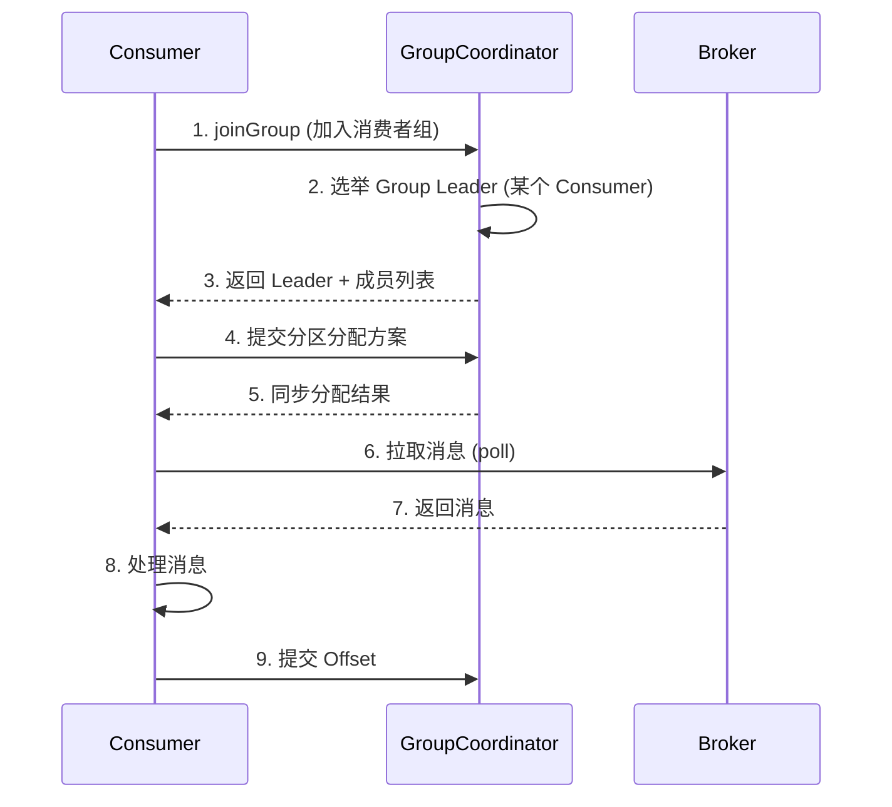

# Kafka 消费者

## 消费者消费流程



## 核心参数

```java
Properties props = new Properties();
props.put("bootstrap.servers", "broker1:9092,broker2:9092");
props.put("key.deserializer", StringDeserializer.class);
props.put("value.deserializer", StringDeserializer.class);
props.put("group.id", "order-consumer-group");
```

### 关键性能/可靠性参数

| 参数 | 默认 | 说明 |
|------|------|------|
| `enable.auto.commit` | true | 是否自动提交 Offset |
| `auto.commit.interval.ms` | 5000 | 自动提交间隔 |
| `auto.offset.reset` | latest | `latest`=从最新开始, `earliest`=从头开始, `none`=抛异常 |
| `max.poll.records` | 500 | 单次 poll 最大拉取条数 |
| `max.poll.interval.ms` | 300000 (5min) | 两次 poll 最大间隔，超时触发 Rebalance |
| `session.timeout.ms` | 45000 | 心跳超时 |
| `heartbeat.interval.ms` | 3000 | 心跳间隔 |
| `fetch.min.bytes` | 1 | 最少拉取字节数（增大可提高吞吐） |
| `fetch.max.wait.ms` | 500 | 不足 min.bytes 时最多等待时间 |

## 位移提交 (Offset Commit)

Kafka 不会自动知道消费者消费到哪了，需要**消费者主动提交 Offset**。

### 三种提交方式

```java
// 1. 自动提交 (最简单，可能丢消息)
props.put("enable.auto.commit", true);
props.put("auto.commit.interval.ms", 5000);

// 2. 同步提交 (最可靠，性能最差)
consumer.commitSync();  // 阻塞等待 Broker 确认

// 3. 异步提交 (推荐，兼顾性能与可靠)
consumer.commitAsync((offsets, exception) -> {
    if (exception != null) {
        System.err.println("提交失败: " + exception.getMessage());
        // 可尝试重试或记录日志
    }
});
```

### 推荐方案：异步提交 + 同步兜底

```java
try {
    while (running) {
        ConsumerRecords<String, String> records = consumer.poll(Duration.ofMillis(1000));
        for (ConsumerRecord<String, String> record : records) {
            // 处理消息
            processRecord(record);
        }
        // 异步提交
        consumer.commitAsync();
    }
} catch (Exception e) {
    System.err.println("消费异常: " + e.getMessage());
} finally {
    // 最后一次同步提交，确保不丢进度
    try {
        consumer.commitSync();
    } finally {
        consumer.close();
    }
}
```

## Rebalance 监听器

```java
consumer.subscribe(Collections.singletonList("order-events"),
    new ConsumerRebalanceListener() {
        @Override
        public void onPartitionsRevoked(Collection<TopicPartition> partitions) {
            // Rebalance 前：保存当前 Offset
            System.out.println("失去分区: " + partitions);
            consumer.commitSync();
        }

        @Override
        public void onPartitionsAssigned(Collection<TopicPartition> partitions) {
            // Rebalance 后：可指定 Offset 继续消费
            System.out.println("获得分区: " + partitions);
            // consumer.seek(partition, offset);
        }
    });
```

## 消费者完整示例

```java
public class OrderConsumer {
    public static void main(String[] args) {
        Properties props = new Properties();
        props.put("bootstrap.servers", "localhost:9092");
        props.put("key.deserializer", StringDeserializer.class);
        props.put("value.deserializer", StringDeserializer.class);
        props.put("group.id", "order-consumer-group");
        props.put("enable.auto.commit", false);
        props.put("auto.offset.reset", "earliest");
        props.put("max.poll.records", 500);

        try (KafkaConsumer<String, String> consumer = new KafkaConsumer<>(props)) {
            consumer.subscribe(Collections.singletonList("order-events"));

            while (true) {
                ConsumerRecords<String, String> records = 
                    consumer.poll(Duration.ofMillis(1000));

                for (ConsumerRecord<String, String> record : records) {
                    System.out.printf("收到消息: topic=%s, partition=%d, offset=%d, key=%s, value=%s%n",
                        record.topic(), record.partition(), 
                        record.offset(), record.key(), record.value());
                    
                    processOrder(record.value());
                }
                consumer.commitAsync();
            }
        }
    }

    private static void processOrder(String json) {
        // 业务处理逻辑
    }
}
```

## Offset 与消费语义

| 提交时机 | 语义 | 说明 |
|----------|------|------|
| 处理前提交 | **At-Most-Once** (最多一次) | 可能丢消息 |
| 处理后提交 | **At-Least-Once** (至少一次) | 可能重复，推荐 |
| 事务 | **Exactly-Once** | 精确一次 |

::: warning 消费顺序
Kafka 只保证 **单个 Partition 内有序**。如果你需要全局有序，要么用单分区，要么在业务层做全局排序。
:::
