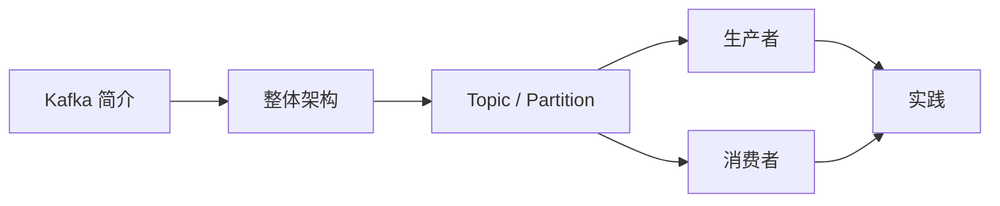

# Kafka 基础知识概述

欢迎来到 Kafka 基础知识章节。在这一部分，我们将从零开始，系统学习 Apache Kafka 的核心概念和架构设计。

## 学习路线

## 章节介绍

| 章节 | 内容 | 目标 |
|------|------|------|
| Kafka 简介 | 什么是 Kafka、核心能力、应用场景 | 建立宏观认识 |
| 整体架构 | Broker/Zookeeper/KRaft、集群角色 | 理解 Kafka 的分布式架构 |
| Topic 与 Partition | 主题、分区、偏移量、消费者组 | 掌握核心数据模型 |
| 生产者 | 发送流程、分区策略、ACK 机制 | 理解消息写入过程 |
| 消费者 | 消费流程、Rebalance、位移提交 | 理解消息消费过程 |

## 前置知识

在学习 Kafka 之前，建议你具备以下基础：

- Java 编程基础
- 基本的 Linux 命令行操作
- 分布式系统基础概念（了解即可）
- Spring Boot 基础（实战部分需要）
