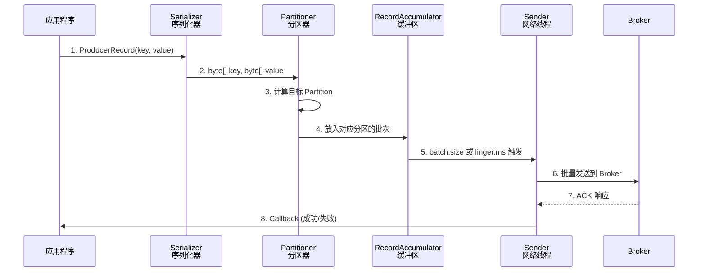
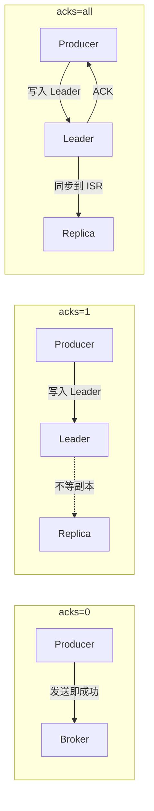

# Kafka 生产者

## 生产者发送流程



## Producer 核心参数

### 必知参数

```java
Properties props = new Properties();
props.put("bootstrap.servers", "broker1:9092,broker2:9092"); // Broker 地址
props.put("key.serializer", "org.apache.kafka.common.serialization.StringSerializer");
props.put("value.serializer", "org.apache.kafka.common.serialization.StringSerializer");
```

### 性能相关参数

| 参数 | 默认 | 建议 | 说明 |
|------|------|------|------|
| `batch.size` | 16KB | 32KB~256KB | 批次大小，大了吞吐高延迟也高 |
| `linger.ms` | 0 | 5~100 | 发送前等待时间，增大可提高批次利用率 |
| `buffer.memory` | 32MB | 64MB~256MB | 缓冲区总内存 |
| `compression.type` | none | `lz4`/`snappy` | 压缩算法，lz4 性价比最高 |
| `max.request.size` | 1MB | 1MB~10MB | 单次请求最大大小 |

### 可靠性参数

| 参数 | 默认 | 说明 |
|------|------|------|
| `acks` | `all` (-1) | 0=不等, 1=Leader, all=全部 ISR 确认 |
| `retries` | Integer.MAX | 重试次数 |
| `enable.idempotence` | true (3.0+) | 幂等性，防止重试导致消息重复 |
| `max.in.flight.requests.per.connection` | 5 | 未确认的请求数上限 |

## ACK 机制详解



| acks | 可靠性 | 延迟 | 适用场景 |
|------|--------|------|----------|
| `0` | 可能丢失 | 最低 | 日志收集、监控指标 |
| `1` | Leader 宕机可能丢 | 中等 | 普通业务 |
| `all` / `-1` | **不丢消息** | 最高 | 金融、订单 |

## 分区策略

```java
// 默认分区策略源码逻辑：
int partition(ProducerRecord record, Cluster cluster) {
    if (record.key() != null) {
        // 方式1: 指定 Key → 按 Key 哈希分区
        return Utils.murmur2(keyBytes) % numPartitions;
    }
    if (record.partition() != null) {
        // 方式2: 显式指定 Partition
        return record.partition();
    }
    // 方式3: 粘性分区 (Sticky Partition)
    return stickyPartition;
}
```

::: tip 分区选择建议
- 需要**局部有序**：指定 Key，相同 Key 发往同一分区
- 需要**全局有序**：单分区（牺牲并发性）
- 需要**负载均衡**：不指定 Key，使用粘性分区
:::

## 消息发送方式

```java
// 1. 发送并忘记 (fire-and-forget)
producer.send(record);

// 2. 同步发送
RecordMetadata meta = producer.send(record).get(); // 阻塞等待

// 3. 异步发送 + 回调 (推荐)
producer.send(record, (metadata, exception) -> {
    if (exception == null) {
        System.out.printf("发送成功: topic=%s, partition=%d, offset=%d%n",
            metadata.topic(), metadata.partition(), metadata.offset());
    } else {
        exception.printStackTrace();
    }
});
```

## 生产者完整示例

```java
public class OrderProducer {
    private static final String TOPIC = "order-events";

    public static void main(String[] args) {
        Properties props = new Properties();
        props.put("bootstrap.servers", "localhost:9092");
        props.put("key.serializer", StringSerializer.class);
        props.put("value.serializer", StringSerializer.class);
        props.put("acks", "all");
        props.put("batch.size", 16384);
        props.put("linger.ms", 10);
        props.put("compression.type", "lz4");
        props.put("enable.idempotence", true);

        try (KafkaProducer<String, String> producer = new KafkaProducer<>(props)) {
            for (int i = 0; i < 100; i++) {
                String key = "order_" + i;
                String value = "{\"orderId\":" + i + ",\"amount\":100}";
                
                producer.send(new ProducerRecord<>(TOPIC, key, value),
                    (meta, ex) -> {
                        if (ex != null) {
                            System.err.println("发送失败: " + ex.getMessage());
                        }
                    });
            }
        }
        // try-with-resources 自动 flush + close
    }
}
```

::: warning 重要
生产环境务必调用 `producer.close()` 或使用 try-with-resources，否则缓冲区中的数据可能丢失。
:::
