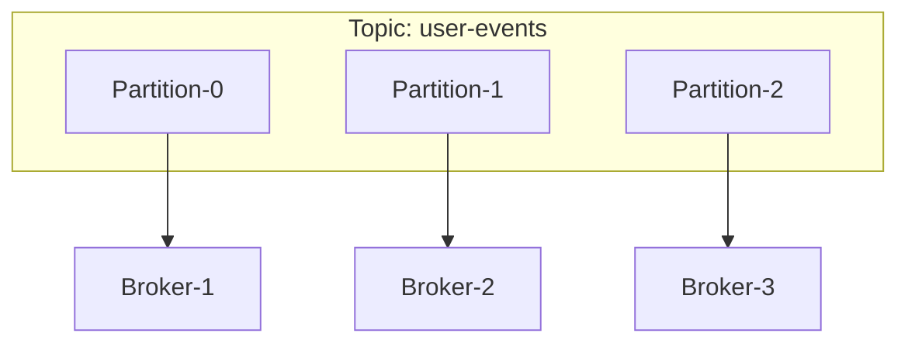
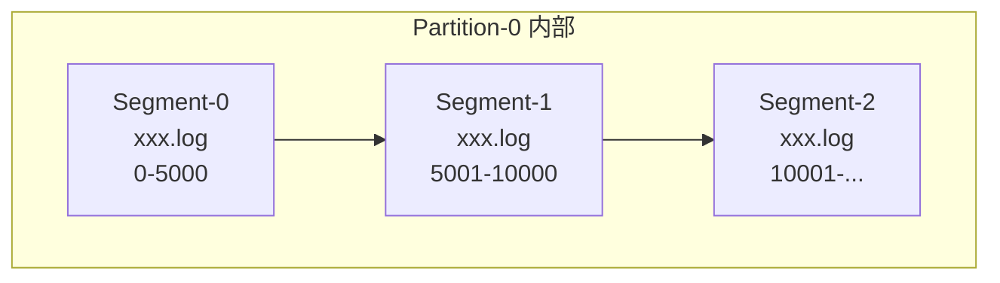
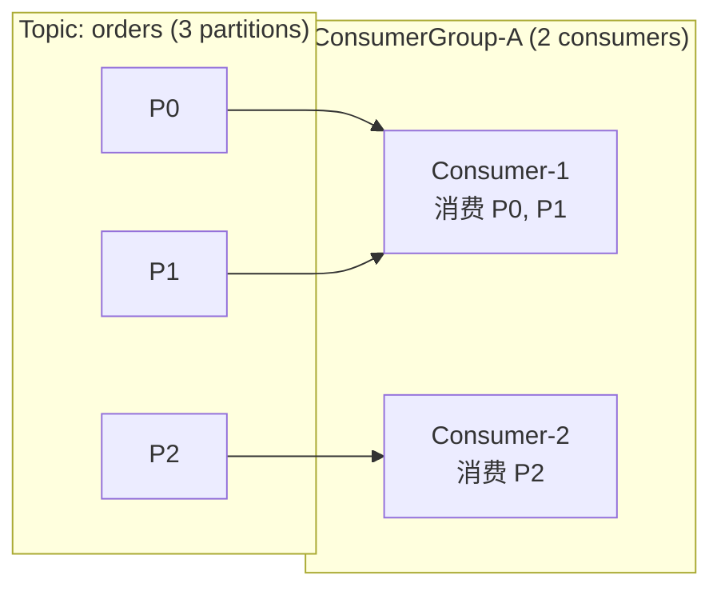
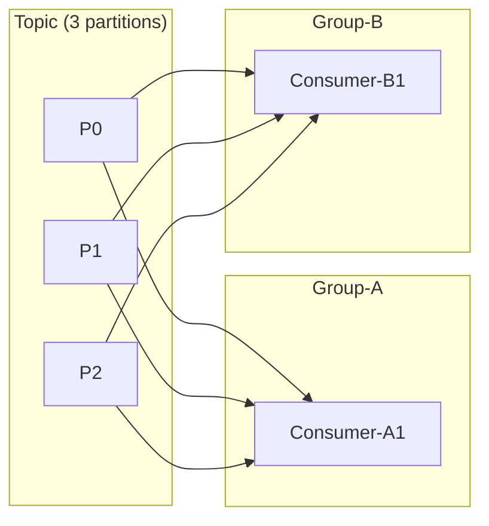

# Topic 与 Partition

## Topic 的本质

Topic 是 Kafka 中最核心的概念，它是一个**逻辑的消息类别**。



## Partition 内部结构



### Segment 文件

每个 Partition 由多个 **Segment 文件**组成：

```
topic-0/
├── 00000000000000000000.log       # 日志文件（消息数据）
├── 00000000000000000000.index     # 偏移量索引
├── 00000000000000000000.timeindex # 时间戳索引
├── 00000000000000005001.log
├── 00000000000000005001.index
├── 00000000000000005001.timeindex
└── ...
```

| 文件 | 作用 |
|------|------|
| `.log` | 存储实际消息数据 |
| `.index` | 稀疏索引，Offset → 文件位置 |
| `.timeindex` | 时间戳 → Offset |

## 分区策略

### 生产者的消息如何确定 Partition？

```java
// 默认分区策略
int partition = key != null 
    ? Utils.toPositive(Utils.murmur2(keyBytes)) % numPartitions  // Key 哈希
    : stickyPartition;  // 粘性分区（随机选一个粘住）
```

| 策略 | 触发条件 | 特点 |
|------|----------|------|
| **Key 哈希** | 指定了 Key | 相同 Key 的消息发到同一分区，保证局部有序 |
| **粘性分区** | 未指定 Key | 随机选一个分区，一段时间内粘住，减少批量切换 |
| **自定义分区器** | 自定义实现 `Partitioner` | 完全自定义路由逻辑 |

```java
// 自定义分区器示例
public class MyPartitioner implements Partitioner {
    @Override
    public int partition(String topic, Object key, byte[] keyBytes,
                         Object value, byte[] valueBytes, Cluster cluster) {
        // VIP 用户的消息发到低编号分区（优先处理）
        if (key.toString().startsWith("vip_")) {
            return 0;
        }
        return 1;
    }
}
```

## ConsumerGroup

ConsumerGroup 是 Kafka 消费模型的灵魂。



### 核心规则

| 规则 | 说明 |
|------|------|
| 分区数 ≥ 消费者数 | 多余消费者空闲 |
| 分区数 < 消费者数 | 多个消费者可消费同一分区（需不同 Group） |
| 一个分区只能被组内一个消费者消费 | 保证顺序消费 |
| 一个消费者可消费多个分区 | 常见于分区数 > 消费者数 |

### 不同 Group 独立消费



同一个 Topic 可以被多个 ConsumerGroup 独立消费，互不影响——这就是**发布-订阅**的核心。

## Rebalance 机制

当消费者加入或退出 ConsumerGroup 时，Kafka 会触发 **Rebalance**（重新分区分配）。

### 三种分配策略

```java
// 1. RangeAssignor (默认) - 按主题范围分配
// Topic-A: P0  P1  P2  P3
// Consumer-1: P0, P1
// Consumer-2: P2, P3

// 2. RoundRobinAssignor - 轮询分配
// Consumer-1: P0, P2
// Consumer-2: P1, P3

// 3. StickyAssignor - 粘性分配（尽量保持原有关系）
// Consumer-1: P0, P1
// Consumer-2: P2, P3
// 某 Consumer 退出后，尽量保持原有分配不变

// 4. CooperativeStickyAssignor (推荐) - 合作式粘性分配
// 渐进式 Rebalance，减少 "Stop The World" 影响
```

::: warning Rebalance 的影响
- 触发时，所有消费者**暂停消费**
- 频繁 Rebalance 会严重影响吞吐量
- 生产环境推荐使用 `CooperativeStickyAssignor`
:::

## Partition 数与性能

| 场景 | 建议分区数 | 原因 |
|------|-----------|------|
| 低吞吐 | 3~6 | 足够满足并发 |
| 高吞吐 | 12~24 | 充分并行 |
| 极限 | 不超过 Broker 数的倍数 | 避免单 Broker 压力过大 |

::: tip
分区数只能增加不能减少（删除 Topic 重建除外），规划时留有余量。
:::
