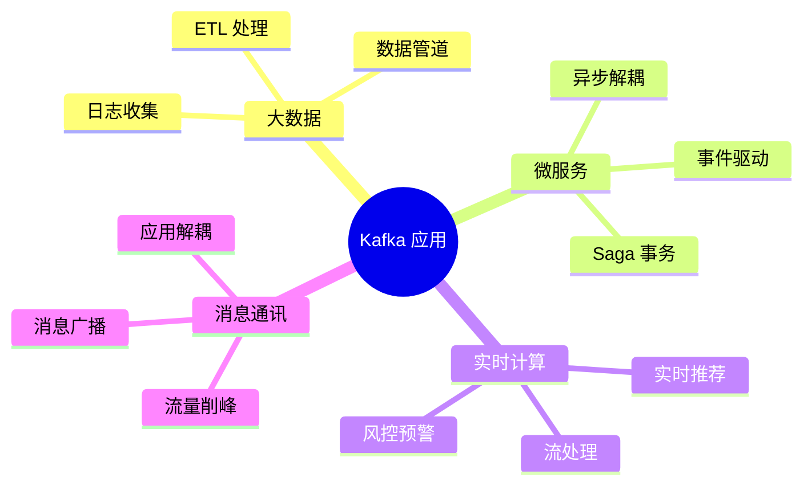

# Kafka 简介

## 什么是 Kafka

Apache Kafka 是由 **LinkedIn** 开发的一个**分布式消息引擎/流处理平台**，使用 Scala 和 Java 编写。

Kafka 的核心定位：**高吞吐、低延迟、持久化的分布式消息系统**。

## Kafka 的核心能力

| 能力 | 说明 |
|------|------|
| **消息系统** | 发布-订阅模式，支持点对点和广播 |
| **存储系统** | 数据持久化到磁盘，支持 TB 级别存储 |
| **流处理** | Kafka Streams API，实时数据转换 |
| **连接器** | Kafka Connect，无代码对接 100+ 数据源 |

## Kafka 的核心优势

| 特性 | 说明 |
|------|------|
| 高吞吐 | 单机 QPS 可达 100万+，顺序写入磁盘 |
| 低延迟 | 毫秒级延迟，适合实时场景 |
| 持久化 | 数据写入磁盘，支持数据重放 |
| 水平扩展 | 增加 Broker 即可线性提升性能 |
| 高可用 | 副本机制保证数据不丢失 |
| 解耦削峰 | 异步通讯，上下游解耦 |

## 应用场景

## Kafka 核心概念速览

| 概念 | 说明 | 类比 |
|------|------|------|
| **Producer** | 生产者，发送消息的客户端 | 快递寄件人 |
| **Consumer** | 消费者，接收消息的客户端 | 快递收件人 |
| **Broker** | Kafka 服务节点 | 快递中转站 |
| **Topic** | 消息主题，逻辑分类 | 快递类型 |
| **Partition** | 分区，物理存储单元 | 分仓库 |
| **ConsumerGroup** | 消费者组，分区分配单元 | 收件组 |
| **Offset** | 消息在分区内的唯一编号 | 快递编号 |

## Kafka 与其他 MQ 对比

| 特性 | Kafka | RocketMQ | RabbitMQ |
|------|-------|----------|----------|
| 开发语言 | Scala/Java | Java | Erlang |
| 吞吐量 | **极高** | 高 | 中等 |
| 延迟 | 毫秒级 | 毫秒级 | 微秒级 |
| 数据持久化 | ✅ 磁盘 | ✅ 磁盘 | 可选 |
| 消息回放 | ✅ 天然支持 | ✅ 支持 | ❌ |
| 事务 | ✅ | ✅ | 有限支持 |
| 社区生态 | 极强 | 较强 | 极强 |
| 适用场景 | 大数据/日志 | 在线业务 | 企业应用 |

::: tip
Kafka 是大数据 + 日志场景的**事实标准**，也是很多企业的**统一消息总线**。
:::
