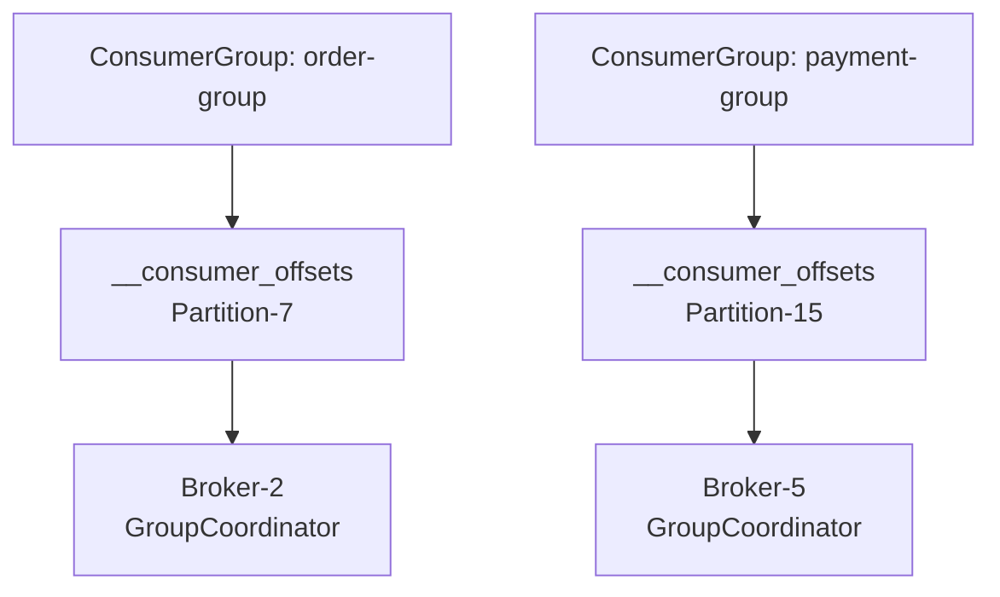
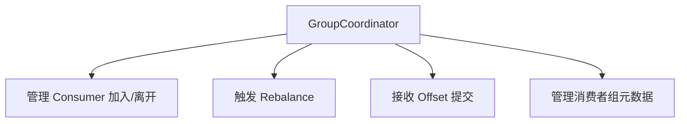
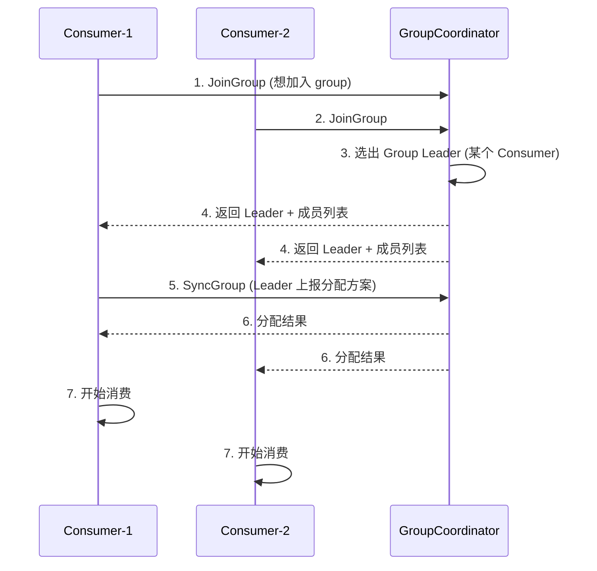
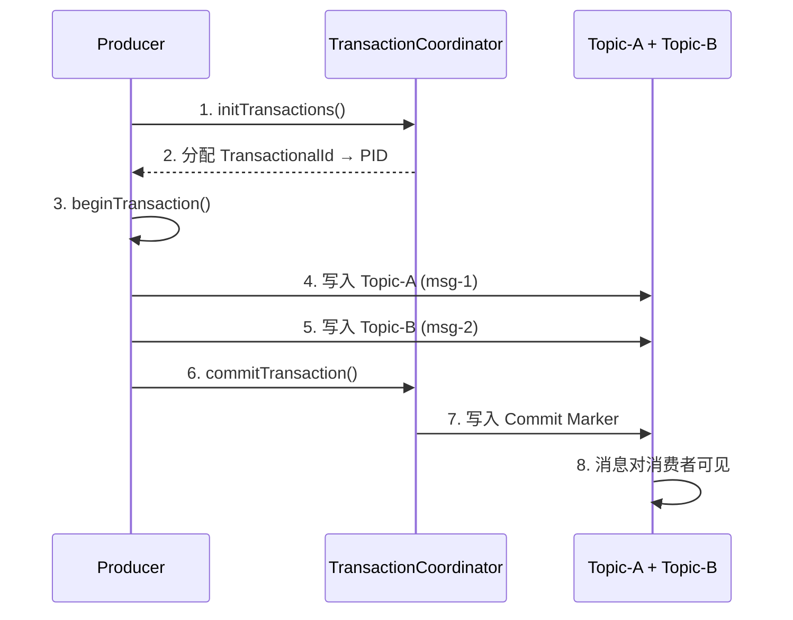

# Coordinator 协调器

## Coordinator 体系

Kafka 有两类协调器，分别负责不同的协调任务：

| 协调器 | 负责 | 所管理的 |
|--------|------|----------|
| **GroupCoordinator** | 消费者组管理 | ConsumerGroup 的 Rebalance、Offset 管理 |
| **TransactionCoordinator** | 事务管理 | 生产者事务、幂等性 |

## GroupCoordinator

### 位置



- ConsumerGroup 的 Offset 存储在内部 Topic `__consumer_offsets` 的某个分区
- 该分区的 **Leader 所在的 Broker** 就是这个 Group 的 GroupCoordinator

### 职责



### Rebalance 流程



### Rebalance 触发场景

| 场景 | 说明 |
|------|------|
| Consumer 加入 | 新消费者 join 组 |
| Consumer 离开 | 正常关闭或 crash |
| 心跳超时 | `session.timeout.ms` 内未收到心跳 |
| 消费超时 | `max.poll.interval.ms` 内未 poll |
| Topic 分区变化 | 分区数增加 |

## TransactionCoordinator

### 幂等性 (Idempotent)

幂等性保证单分区内不会有重复消息：

```java
// 启用幂等性
props.put("enable.idempotence", true);  // Kafka 3.0+ 默认开启
// 隐式设置: acks=all, retries=MAX, max.in.flight=5
```

**实现原理**: Producer 初始化时获得 PID (Producer ID)，每条消息携带 `<PID, SequenceNumber>`。Broker 据此去重。

```
同一个 PID 的 SequenceNumber 严格递增:
  msg-1: <PID=1001, Seq=0>
  msg-2: <PID=1001, Seq=1>
  msg-3: <PID=1001, Seq=1>  ← 重复! Broker 丢弃
  msg-4: <PID=1001, Seq=2>
```

### 事务 (Transaction)

事务更进一步，保证**跨分区**的原子写入：



```java
// 事务生产者示例
Properties props = new Properties();
props.put("bootstrap.servers", "localhost:9092");
props.put("transactional.id", "order-tx-1");  // 事务 ID
props.put("enable.idempotence", true);

KafkaProducer<String, String> producer = new KafkaProducer<>(props);
producer.initTransactions();  // 初始化事务

try {
    producer.beginTransaction();
    producer.send(new ProducerRecord<>("topic-A", "msg1"));
    producer.send(new ProducerRecord<>("topic-B", "msg2"));
    producer.commitTransaction();  // 原子提交
} catch (Exception e) {
    producer.abortTransaction();   // 回滚
}
```

### 事务消费

```java
// 隔离级别
props.put("isolation.level", "read_committed");  // 只读已提交消息
// read_uncommitted = 读取所有消息 (默认)
```

::: tip 事务 vs 幂等
| 特性 | 幂等性 | 事务 |
|------|--------|------|
| 作用范围 | 单分区 | 跨分区 |
| 保证 | 无重复 | 原子性 + 无重复 |
| 性能开销 | 极低 | 有开销 |
| 适用场景 | 几乎所有场景 | 金融、订单等严格场景 |
:::
