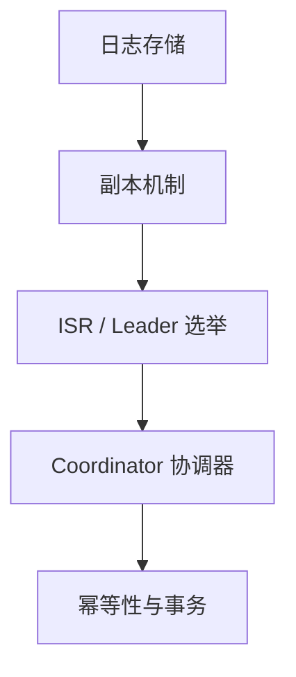

# Kafka 核心原理概述

本章节深入 Kafka 内部实现，理解其高性能、高可用的设计精髓。

::: info 阅读前提
建议先完成**基础知识**章节的学习，对 Kafka 核心概念有基本了解后再阅读本章节。
:::

## 原理分析路线

## 各模块要点

| 模块 | 核心问题 | 学完你将理解 |
|------|----------|-------------|
| 日志存储 | Kafka 如何实现高性能磁盘写入？ | 顺序写、零拷贝、稀疏索引 |
| 副本机制 | 数据如何在多个 Broker 间同步？ | ISR 机制、HW/LEO 水位线 |
| Leader 选举 | 宕机后如何自动恢复？ | Controller、选主流程 |
| Coordinator | 消费者组如何管理？ | GroupCoordinator、TransactionCoordinator |
| 幂等性与事务 | 如何保证消息不重不丢？ | PID、幂等 Producer、事务 API |
