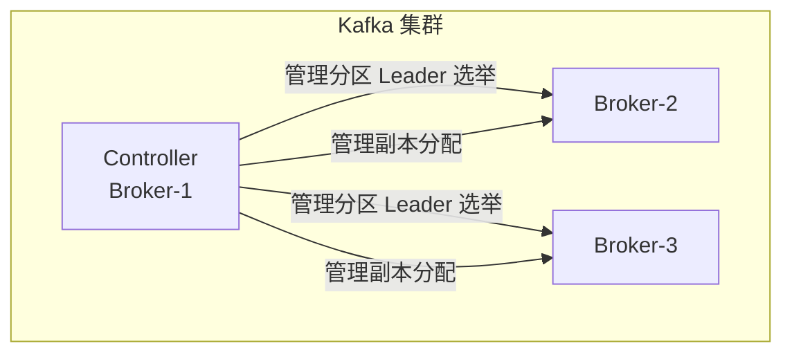
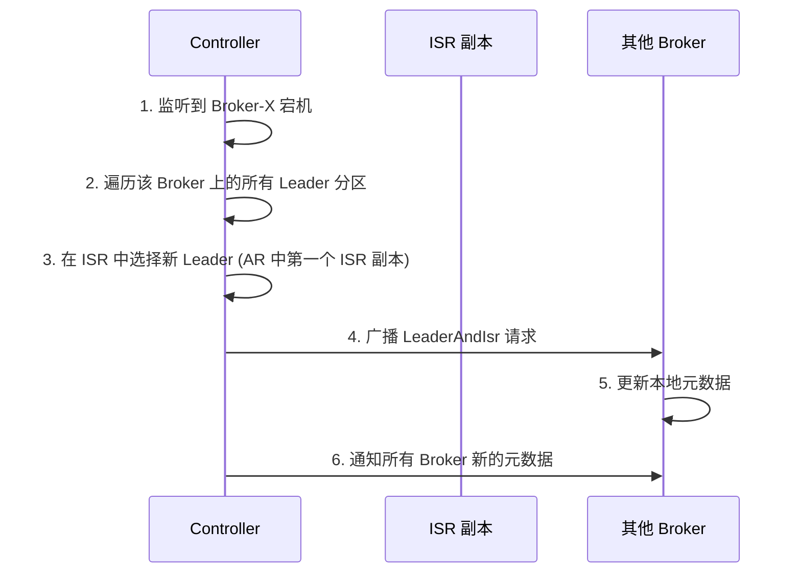
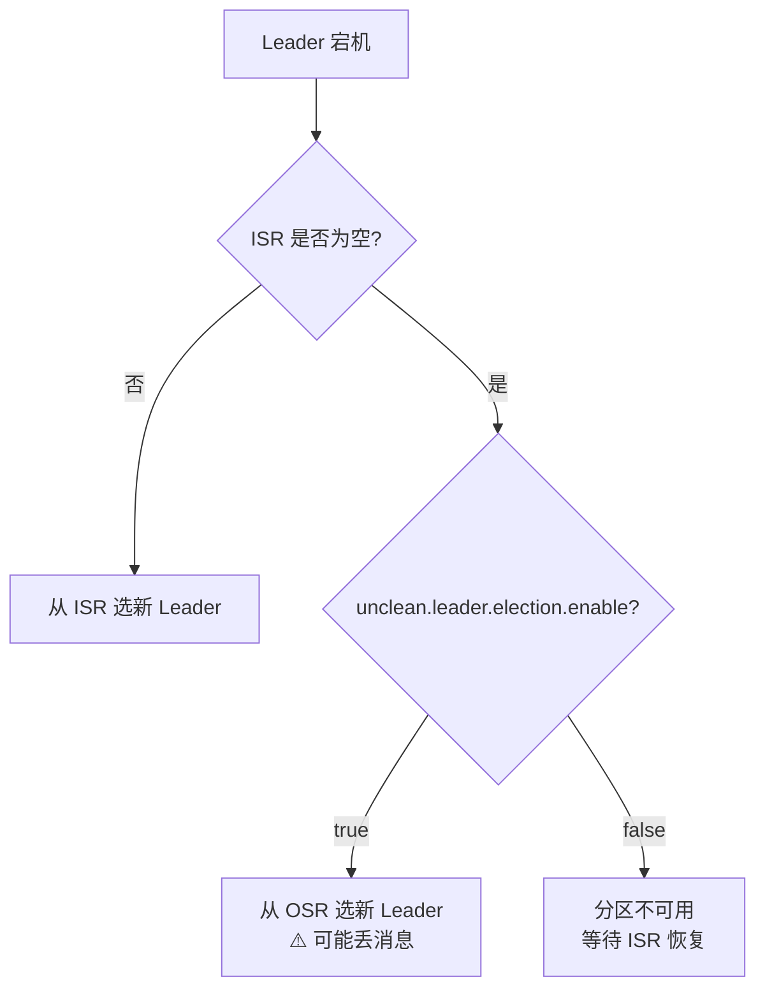
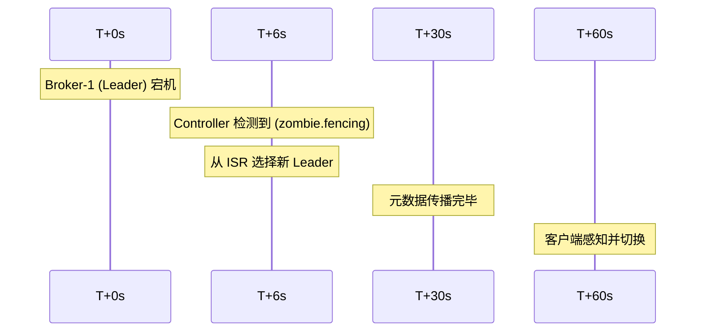

# Leader 选举与 ISR

## Kafka Controller

Controller 是 Kafka 集群的**大总管**，负责管理分区和副本的状态。



### Controller 的职责

| 职责 | 说明 |
|------|------|
| **Leader 选举** | 分区 Leader 宕机时选出新 Leader |
| **ISR 管理** | 维护 ISR 集合的伸缩 |
| **元数据广播** | 将分区状态变更通知给所有 Broker |
| **Broker 管理** | 监听 Broker 上下线 |
| **Topic 管理** | 创建/删除 Topic、分区 |

### Controller 选举

Controller 本身也是通过选主产生的：

```
1. 所有 Broker 启动时尝试在 ZooKeeper/KRaft 创建 /controller 节点
2. 第一个创建成功的成为 Controller
3. Controller 宕机后，其他 Broker 监听到 → 重新争抢 → 新的 Controller 诞生
```

::: info KRaft 模式
从 Kafka 3.3+ 开始，Controller 选举改用 KRaft（Raft 协议），不再依赖 ZooKeeper。
:::

## Leader 选举流程

当 Partition Leader 所在的 Broker 宕机时：



### 选举策略

| 策略 | 说明 |
|------|------|
| **优先副本** | 优先选择 AR 列表中的第一个 ISR 副本 |
| **ISR 优先** | 只在 ISR 中选择，OSR 不会成为 Leader |
| **Unclean 选举** | 允许 OSR 成为 Leader（开启 unclean.leader.election.enable） |



::: warning Unclean 选举
开启 `unclean.leader.election.enable=true` 可以保证可用性，但**可能丢失已写入 Leader 但未同步的消息**。高可靠场景建议关闭。
:::

## 优先副本与自动平衡

```bash
# 查看分区分布
kafka-topics.sh --bootstrap-server localhost:9092 \
    --describe --topic my-topic

# 自动平衡 Leader（让 Leader 均衡分布在所有 Broker）
# 配置: auto.leader.rebalance.enable=true
# 配置: leader.imbalance.check.interval.seconds=300
```

Kafka 定期检查 Leader 分布，如某个 Broker 承担了过多 Leader，会自动将部分 Leader 迁移到其他 Broker。

## 宕机恢复时间线



| 阶段 | 耗时 | 影响因素 |
|------|------|----------|
| 检测宕机 | `session.timeout.ms` (约6s) | ZK/KRaft 心跳 |
| 选新 Leader | 秒级 | ISR 数量 |
| 元数据传播 | 秒级-分钟级 | 集群规模 |
| 客户端感知 | `metadata.max.age.ms` (默认5min) | 客户端配置 |

::: tip 缩短恢复时间
- 降低 `session.timeout.ms`（不要过低，防止误判）
- 客户端设置 `metadata.max.age.ms` 为 60s (默认 5min 太长)
- 合理控制 ISR 数量（不要过多）
:::
