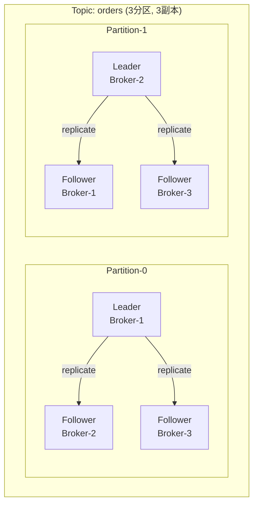
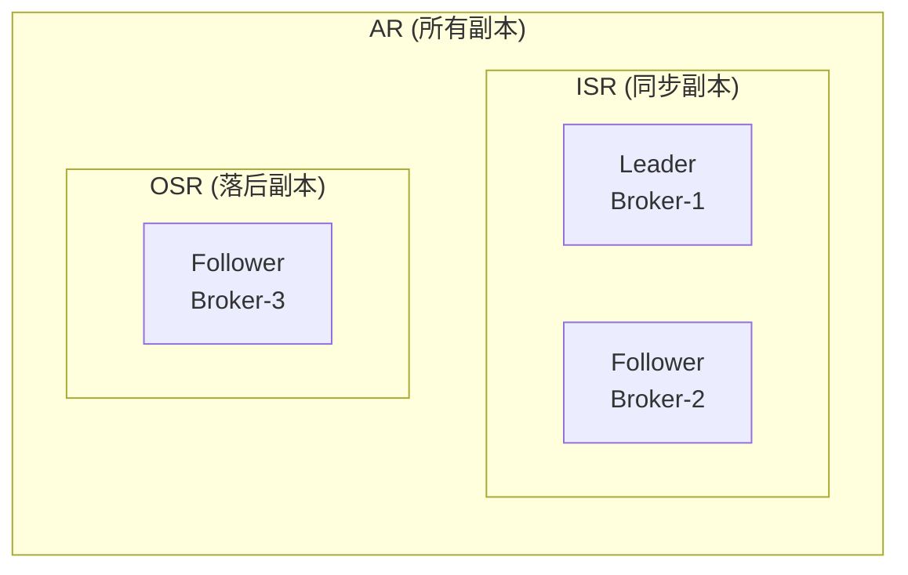
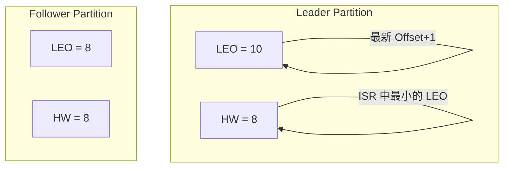
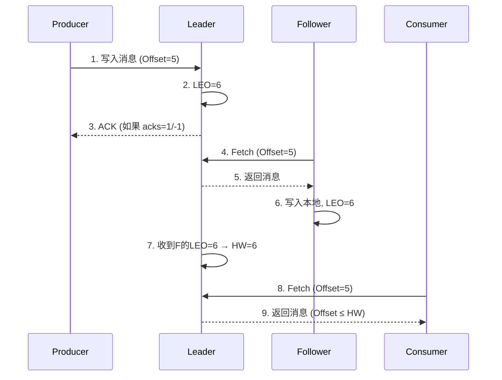

# Kafka 副本机制

## 为什么需要副本

单台 Broker 宕机会导致数据不可用。Kafka 通过**多副本**机制保证高可用。



## 核心概念

| 概念 | 说明 |
|------|------|
| **Replica** | 一个分区的拷贝，一个分区可以有多个 Replica |
| **Leader Replica** | 负责处理所有读写请求的副本 |
| **Follower Replica** | 被动从 Leader 同步数据的副本 |
| **ISR** | In-Sync Replica，与 Leader 保持同步的副本集合 |
| **AR** | Assigned Replica，该分区分配的所有副本 |
| **OSR** | Out-of-Sync Replica，落后于 Leader 的副本 |

```
AR = ISR + OSR
```

## ISR 机制



### ISR 伸缩

| 事件 | 操作 |
|------|------|
| Follower 在 `replica.lag.time.max.ms` (30s) 内同步 | 加入 ISR |
| Follower 落后超过 `replica.lag.time.max.ms` | 移出 ISR（进入 OSR） |
| Follower 追上 Leader 后 | 重新加入 ISR |

```bash
# 查看分区 ISR 状态
kafka-topics.sh --bootstrap-server localhost:9092 \
    --describe --topic my-topic

# 输出:
# Topic: my-topic  Partition: 0  Leader: 1  Replicas: 1,2,3  Isr: 1,2,3
```

## HW 与 LEO (水位线)



| 概念 | 全称 | 含义 | 作用 |
|------|------|------|------|
| **LEO** | Log End Offset | 日志末尾下一条消息的 Offset | 标识写入进度 |
| **HW** | High Watermark | ISR 中最小的 LEO | 消费者可见的最高的 Offset |

::: warning 重要
消费者**只能读到 HW 之前的消息**。HW 之后的消息对消费者不可见。
:::

## 数据同步流程



## 副本配置建议

| 场景 | 副本数 | ISR 最小 | min.insync.replicas |
|------|--------|----------|---------------------|
| 开发测试 | 1 | 1 | 1 |
| 一般生产 | 3 | 2 | 2 |
| 高可靠 | 3~5 | 2~3 | 2~3 |

```bash
# Broker 级别默认配置
default.replication.factor=3
min.insync.replicas=2

# Topic 级别覆盖
kafka-topics.sh --create \
    --topic critical-orders \
    --replication-factor 3 \
    --config min.insync.replicas=2
```

::: tip 
`replication.factor=N` 意味着可以容忍 **N-1** 个 Broker 宕机。

`min.insync.replicas=2` 配合 `acks=all` 时，至少 2 个 ISR 确认才算写入成功。
:::
