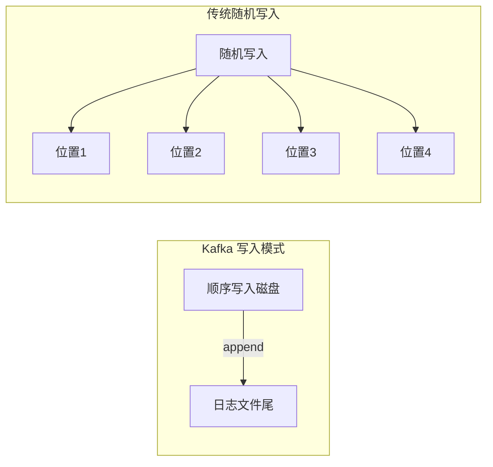
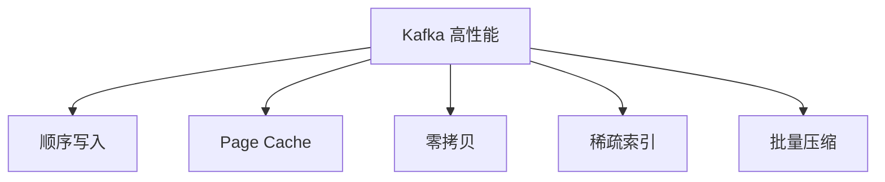
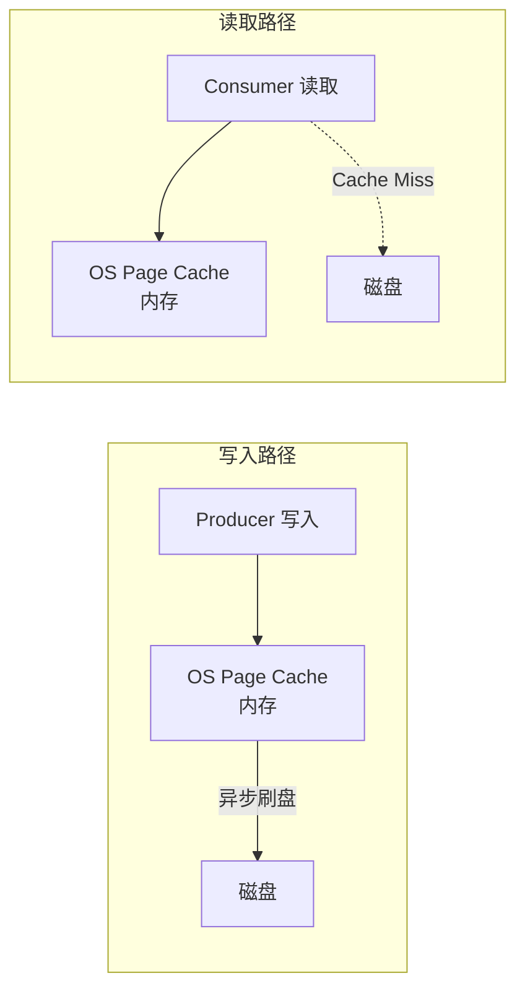

# Kafka 日志存储

## 为什么 Kafka 这么快

Kafka 写入磁盘可以达到 100万+ QPS，关键在于**顺序**二字。



| 对比 | 顺序写 | 随机写 |
|------|--------|--------|
| 硬盘 HDD | ~600 MB/s | ~100 KB/s |
| 硬盘 SSD | ~2000 MB/s | ~350 MB/s |
| 性能比 | **快数千倍** | - |

### 五大核心设计



## 1. 顺序写入 (Append-Only)

Kafka 的消息写入是**追加**（append）到日志文件末尾，不是修改/删除。

```
Partition 日志文件:
[msg-0][msg-1][msg-2][msg-3][msg-4]... ← 新消息追加在末尾
```

| 操作 | 实现方式 | 速度 |
|------|----------|------|
| 写消息 | 追加到文件末尾 | 极快 |
| 删除老消息 | 按时间/大小删除整个 Segment | 极快 |
| 读消息 | Offset → Index → Log 定位 | 极快 |

## 2. Page Cache (页缓存)

Kafka 重度依赖操作系统的 **Page Cache**（页缓存）。



- 数据先写入 Page Cache（内存），后续由 OS 异步刷盘到磁盘
- 消费者优先从 Page Cache 读取（热数据在内存）
- 充分利用操作系统对内存的管理能力

## 3. 零拷贝 (Zero-Copy)

传统数据传输需要 4 次拷贝 + 4 次上下文切换。

Kafka 使用 `sendfile()` 系统调用实现**零拷贝**：

```
传统方式:
  磁盘 → Read Buffer → 用户空间 Buffer → Socket Buffer → 网卡
  (4次 copy，2次 CPU copy，2次 DMA)

零拷贝 (sendfile):
  磁盘 → Read Buffer → Socket Buffer (直接) → 网卡
  (2次 copy，0次 CPU copy，2次 DMA)
```

```java
// Kafka 内部使用 FileChannel.transferTo() 实现零拷贝
// 将日志文件直接传输到 Socket
fileChannel.transferTo(position, count, socketChannel);
```

| 对比 | 传统方式 | 零拷贝 |
|------|----------|--------|
| CPU 拷贝次数 | 2 | 0 |
| CPU 使用率 | 高 | **极低** |
| 吞吐量 | 基准 | **提高 60%+** |

## 4. 稀疏索引

Kafka 使用**稀疏索引**（Sparse Index），而不是为每条消息建索引。

```
.index 文件格式:
[Offset=0, Position=0]
[Offset=100, Position=5120]
[Offset=200, Position=10240]
...

查找 Offset=150:
  1. 二分查找 .index → 最近的小于等于记录: [Offset=100, Position=5120]
  2. 从 Position=5120 开始顺序扫描 .log 文件
  3. 最多扫描 100 条（稀疏粒度）找到目标消息
```

| 索引类型 | 作用 |
|----------|------|
| `.index` | Offset → 文件位置 (Position) |
| `.timeindex` | 时间戳 → Offset |

## 5. 日志清理 (Log Cleanup)

Kafka 通过两种策略清理过期数据：

| 策略 | 参数 | 原理 |
|------|------|------|
| **时间删除** | `retention.ms` = 7天 | 超过时间的 Segment 直接删除 |
| **大小删除** | `retention.bytes` = 1GB | 超过大小的旧 Segment 删除 |
| **压缩** | `cleanup.policy` = compact | 保留每个 Key 的最新值 |

::: tip 最佳实践
- 给 Kafka 配**专用磁盘**（不要和其他服务混用）
- 分区数 × Segment 数不要过大（过多文件影响 IO）
- 监控 Page Cache 命中率
:::
