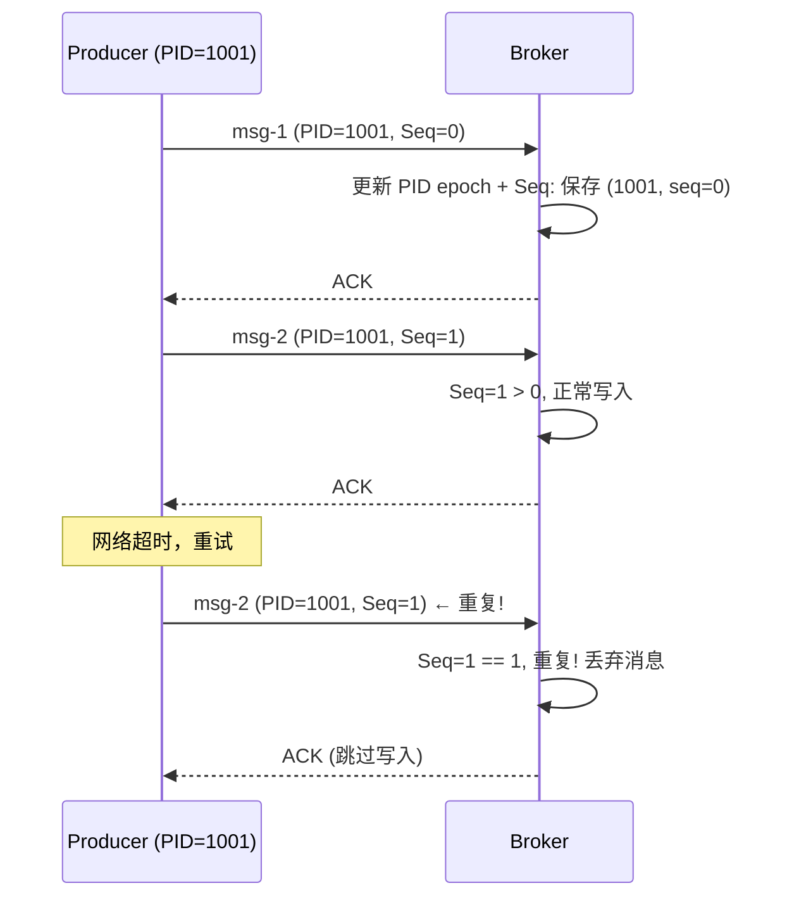
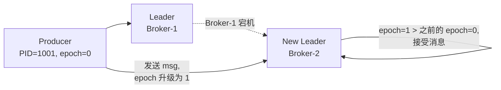
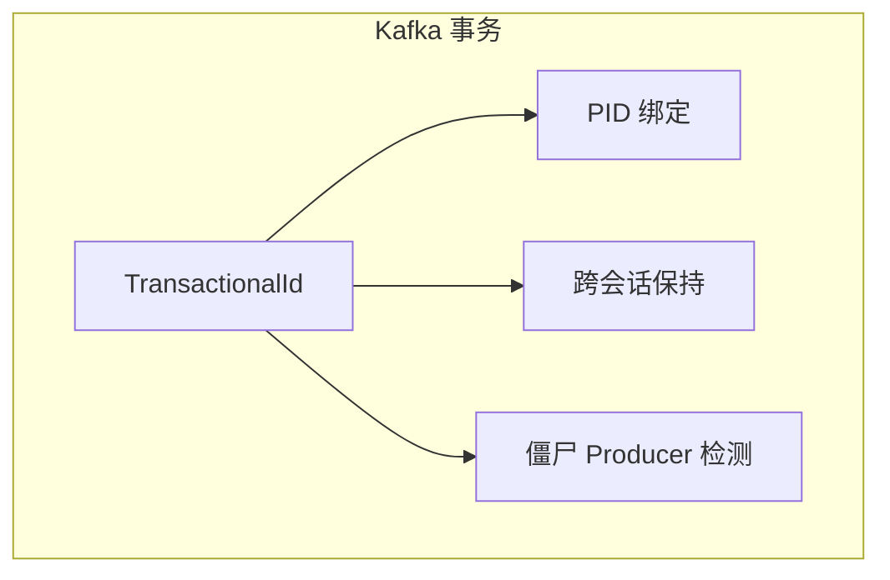

# Kafka 幂等性与事务

## 消息可靠性问题

分布式系统中，消息传递面临三个挑战：

| 问题 | 原因 | 影响 |
|------|------|------|
| **消息重复** | Producer 重试 + Broker 宕机 | 消费者收到重复消息 |
| **消息丢失** | Producer 配置不当 + 副本失效 | 消息永久丢失 |
| **消息乱序** | 重试机制 + 多分区 | 业务处理混乱 |

## 幂等性 (Idempotence)

### 工作原理



### 实现机制

```
Broker 为每个 <PID, Partition> 维护:
  - 最近 5 个 SequenceNumber (默认)
  - producer epoch (用于区分 Producer 重启)
```

当 Broker 检测到：
- `Seq < broker.seq + 1`：旧消息（已确认过），丢弃但返回 ACK
- `Seq > broker.seq + 1`：有消息丢失，抛出 `OutOfOrderSequenceException`
- `Seq == broker.seq + 1`：正常消息，写入

### 分区 Leader 切换时的幂等



Producer Epoch 保证即使 Leader 切换，旧 Leader 上的"幽灵" Producer 不能写入新消息。

## 事务 (Transactions)

### 事务三要素



### transactional.id 的作用

| 作用 | 说明 |
|------|------|
| **PID 绑定** | TransactionalId ↔ PID 持久化绑定 |
| **僵尸检测** | Producer 重启后 epoch 递增，旧 PID 写入被拒绝 |
| **未完成事务恢复** | Producer 重启时完成或回滚之前未完成的事务 |

### 完整流程

```java
// 1. 配置
Properties props = new Properties();
props.put("bootstrap.servers", "localhost:9092");
props.put("transactional.id", "my-tx-id");  // 关键：事务 ID
props.put("enable.idempotence", true);       // 自动设置为 true

// 2. 初始化
KafkaProducer<String, String> producer = new KafkaProducer<>(props);
producer.initTransactions();  // 分配到 TransactionCoordinator

// 3. 事务内操作
producer.beginTransaction();
try {
    producer.send(new ProducerRecord<>("topic-A", "key", "value-A"));
    producer.send(new ProducerRecord<>("topic-B", "key", "value-B"));

    // 事务内消费-处理-生产模式
    // Consumer<Offset> → Process → Producer
    
    producer.commitTransaction();
} catch (KafkaException e) {
    producer.abortTransaction();
}
```

### 消费者端事务

```java
// 事务消费者配置
Properties consumerProps = new Properties();
consumerProps.put("isolation.level", "read_committed");
// read_committed: 只读已提交的事务消息
// read_uncommitted: 读取所有消息（含未提交的）

// 与生产者在事务内配合：
// 1. Consumer 读取消息，提交 Offset
// 2. 业务处理
// 3. Producer 写入结果
// 4. 在一个事务中原子提交 Offset + 写入结果

producer.beginTransaction();
// 提交消费位移（作为事务的一部分）
producer.sendOffsetsToTransaction(consumerOffsets, consumerGroupId);
// 写入业务结果
producer.send(new ProducerRecord<>("output-topic", result));
// 原子提交
producer.commitTransaction();
```

## 幂等性 vs 事务 vs 普通

| 特性 | 普通 Producer | 幂等 Producer | 事务 Producer |
|------|--------------|--------------|--------------|
| 重复检测 | ❌ | ✅ 单分区 | ✅ 跨分区 |
| acks | 任意 | all (-1) | all (-1) |
| 重试安全 | ❌ | ✅ | ✅ |
| 原子性 | ❌ | ❌ | ✅ |
| 性能影响 | 基准 | ~5% | ~15% |
| 需要 transactional.id | ❌ | ❌ | ✅ |

## 性能优化建议

```java
// 1. 合理设置 transactional.timeout.ms (默认 60s)
props.put("transactional.timeout.ms", 30000);  // 不要太长

// 2. 事务不宜太大，控制在合理大小
// 坏: 100万条消息在一个事务中
// 好: 每次 100~1000 条

// 3. 避免事务中包含外部系统调用
producer.beginTransaction();
// ❌ httpClient.callExternalService(); // 外部调用可能超时
producer.send(new ProducerRecord<>("topic", "msg"));
producer.commitTransaction();
```

::: tip
Kafka 事务主要用于 **流处理中的 exactly-once** 场景（消费→处理→生产）。对于简单的消息发送，**幂等性已经足够**。
:::
