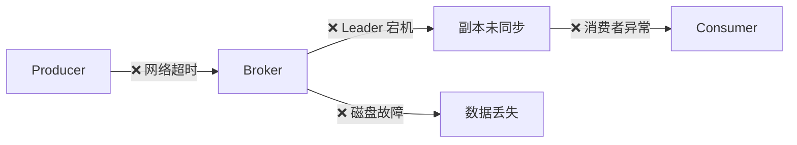
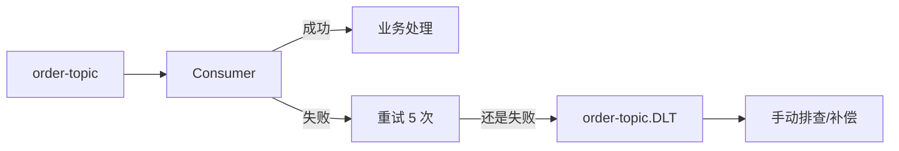

# 消息可靠性保障

消息可靠性是生产环境中最重要的课题。本章总结 6 种方案，从基础到高级，逐步提升可靠性。

## 消息丢失的场景



| 阶段 | 丢失原因 | 解决方案 |
|------|----------|----------|
| 生产者 | 发送失败后不重试 | 重试 + 幂等 |
| Broker | Leader 宕机，副本未同步 | `acks=all` + `min.insync.replicas≥2` |
| 消费者 | 先提交 Offset 后处理 → 处理失败 | 处理完再提交 |
| 磁盘 | 磁盘故障 | 多副本 + 异地容灾 |

## 方案 1：基础可靠性（At-Least-Once）

```java
// Producer
props.put("acks", "all");                       // 所有 ISR 确认
props.put("retries", Integer.MAX_VALUE);         // 无限重试
props.put("enable.idempotence", true);           // 幂等去重

// Consumer
props.put("enable.auto.commit", false);          // 关闭自动提交
// 处理完后手动提交: consumer.commitAsync();
```

::: tip
这是**基础防线**，应该成为默认配置。但仍可能丢失消息（如 Broker 全部宕机）。
:::

## 方案 2：副本 + ISR 强化

```bash
# Topic 创建时设置
kafka-topics.sh --create \
    --topic critical-topic \
    --partitions 3 \
    --replication-factor 3 \
    --config min.insync.replicas=2

# Broker 配置
default.replication.factor=3
min.insync.replicas=2
unclean.leader.election.enable=false   # 禁止 OSR 成为 Leader
```

| 配置 | 值 | 作用 |
|------|-----|------|
| `acks` | all (-1) | 所有 ISR 确认 |
| `min.insync.replicas` | 2 | 至少 2 个副本写入 |
| `replication.factor` | 3 | 共 3 个副本 |
| `unclean.leader.election.enable` | false | 不允许 OSR 当选 |

## 方案 3：失败消息补偿

```java
@Component
public class ReliableProducer {

    @Autowired
    private KafkaTemplate<String, String> kafkaTemplate;

    @Autowired
    private FailedMessageRepository failedRepo;  // 数据库/Redis

    public void sendReliable(String topic, String key, String value) {
        kafkaTemplate.send(topic, key, value)
            .thenAccept(result -> {
                log.info("发送成功: offset={}", 
                    result.getRecordMetadata().offset());
            })
            .exceptionally(ex -> {
                log.error("发送失败，保存到补偿表: {}", ex.getMessage());
                // 保存失败消息到数据库，后续定时任务重试
                failedRepo.save(new FailedMessage(topic, key, value, 
                    LocalDateTime.now(), 0));
                return null;
            });
    }
}
```

```java
// 定时补偿任务
@Scheduled(fixedDelay = 30000)  // 每 30 秒检查一次
public void retryFailedMessages() {
    List<FailedMessage> messages = failedRepo.findByRetryCountLessThan(5);
    for (FailedMessage msg : messages) {
        kafkaTemplate.send(msg.getTopic(), msg.getKey(), msg.getValue())
            .thenAccept(r -> failedRepo.delete(msg))
            .exceptionally(e -> {
                msg.setRetryCount(msg.getRetryCount() + 1);
                failedRepo.save(msg);
                return null;
            });
    }
}
```

## 方案 4：消费者重试 + 死信队列

```java
@Configuration
public class RetryConfig {

    @Bean
    public DefaultErrorHandler errorHandler(
            KafkaTemplate<String, String> kafkaTemplate) {
        
        // 死信发布器 → 失败消息发到 topic.DLT
        DeadLetterPublishingRecoverer recoverer = 
            new DeadLetterPublishingRecoverer(kafkaTemplate,
                (record, ex) -> new TopicPartition(
                    record.topic() + ".DLT", record.partition()));

        // 固定延迟重试: 3s * 5 次 = 15s 总重试时间
        DefaultErrorHandler handler = 
            new DefaultErrorHandler(recoverer, new FixedBackOff(3000L, 5));
        
        // 不重试的异常
        handler.addNotRetryableExceptions(
            IllegalArgumentException.class,
            JsonProcessingException.class);

        return handler;
    }
}
```



## 方案 5：事务机制（Exactly-Once）

```java
@Service
public class ExactlyOnceService {

    @Autowired
    private KafkaTemplate<String, String> kafkaTemplate;

    @Transactional
    public void processWithTransaction(String input, String output) {
        // DB 操作和 Kafka 发送在同一个事务中
        jdbcTemplate.update("UPDATE inventory SET stock = stock - 1 WHERE id = ?", 
            input);

        kafkaTemplate.send("order-confirmed", output);

        // 如果任一操作失败，全部回滚
    }
}
```

## 方案 6：多数据中心容灾

```
                     ┌─ Kafka Cluster DC-1 (上海) ─┐
Producer → MirrorMaker →                          Consumer
                     └─ Kafka Cluster DC-2 (北京) ─┘
```

```bash
# MirrorMaker 2.0 配置 — 跨集群复制
# connect-mirror-maker.properties
clusters = dc1, dc2
dc1.bootstrap.servers = kafka-dc1:9092
dc2.bootstrap.servers = kafka-dc2:9092

dc1->dc2.enabled = true
topics = critical-.*

# 启动
connect-mirror-maker connect-mirror-maker.properties
```

## 方案对比

| 方案 | 可靠性 | 复杂度 | 性能影响 | 适用场景 |
|------|--------|--------|----------|----------|
| 1. 基础配置 | ⭐⭐⭐ | 低 | ~5% | 普通业务 |
| 1+2. 副本强化 | ⭐⭐⭐⭐ | 低 | ~10% | 重要业务 |
| 1+2+3. 补偿 | ⭐⭐⭐⭐ | 中 | ~10% | 一般生产 |
| 1+2+3+4. 死信 | ⭐⭐⭐⭐⭐ | 中 | ~15% | 核心业务 |
| 1+2+3+4+5. 事务 | ⭐⭐⭐⭐⭐ | 高 | ~20% | 金融/订单 |
| 全部+6. 容灾 | ⭐⭐⭐⭐⭐⭐ | 极高 | ~25% | 极端场景 |

::: tip 选择建议
大多数生产环境使用 **方案 1+2+3+4** 即可达到 99.99% 可靠性。事务和异地容灾按需开启。
:::
