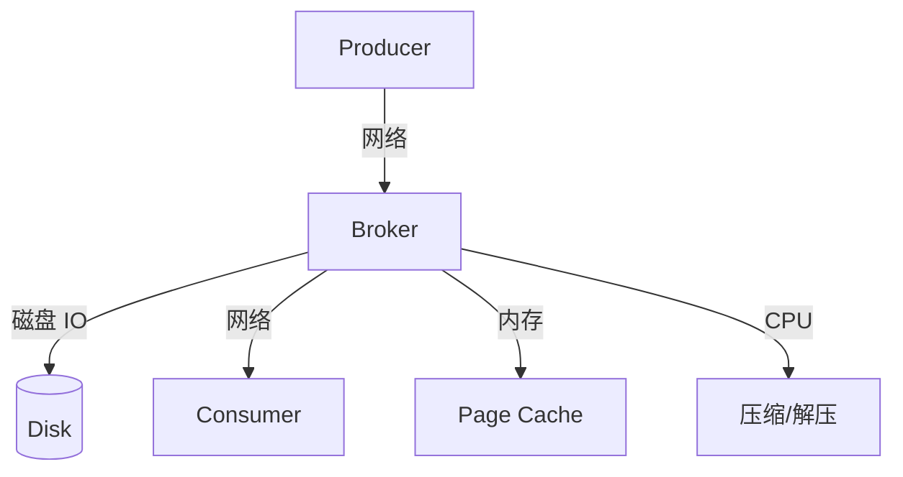

# Kafka 性能调优

Kafka 的性能调优涉及 OS、JVM、Broker 配置、Producer、Consumer 等多个层面。本章从实战角度总结关键调优点。

## 性能全景



## OS 层面调优

### 文件系统

```bash
# 1. 使用 XFS 或 ext4 文件系统
mkfs.xfs /dev/sdb

# 2. 挂载时使用 noatime (不记录访问时间) 
mount -o noatime /dev/sdb /data/kafka

# 3. 增大文件描述符限制
# /etc/security/limits.conf
kafka  soft  nofile  100000
kafka  hard  nofile  100000
```

### 磁盘调度器

```bash
# 将磁盘调度器改为 deadline 或 noop (SSD 推荐 noop)
echo deadline > /sys/block/sdb/queue/scheduler
echo noop > /sys/block/nvme0n1/queue/scheduler
```

### 网络调优

```bash
# /etc/sysctl.conf
net.core.rmem_default = 1048576
net.core.wmem_default = 1048576
net.core.rmem_max = 16777216
net.core.wmem_max = 16777216
net.ipv4.tcp_wmem = 4096 65536 16777216
net.ipv4.tcp_rmem = 4096 65536 16777216
```

### Swap

```bash
# 减少 swap 倾向 (Kafka 依赖 Page Cache)
echo 1 > /proc/sys/vm/swappiness
# 或完全禁用 swap（如果内存足够）
swapoff -a
```

## JVM 调优

```bash
# kafka-server-start.sh / kafka-run-class.sh
export KAFKA_HEAP_OPTS="-Xms6g -Xmx6g"        # 堆内存 6GB
export KAFKA_JVM_PERFORMANCE_OPTS="
    -server
    -XX:+UseG1GC                                # G1 垃圾回收器 (推荐)
    -XX:MaxGCPauseMillis=20                     # GC 暂停最多 20ms
    -XX:InitiatingHeapOccupancyPercent=35       # G1 并发标记阈值
    -XX:+DisableExplicitGC                      # 禁止代码触发 GC
    -XX:+AlwaysPreTouch                         # 启动时预分配内存
    -Djava.awt.headless=true"
```

## Broker 层面调优

```properties
# server.properties 关键配置

# === 网络 ===
num.network.threads=8                  # 网络线程数 (CPU核数)
num.io.threads=16                      # IO 线程数 (CPU核数*2)
socket.send.buffer.bytes=1048576       # Socket 发送缓冲 1MB
socket.receive.buffer.bytes=1048576    # Socket 接收缓冲 1MB
socket.request.max.bytes=104857600     # 最大请求 100MB

# === 日志存储 ===
log.dirs=/data1/kafka,/data2/kafka     # 多磁盘目录
num.partitions=24                       # 默认分区数
log.segment.bytes=1073741824           # Segment 大小 1GB
log.retention.hours=168                # 保留 7 天
log.retention.check.interval.ms=300000 # 5 分钟检查一次

# === 副本 ===
num.replica.fetchers=8                 # 副本拉取线程数
replica.fetch.max.bytes=10485760       # 单次拉取最大 10MB
replica.fetch.wait.max.ms=500          # 拉取等待时间

# === Page Cache ===
# Kafka 自动管理，留足够内存给 OS 即可
# 建议: JVM 堆 < 系统内存的 50%，剩余给 Page Cache
```

## Producer 调优

```java
Properties props = new Properties();

// === 批量 ===
props.put("batch.size", 32768);          // 32KB 批次
props.put("linger.ms", 10);              // 等待 10ms 凑批

// === 压缩 ===
props.put("compression.type", "lz4");    // lz4 性价比最优

// === 缓冲区 ===
props.put("buffer.memory", 67108864);    // 64MB
props.put("max.block.ms", 60000);        // 缓冲区满等待 60s

// === 重试 ===
props.put("retries", Integer.MAX_VALUE); // 无限重试
props.put("delivery.timeout.ms", 120000);// 整体投递超时 2min
props.put("request.timeout.ms", 30000);  // 单次请求超时 30s

// === 并发 ===
props.put("max.in.flight.requests.per.connection", 5);
```

### 调优策略

| 目标 | 策略 |
|------|------|
| 提高吞吐 | 增大 `batch.size`、`linger.ms`、`buffer.memory` |
| 降低延迟 | 减小 `batch.size`、`linger.ms=0` |
| 平衡 | `batch.size=32KB`、`linger.ms=5~20`、`compression=lz4` |

## Consumer 调优

```java
Properties props = new Properties();

// === 拉取 ===
props.put("fetch.min.bytes", 10240);      // 最少 10KB (提高吞吐)
props.put("fetch.max.wait.ms", 500);      // 最多等 500ms
props.put("max.partition.fetch.bytes", 1048576); // 1MB
props.put("max.poll.records", 500);       // 单次最多 500 条

// === 心跳 ===
props.put("session.timeout.ms", 45000);   // 心跳超时
props.put("heartbeat.interval.ms", 3000); // 心跳间隔
props.put("max.poll.interval.ms", 300000); // 处理超时 5min

// === Offset ===
props.put("enable.auto.commit", false);   // 手动提交
```

### 消费并行度

```java
// Spring Kafka 并发消费者
@Configuration
public class ConsumerConfig {
    @Bean
    public ConcurrentKafkaListenerContainerFactory<String, String> factory() {
        ConcurrentKafkaListenerContainerFactory<String, String> factory =
            new ConcurrentKafkaListenerContainerFactory<>();
        factory.setConsumerFactory(consumerFactory());
        factory.setConcurrency(6);  // 6 个消费线程
        factory.setBatchListener(true);  // 批量消费
        return factory;
    }
}
```

::: tip
并发数 ≤ 分区数。多余线程不消费数据，白白占用资源。
:::

## 监控指标

| 指标 | 含义 | 告警阈值 |
|------|------|----------|
| `records-lag` | 消费积压 | > 10000 或持续增长 |
| `records-lag-max` | 最大积压 | > 50000 |
| `bytes-in-per-sec` | 入站流量 | Broker 上限 80% |
| `bytes-out-per-sec` | 出站流量 | Broker 上限 80% |
| `request-latency-avg` | 平均延迟 | > 10ms |
| `request-latency-99th` | P99 延迟 | > 50ms |
| `active-connections` | 活跃连接数 | 突然下降 |
| `under-replicated-partitions` | 未完全副本分区 | > 0 持续超过 1min |

## 压测验证

```bash
# 生产者压测
kafka-producer-perf-test \
    --topic perf-test \
    --num-records 10000000 \
    --record-size 1024 \
    --throughput -1 \
    --producer-props \
        bootstrap.servers=localhost:9092 \
        acks=1 \
        compression.type=lz4 \
        batch.size=32768 \
        linger.ms=10

# 检查结果:
# 目标: ≥ 100000 records/sec, P99 < 10ms
```

## 调优总结

| 层面 | 关键操作 | 收益 |
|------|----------|------|
| OS | noatime 挂载、文件描述符、网络 buffer | 基础性能提升 20%+ |
| JVM | G1GC、堆内存 6GB+ | GC 暂停 < 20ms |
| Broker | 多磁盘、网络/IO 线程数匹配 CPU | 吞吐量线性扩展 |
| Producer | 批量+压缩+异步 | 吞吐提升 3~5 倍 |
| Consumer | 并发消费+批量拉取 | 消费速度提升 N 倍 |
