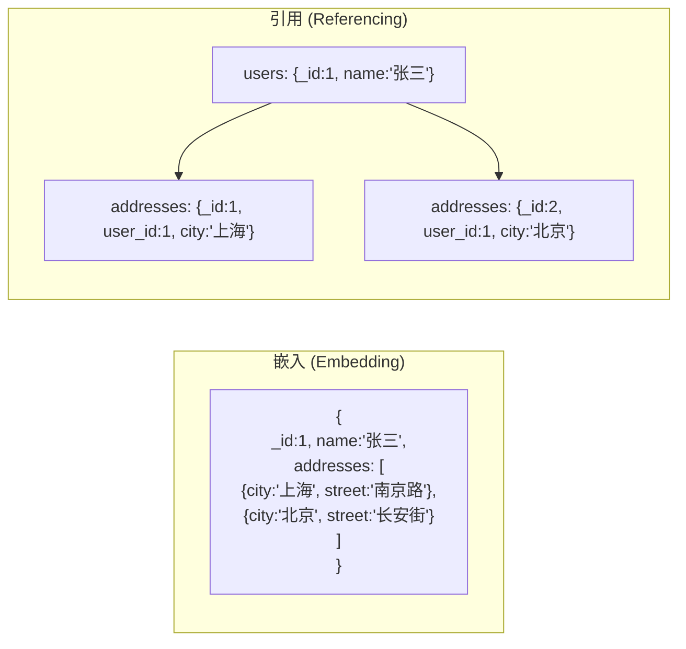

# MongoDB 数据模型设计

MongoDB 的 Schema 设计是影响性能和可维护性的最关键因素。

## 文档模型核心原则

### 嵌入 vs 引用



| 策略 | 优点 | 缺点 | 适用场景 |
|------|------|------|----------|
| **嵌入** | 单次查询、原子操作 | 文档过大、数据冗余 | 包含关系、一起读的数据 |
| **引用** | 灵活、无冗余 | 需要 `$lookup` 或多次查询 | 独立实体、M:N 关系 |

## 一对一关系

**推荐嵌入：**

```json
// users collection
{
  "_id": 1,
  "name": "张三",
  "profile": {
    "avatar": "https://cdn.example.com/avatar.jpg",
    "bio": "软件工程师",
    "socialLinks": ["github.com/zhangsan"]
  }
}
```

## 一对多关系

### 少量关联 (< 几十条) → 嵌入

```json
// users collection
{
  "_id": 1,
  "name": "张三",
  "addresses": [
    { "type": "home", "city": "上海", "detail": "南京路 100 号" },
    { "type": "work", "city": "北京", "detail": "长安街 200 号" }
  ]
}
```

### 大量关联 (> 几百条) → 引用

```json
// users collection
{ "_id": 1, "name": "张三" }

// orders collection
{ "_id": 101, "user_id": 1, "total": 99.9 }
{ "_id": 102, "user_id": 1, "total": 199.9 }
// ... 可能的成千上万条订单
```

::: danger 文档大小限制
单个 MongoDB 文档最大 **16MB**。超过这个限制必须拆分或使用 GridFS。
:::

## 多对多关系

```json
// 学生与课程的多对多关系

// students collection
{
  "_id": 1,
  "name": "张三",
  "course_ids": [101, 102, 103]   // 引用方式
}

// courses collection
{
  "_id": 101,
  "name": "数据库原理",
  "student_ids": [1, 2, 3, 4, 5]
}
```

```java
// 查询学生的所有课程 (需要 $lookup)
db.students.aggregate([
  { $match: { _id: 1 } },
  { $lookup: {
      from: "courses",
      localField: "course_ids",
      foreignField: "_id",
      as: "courses"
  }}
])
```

## 树形结构

### 物化路径（Materialized Path）

```json
// categories collection
{ "_id": 1, "name": "电子产品", "path": ",1," }
{ "_id": 2, "name": "手机", "path": ",1,2," }
{ "_id": 3, "name": "电脑", "path": ",1,3," }
{ "_id": 4, "name": "iPhone", "path": ",1,2,4," }

// 查询"电子产品"下的所有子类
db.categories.find({ "path": /^,1,/ })
```

| 树形策略 | 查询子树 | 查询父节点 | 移动节点 |
|-----------|----------|-----------|----------|
| 物化路径 | 快（正则） | 快 | 慢（批量更新） |
| Parent 引用 | 快 | 快 | 只需改一个文档 |
| Child 引用 | 快 | 慢 | 中等 |
| Nested Set | 快 | 快 | 很慢 |

## Schema 设计最佳实践

| 实践 | 说明 |
|------|------|
| **一起访问的放一起** | 业务查询主导 Schema 设计 |
| **考虑读写比** | 读多写少 → 嵌入；写多读少 → 引用 |
| **避免超大文档** | 超过 10MB 考虑拆分 |
| **避免无限增长数组** | 使用引用或桶模式 |
| **字段名尽量短** | 字段名会存储在每个文档中 |
| **善用索引** | 为常用查询创建索引 |

## 常见设计模式

| 模式 | 说明 | 示例 |
|------|------|------|
| **桶模式** | 按时间/范围分桶 | IoT 每小时一个文档 |
| **子集模式** | 热/冷数据分离 | 列表页只加载摘要字段 |
| **计算模式** | 预计算结果 | 文章的阅读量/点赞数 |
| **多态模式** | 同一集合存多种类型 | 不同产品类型同一集合 |
| **版本模式** | 文档携带版本号 | 增量更新和冲突解决 |

::: tip
MongoDB 的 Schema 设计是**查询优先**的。先确定你的查询模式，再反推数据结构。
:::
