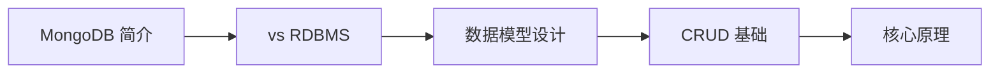

# MongoDB 基础知识概述

欢迎来到 MongoDB 基础知识章节。MongoDB 是最流行的 NoSQL 文档数据库，以灵活的文档模型和强大的扩展能力著称。

## 学习路线

## 章节介绍

| 章节 | 内容 | 目标 |
|------|------|------|
| MongoDB 简介 | 什么是 MongoDB、核心特性、应用场景 | 建立宏观认识 |
| MongoDB vs RDBMS | 文档模型 vs 关系模型、适用场景对比 | 理解何时用 MongoDB |
| 数据模型设计 | 嵌入 vs 引用、Schema 设计原则 | 掌握文档建模方法 |
| CRUD 基础 | 增删改查、查询操作符、聚合初步 | 上手基础操作 |

## 前置知识

- JSON 数据格式基础
- 数据库基本概念
- Java 编程基础（Spring Data 部分）
