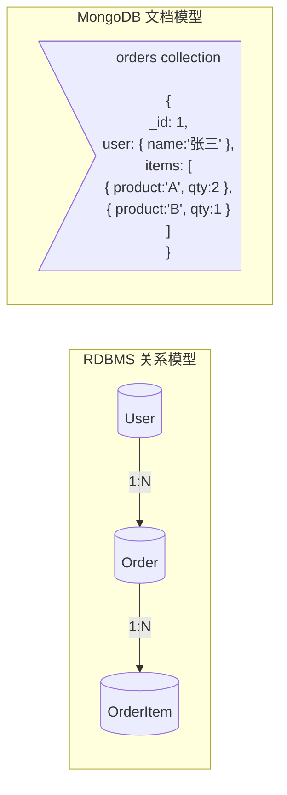
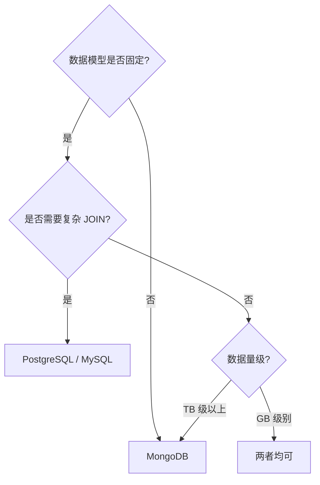

# MongoDB vs RDBMS

## 数据模型对比



RDBMS 需要 3 张表 + JOIN，MongoDB 一个文档搞定。

## 详细对比

| 维度 | RDBMS | MongoDB |
|------|-------|---------|
| **数据模型** | 表 + 行 + 列 | 集合 + 文档 + 字段 |
| **Schema** | 预定义，严格 | 动态，灵活 |
| **关系** | JOIN (外键) | 嵌入文档 或 `$lookup` |
| **事务** | 天然支持，成熟 | 4.0+ 多文档事务 |
| **扩展** | 垂直扩展为主 | 水平扩展 (分片) |
| **查询语言** | SQL | MQL (MongoDB Query Language) |
| **性能** | JOIN 开销大 | 嵌入文档单次查询 |
| **一致性** | 强一致 | 可配置（最终/强一致） |
| **存储空间** | 紧凑 | 冗余较大（字段名重复） |

## 查询对比

```
RDBMS (SQL):
SELECT u.name, o.total, oi.product
FROM users u
JOIN orders o ON u.id = o.user_id
JOIN order_items oi ON o.id = oi.order_id
WHERE u.id = 123;

MongoDB (嵌入模型):
db.orders.findOne(
  { "user.id": 123 },
  { "user.name": 1, "total": 1, "items.product": 1 }
)
// 单次查询，无 JOIN！
```

## 何时用 MongoDB

| 适合 | 不适合 |
|------|--------|
| 灵活/变化的 Schema | 严格的表格结构 |
| 嵌套/层次化数据 | 大量多表关联 |
| 高写入吞吐量 | 复杂事务（虽然支持但并非最强） |
| 快速原型开发 | 严格数据一致性要求 |
| JSON/BSON 原生数据 | 传统的报表/BI 系统 |
| 水平扩展需求 | 单机即足够的场景 |
| 日志/事件存储 | 银行核心账务系统 |

## 实际选型建议



::: tip 混合架构
许多互联网公司采用**混合持久化**：MySQL 存核心业务，MongoDB 存用户画像/内容数据，Redis 做缓存。数据库选型不是非此即彼。
:::
