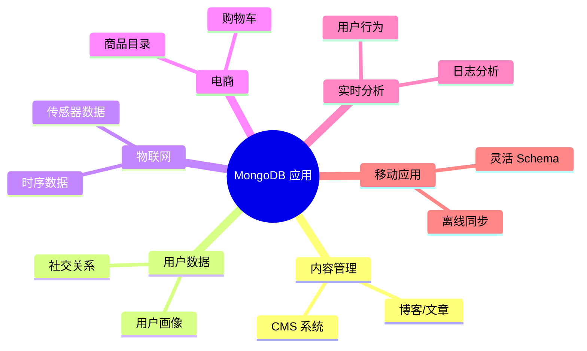

# MongoDB 简介

## 什么是 MongoDB

MongoDB 是一个**面向文档（Document-Oriented）的 NoSQL 数据库**，由 MongoDB Inc. 开发。

- 数据以 **BSON**（Binary JSON）格式存储
- 使用**集合（Collection）**和**文档（Document）**替代表（Table）和行（Row）
- 动态 Schema，无需预定义表结构

```json
// 一个 MongoDB 文档示例
{
  "_id": ObjectId("507f1f77bcf86cd799439011"),
  "name": "张三",
  "email": "zhangsan@example.com",
  "age": 28,
  "hobbies": ["编程", "摄影"],
  "address": {
    "city": "上海",
    "street": "南京路 100 号"
  },
  "createdAt": ISODate("2025-01-15T08:00:00Z")
}
```

## 核心特性

| 特性 | 说明 |
|------|------|
| **文档模型** | JSON/BSON 格式，天然支持嵌套结构和数组 |
| **动态 Schema** | 同一集合中的文档可以有不同的字段 |
| **水平扩展** | 通过分片（Sharding）实现 TB/PB 级扩展 |
| **高可用** | 副本集（Replica Set）自动故障转移 |
| **丰富的查询** | 支持嵌套查询、数组查询、全文搜索、地理空间查询 |
| **聚合管道** | 多阶段数据处理，类似 Unix pipeline |
| **事务** | 4.0+ 支持多文档 ACID 事务 |
| **GridFS** | 内置文件存储系统（用于大文件） |

## 应用场景



## MongoDB vs 其他 NoSQL

| 类型 | 代表 | 数据模型 | MongoDB 不同点 |
|------|------|----------|---------------|
| 文档型 | MongoDB, CouchDB | JSON/BSON | 查询最丰富、生态最大 |
| 键值型 | Redis, DynamoDB | K-V | MongoDB 支持复杂查询 |
| 列族型 | Cassandra, HBase | 列族 | MongoDB 更灵活 |
| 图数据库 | Neo4j | 节点+边 | MongoDB 更适合通用场景 |

## 核心概念对应表

| RDBMS | MongoDB | 说明 |
|-------|---------|------|
| Database | Database | 数据库 |
| Table | **Collection** | 集合（表） |
| Row | **Document** | 文档（行） |
| Column | **Field** | 字段（列） |
| Primary Key | **_id** | 主键（默认 ObjectId） |
| Join | `$lookup` / 嵌入 | 关联查询 |
| Transaction | Transaction (4.0+) | 事务 |

## ObjectId

MongoDB 的默认主键是 12 字节的 ObjectId：

```
507f1f77bcf86cd799439011
│        │      │     │
│        │      │     └─ 3字节: 计数器 (随机初始值)
│        │      └─────── 2字节: 进程标识
│        └────────────── 3字节: 机器标识
└─────────────────────── 4字节: Unix 时间戳

优点: 分布式唯一、自带时间戳、无需自增锁
```

::: tip
MongoDB 的文档模型对于**层次化、非结构化数据**非常自然，避免了关系数据库的 JOIN 和多表关联。
:::
