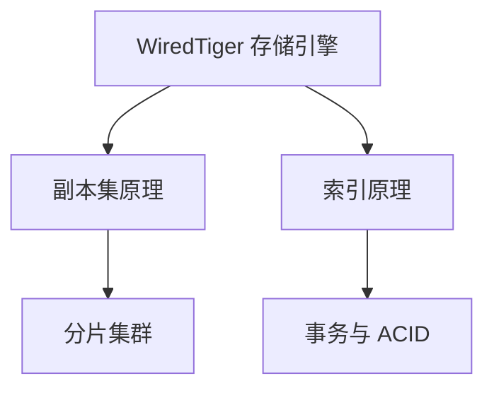

# MongoDB 核心原理概述

本章节深入 MongoDB 内部机制，理解其高性能、高可用的设计精髓。

## 学习路线

## 各模块要点

| 模块 | 核心问题 | 学完你将理解 |
|------|----------|-------------|
| WiredTiger | MongoDB 如何管理磁盘数据？ | 压缩、Checkpoint、Cache 淘汰 |
| 副本集 | 如何实现高可用？ | Raft 选举、Oplog 同步、读写关注 |
| 分片集群 | 如何横向扩展？ | Chunk 分裂、Balancer、片键选择 |
| 索引原理 | 查询如何加速？ | B-Tree、复合索引、ESR 原则 |
| 事务 | 如何保证数据一致性？ | 两阶段提交、Snapshot 隔离、WiredTiger 事务 |
