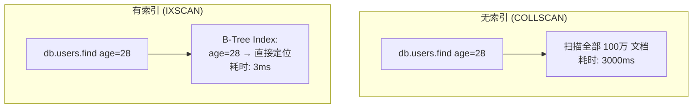

# MongoDB 索引原理

## 索引本质

MongoDB 索引与关系数据库类似，都是**用空间换时间**的 B-Tree 结构。



## 索引类型

### 单字段索引

```javascript
// 创建
db.users.createIndex({ age: 1 })       // 1 = 升序

// 查询会使用索引
db.users.find({ age: 28 })
db.users.find({ age: { $gte: 25 } })   // 范围查询也走索引
db.users.find().sort({ age: -1 })      // 排序也走索引
```

### 复合索引

```javascript
// 创建复合索引
db.orders.createIndex({ userId: 1, status: 1, createTime: -1 })

// ✅ 能用索引 (前缀匹配)
db.orders.find({ userId: 123 })
db.orders.find({ userId: 123, status: "pending" })
db.orders.find({ userId: 123, status: "pending", createTime: { $gte: ... } })

// ❌ 不能用索引 (跳过了前导字段)
db.orders.find({ status: "pending" })
db.orders.find({ createTime: { $gte: ... } })
```

### ESR 原则


```javascript
// 查询: find({ city: "上海", status: "active" }).sort({ createTime: -1 })
//                           ─────────────────    ────────
//                               等值 (E)          排序 (S)

// ✅ 正确: { city: 1, status: 1, createTime: -1 }
//                        E         S

// ❌ 错误: { createTime: -1, city: 1, status: 1 }
//              R 在前, E 在后 → 索引不高效
```

### 多键索引

自动为数组字段的每个元素创建索引条目：

```javascript
// 集合数据
{ _id: 1, tags: ["Java", "MongoDB"] }

// 创建索引
db.articles.createIndex({ tags: 1 })

// 查询 — 自动使用多键索引
db.articles.find({ tags: "Java" })
// 内部: tags 数组的每个元素都在索引树中
```

::: warning 多键索引限制
- 一个复合索引最多只能包含一个数组字段
- 数组字段的全量索引可能会很大
:::

### 文本索引

```javascript
// 创建文本索引
db.articles.createIndex({ title: "text", content: "text" })

// 全文搜索
db.articles.find({ $text: { $search: "MongoDB 索引优化" } })

// 按相关性排序
db.articles.find(
  { $text: { $search: "MongoDB" } },
  { score: { $meta: "textScore" } }
).sort({ score: { $meta: "textScore" } })
```

### TTL 索引

自动删除过期数据：

```javascript
// 30 秒后自动删除
db.sessions.createIndex({ createdAt: 1 }, { expireAfterSeconds: 30 })

// 常用于: 会话数据、验证码、临时缓存
```

## 索引分析

```javascript
// 1. 查看查询执行计划
db.users.find({ age: 28 }).explain("executionStats")

// 关键指标:
{
  "executionStats": {
    "executionTimeMillis": 3,        // 执行耗时 ms
    "totalDocsExamined": 1,          // 扫描的文档数
    "totalKeysExamined": 1,          // 扫描的索引条目数
    "executionStages": {
      "stage": "IXSCAN",             // IXSCAN = 使用索引, COLLSCAN = 全表扫描
      "indexName": "age_1"
    }
  }
}
```

### 性能诊断

```javascript
// 2. 查看慢查询 (>= 100ms)
db.setProfilingLevel(1, { slowms: 100 })
db.system.profile.find().sort({ ts: -1 }).limit(5)

// 3. 查看索引使用情况
db.users.aggregate([{ $indexStats: {} }])
```

## 索引注意事项

| 注意点 | 说明 |
|--------|------|
| **索引选择性** | 字段唯一值越多，索引越高效 |
| **覆盖查询** | `projection` 字段全在索引中 → 不读文档，直接返回 |
| **不能太多** | 每个索引消耗内存和写入时间，一般 ≤ 5 个 |
| **后台创建** | 生产环境用 `{ background: true }` |
| **索引交集** | MongoDB 可以同时使用多个索引取交集 |
| **排序内存限制** | 排序内存超过 32MB 需要索引支持 |

## 常用命令

```javascript
// 查看集合所有索引
db.users.getIndexes()

// 删除索引
db.users.dropIndex("age_1")
db.users.dropIndexes()              // 删除所有 (保留 _id)

// 隐藏索引 (不删除, 评估效果)
db.users.hideIndex("age_1")
db.users.unhideIndex("age_1")
```

::: tip
MongoDB 的索引设计可以借助 **Atlas 的 Performance Advisor** 或手动 analyze `explain("executionStats")`。
:::
