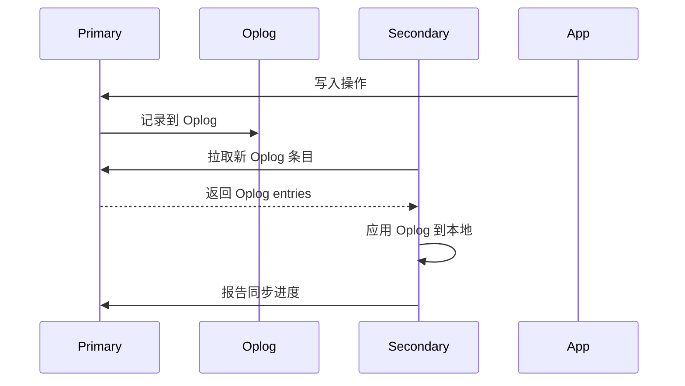
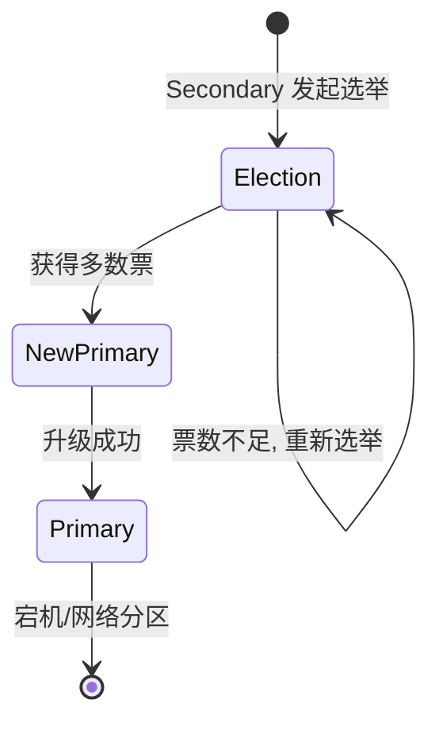

# MongoDB 副本集

## 副本集架构

```mermaid
flowchart TD
    subgraph "Replica Set"
        P[Primary<br/>读写] -->|"异步复制<br/>(Oplog)"| S1[Secondary]
        P -->|"异步复制"| S2[Secondary]
        Arbiter[Arbiter<br/>投票权]
    end

    App[应用程序] -->|写| P
    App -->|读 (可选)| S1
    App -->|读 (可选)| S2
```

| 角色 | 职责 | 数据存储 |
|------|------|----------|
| **Primary** | 处理所有写入 | 是 |
| **Secondary** | 备份 + 分担读请求 | 是 |
| **Arbiter** | 仅参与选举投票 | 否 |

## Oplog (操作日志)

Oplog 是副本集同步的核心：

```javascript
// Oplog 是一个特殊的 Capped Collection
// 存在于 local 数据库中
use local
db.oplog.rs.find().sort({$natural: -1}).limit(1)

// 示例 Oplog 条目:
{
  "ts": Timestamp(1720000000, 1),  // 操作时间戳
  "op": "i",                       // i=insert, u=update, d=delete
  "ns": "mydb.users",              // 命名空间
  "o": {                           // 操作内容
    "_id": 1,
    "name": "张三",
    "age": 28
  }
}
```



## 自动故障转移 (Raft 协议)



### 选举过程

```
1. Primary 心跳超时 (默认 10 秒)
2. 优先级最高的 Secondary 发起选举
3. 获得 N/2+1 票 → 成为新 Primary (最多 5 秒)
4. 新 Primary 同步所有 Secondary 到最新状态
5. 恢复服务
```

### 选举优先级配置

```javascript
// 设置优先级 (高优先级的更容易当选)
cfg = rs.conf()
cfg.members[0].priority = 2      // 更适合当选
cfg.members[1].priority = 1      // 默认
cfg.members[2].priority = 0.5    // 不太适合
cfg.members[3].priority = 0      // 不参与选举 (如 Arbiter)
rs.reconfig(cfg)
```

## 读写关注 (Read/Write Concern)

### Write Concern

```javascript
// { w: <value>, j: <boolean>, wtimeout: <ms> }

// w: 0 → 不等待确认 (最快, 可能丢数据)
db.orders.insertOne({...}, { writeConcern: { w: 0 } })

// w: 1 → Primary 确认 (默认)
db.orders.insertOne({...}, { writeConcern: { w: 1 } })

// w: "majority" → 多数节点确认 (推荐)
db.orders.insertOne({...}, { writeConcern: { w: "majority" } })

// j: true → 写入 Journal 后才确认
db.orders.insertOne({...}, { writeConcern: { w: "majority", j: true } })
```

### Read Concern

```javascript
// local: 读最新数据 (可能读到未复制确认的数据, 默认)
db.orders.find().readConcern("local")

// majority: 只读已复制到多数节点的数据 (防止脏读)
db.orders.find().readConcern("majority")

// linearizable: 线性读 (最强, 保证读到最新的)
db.orders.find().readConcern("linearizable")
```

### Read Preference (读偏好)

```javascript
// primary: 只读 Primary (默认)
db.orders.find().readPref("primary")

// primaryPreferred: 优先 Primary, 不可用时读 Secondary
db.orders.find().readPref("primaryPreferred")

// secondary: 只读 Secondary
db.orders.find().readPref("secondary")

// nearest: 读延迟最低的节点
db.orders.find().readPref("nearest")
```

## 生产建议

| 配置 | 建议值 | 原因 |
|------|--------|------|
| 副本集节点数 | 3 (或 5) | 奇数, 保证多数投票 |
| Oplog 大小 | 磁盘的 5% | 容错 Secondary 落后 |
| heartbeatInterval | 2s | 更快检测故障 |
| electionTimeout | 10s | 平衡故障检测与误判 |
| Write Concern | majority | 防止 Rollback |
