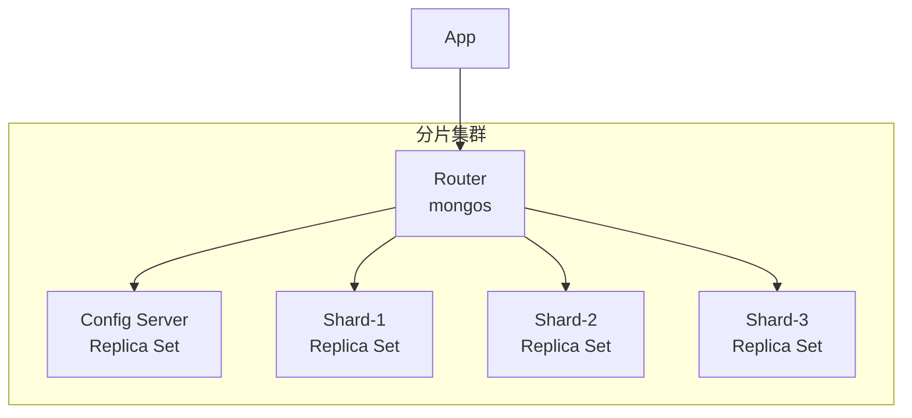
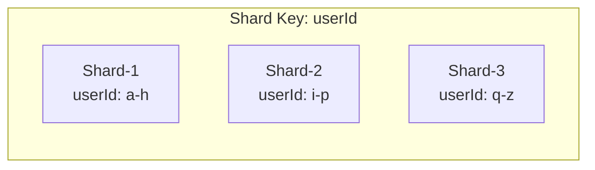
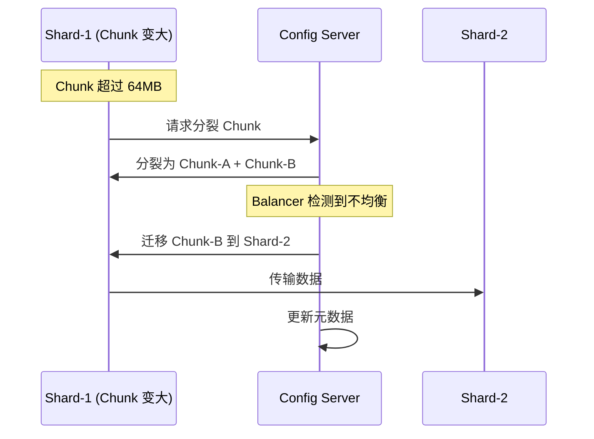
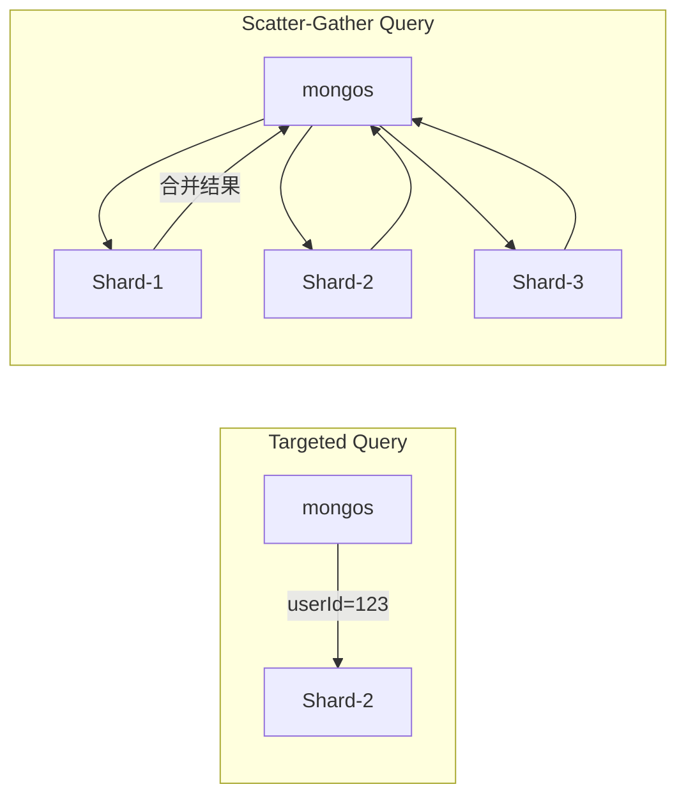

# MongoDB 分片集群

分片（Sharding）是 MongoDB 水平扩展的唯一方式。当单机无法承载时，通过分片将数据分布到多个节点。

## 分片架构



| 组件 | 职责 | 数量 |
|------|------|------|
| **mongos** | 查询路由，客户端只需连接 mongos | 1-N |
| **Config Server** | 存储集群元数据、Chunk 分布 | 1 个副本集 |
| **Shard** | 存储实际数据 | N 个副本集 |

## 片键（Shard Key）

片键是分片策略的核心——决定了数据如何分布。



### 片键类型

| 类型 | 示例 | 特点 |
|------|------|------|
| **哈希分片** | `{ userId: "hashed" }` | 均匀分布，但范围查询跨分片 |
| **范围分片** | `{ createTime: 1 }` | 范围查询高效，但写入热点 |
| **复合片键** | `{ city: 1, userId: "hashed" }` | 组合优化 |

### 片键选择四要素

```javascript
// ✅ 好的片键
sh.shardCollection("mydb.orders", { userId: "hashed" })
// 1. 高基数 (cardinality) — 字段值够多
// 2. 均匀分布 — 没有热点分片
// 3. 查询覆盖 — 大多数查询能路由到单个分片
// 4. 单调性考量 — 时间戳类字段做范围分片会导致热点

// ❌ 糟糕的片键
sh.shardCollection("mydb.orders", { status: 1 })
// status 只有几个值 → 数据极不均匀
```

## Chunk 分裂与迁移



| 参数 | 默认值 | 说明 |
|------|--------|------|
| Chunk Size | 64MB | 自动分裂阈值 |
| Balancer | ON | 自动均衡 Chunk 分布 |
| Balancer 窗口 | 无限制 | 可设置业务低峰期均衡 |

## 分片查询路由

```javascript
// 1. 目标查询 (Targeted) — 片键在查询条件中
db.orders.find({ userId: 123 })
// mongos 直接路由到包含 userId=123 的分片 ✅

// 2. 散射查询 (Scatter-Gather) — 片键不在查询条件中
db.orders.find({ status: "pending" })
// mongos 向所有分片广播查询，合并结果 ⚠️ 慢!
```



## 开启分片步骤

```javascript
// 1. 启用数据库分片
sh.enableSharding("mydb")

// 2. 创建片键索引
db.orders.createIndex({ userId: "hashed" })

// 3. 分片集合
sh.shardCollection("mydb.orders", { userId: "hashed" })

// 4. 查看分片状态
sh.status()
```

## 分片注意事项

| 注意点 | 说明 |
|--------|------|
| **片键不可更改** | 选错片键 → 需要重新建集合导入数据 |
| **唯一索引必须包含片键** | 跨分片无法保证全局唯一 |
| **非片键查询慢** | 需要 Scatter-Gather |
| **join/lookup 限制** | `$lookup` 在分片集合中有限制 |
| **片键字段不可更新** | 可更新但不是 hashed 类型的片键 |

::: tip
选片键是 MongoDB 分片中最关键的决策。原则：**查询模式决定片键，数据分布决定哈希还是范围**。
:::
