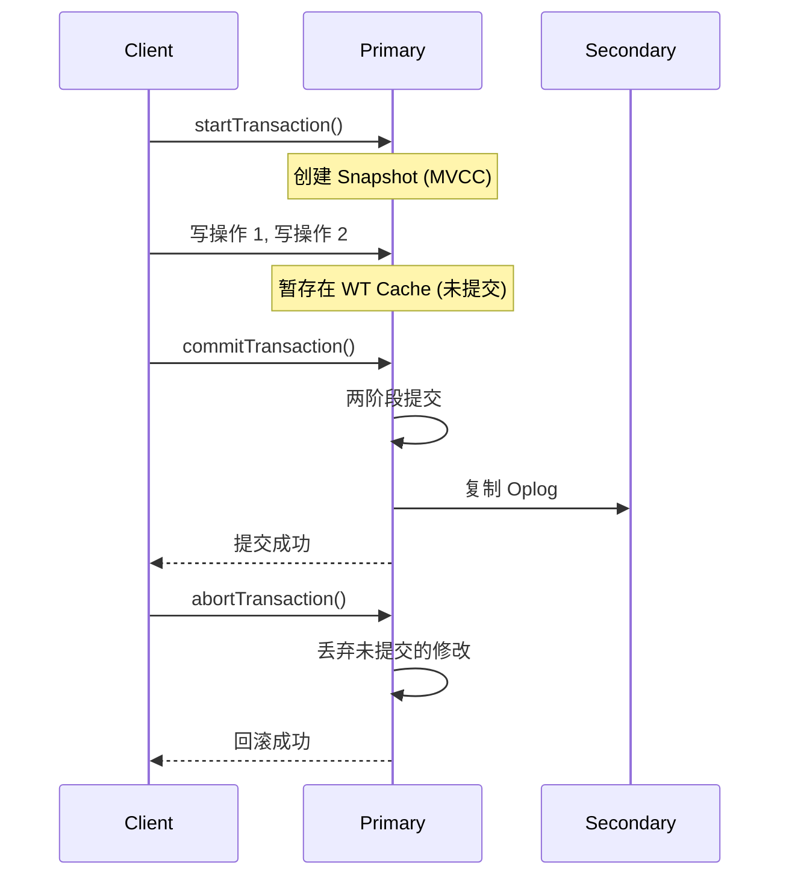

# MongoDB 事务与 ACID

## 事务能力演进

| 版本 | 事务能力 |
|------|----------|
| < 4.0 | 仅单文档原子操作 |
| 4.0 | 副本集多文档事务 |
| 4.2 | 分片集群多文档事务 |
| 5.0+ | 性能大幅优化，生产可用 |

## 单文档操作

即使不使用显式事务，MongoDB 也保证**单文档操作的原子性**：

```javascript
// 以下操作是原子的（嵌入式模型让这很强大）
db.orders.updateOne(
  { _id: 1 },
  {
    $set: { status: "paid" },
    $push: { history: { action: "payment", time: new Date() } },
    $inc: { version: 1 }
  }
)
// status、history、version 在同一文档内，原子执行 ✅
```

## 多文档事务

```javascript
// MongoDB Shell 事务示例
const session = db.getMongo().startSession()
const orders = session.getDatabase("shop").orders
const inventory = session.getDatabase("shop").inventory

session.startTransaction({
  readConcern: { level: "snapshot" },
  writeConcern: { w: "majority" }
})

try {
  // 创建订单
  orders.insertOne({
    _id: 1001,
    items: [{ productId: 1, qty: 2 }],
    status: "created"
  })

  // 扣减库存
  inventory.updateOne(
    { productId: 1, stock: { $gte: 2 } },
    { $inc: { stock: -2 } }
  )

  session.commitTransaction()
} catch (error) {
  session.abortTransaction()
  // 订单创建和库存扣减全部回滚
} finally {
  session.endSession()
}
```

## 事务原理



## 事务隔离级别

| 隔离级别 | 说明 | 问题 |
|----------|------|------|
| **Snapshot** (默认) | 事务看到开始时的快照 | 写冲突可能回滚 |
| **Read Uncommitted** | 可读未提交数据 | 脏读 |
| **Read Committed** | 只读已提交数据 | 不可重复读 |

MongoDB 的 Snapshot 隔离 ≈ SQL 的 Snapshot Isolation：

```javascript
// 写冲突检测
session1.startTransaction()
session1 更新文档 A (version=1 → 2)

session2.startTransaction()
session2 更新文档 A (version=1 → 2)
// → TransientTransactionError! 写冲突
// → session2 必须重试整个事务
```

## Spring Data 事务

### 配置

```java
@Configuration
public class MongoConfig {

    @Bean
    public MongoTransactionManager transactionManager(
            MongoDatabaseFactory dbFactory) {
        return new MongoTransactionManager(dbFactory);
    }
}
```

### 使用

```java
@Service
public class OrderService {

    @Autowired
    private MongoTemplate mongoTemplate;

    @Transactional  // ← 标注事务
    public Order createOrder(OrderRequest request) {
        // 1. 创建订单
        Order order = buildOrder(request);
        mongoTemplate.insert(order);

        // 2. 扣减库存
        UpdateResult result = mongoTemplate.updateFirst(
            Query.query(Criteria.where("productId").is(request.getProductId())
                .and("stock").gte(request.getQty())),
            new Update().inc("stock", -request.getQty()),
            Inventory.class);

        if (result.getModifiedCount() == 0) {
            throw new InsufficientStockException("库存不足");
        }

        return order;
    }
}
```

## 事务限制与建议

| 限制 | 说明 |
|------|------|
| **事务超时** | 默认 60 秒自动中止 |
| **事务大小** | 避免单事务修改超大量文档 |
| **不支持 DDL** | 不能创建/删除集合 |
| **性能开销** | 事务比非事务慢 5-15% |

::: tip 何时用事务
1. **优先文档嵌入** — 自然保证原子性
2. **跨集合强一致** — 使用多文档事务
3. **跨分片强一致** — 使用事务 (4.2+)
4. **大多数场景** — 单文档原子操作 + 最终一致性就够用
:::

## 重试策略

```java
public void executeWithRetry(Runnable transactionalOp) {
    int retries = 0;
    while (retries < 3) {
        try {
            transactionalOp.run();
            return;  // 成功
        } catch (MongoCommandException e) {
            if (e.hasErrorLabel(MongoException.TRANSIENT_TRANSACTION_ERROR_LABEL)) {
                retries++;
                Thread.sleep(100L * (1 << retries));  // 指数退避
            } else {
                throw e;  // 非瞬时错误直接抛
            }
        }
    }
}
```
