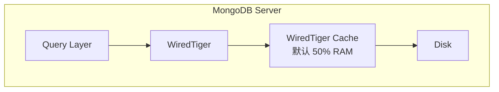
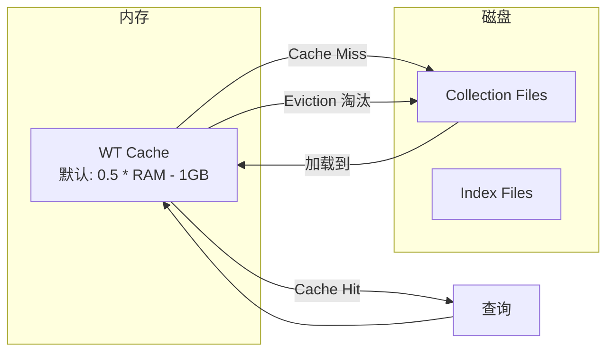
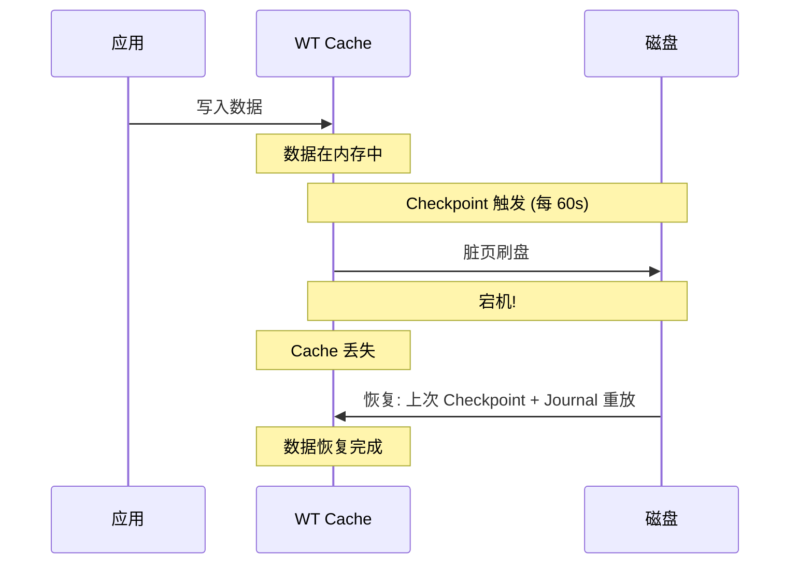

# WiredTiger 存储引擎

WiredTiger 是 MongoDB 3.2+ 的**默认存储引擎**，也是其高性能的核心。

## 存储引擎架构



## 核心特性

| 特性 | 说明 |
|------|------|
| **文档级并发** | 文档级别的 MVCC 锁，而非集合级锁 |
| **压缩** | 支持 snappy / zstd / zlib 压缩 |
| **Checkpoint** | 定期将内存数据持久化到磁盘 |
| **Journal** | WAL (Write-Ahead Log)，保证宕机恢复 |
| **B-Tree** | 使用 B-Tree 而非 LSM-Tree |

## 存储结构

```
/data/db/
├── WiredTiger                   # WT 元数据
├── WiredTiger.wt                # WT 配置
├── WiredTiger.lock              # 锁文件
├── collection-0--xxx.wt         # 集合数据文件
├── collection-1--xxx.wt
├── index-0--xxx.wt              # 索引数据文件
├── index-1--xxx.wt
├── journal/
│   ├── WiredTigerLog.00000001   # Journal 预写日志
│   └── WiredTigerPreplog.xxx    # 预写日志
└── diagnostic.data/             # 诊断数据
```

## WiredTiger Cache



### Cache 配置

```yaml
# mongod.conf
storage:
  wiredTiger:
    engineConfig:
      cacheSizeGB: 4           # Cache 大小 4GB
      journalCompressor: snappy
    collectionConfig:
      blockCompressor: zstd    # 数据压缩
    indexConfig:
      prefixCompression: true  # 索引前缀压缩
```

## 压缩

```bash
# 比较不同压缩算法的效果
snappy → 压缩率 ~2x,   CPU 开销低 (推荐)
zstd   → 压缩率 ~3-4x, CPU 开销中
zlib   → 压缩率 ~4-5x, CPU 开销高
none   → 无压缩,      适合已压缩数据
```

## Checkpoint 机制



- Checkpoint 默认 **60 秒**一次
- 两次 Checkpoint 之间的修改通过 **Journal** 保护
- 宕机恢复 = 最近 Checkpoint + Journal 重放

## 文档级并发 (MVCC)

```mermaid
flowchart LR
    subgraph "并发写入"
        T1[事务1: 更新文档A]
        T2[事务2: 更新文档B]
    end

    T1 --> A[文档A 被锁]
    T2 --> B[文档B 被锁]
    Note: 两个事务互不阻塞!
```

WiredTiger 使用 **MVCC (多版本并发控制)** + 文档级锁：
- 读取不阻塞写入
- 写入不阻塞读取
- 不同文档的写入互不阻塞

## 性能优化

| 优化项 | 建议 |
|--------|------|
| Cache 大小 | 设为可用 RAM 的 50% (扣除 OS 需求) |
| 压缩算法 | `snappy` 平衡, `zstd` 节省空间 |
| 分离 Journal | 将 journal 目录放独立磁盘 |
| Cache 监控 | `db.serverStatus().wiredTiger.cache` 监控命中率 |
| 避免 Cache 颠簸 | 如果工作集 > Cache，加内存或分片 |
