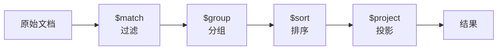

# MongoDB 聚合管道实战

聚合管道是 MongoDB 最强大的数据分析工具，类似 Unix 的 pipeline 思想。

## 聚合管道模型



## 常用阶段速查

| 阶段 | 作用 | 类比 SQL |
|------|------|----------|
| `$match` | 过滤文档 | WHERE |
| `$group` | 分组聚合 | GROUP BY |
| `$sort` | 排序 | ORDER BY |
| `$project` | 字段投影/转换 | SELECT |
| `$limit` / `$skip` | 限制/跳过 | LIMIT / OFFSET |
| `$lookup` | 左外连接 | LEFT JOIN |
| `$unwind` | 展开数组 | UNNEST |
| `$addFields` | 添加计算字段 | 计算列 |
| `$bucket` | 分桶统计 | CASE WHEN + GROUP BY |
| `$facet` | 多维度并行聚合 | 多个 GROUP BY 并行 |

## 实战示例

### 数据准备

```javascript
db.orders.insertMany([
  { _id: 1, userId: "u1", status: "completed", amount: 99.9, 
    items: ["书籍", "文具"], createdAt: ISODate("2025-06-01") },
  { _id: 2, userId: "u1", status: "pending", amount: 199.9,
    items: ["电子产品"], createdAt: ISODate("2025-06-02") },
  { _id: 3, userId: "u2", status: "completed", amount: 49.9,
    items: ["文具"], createdAt: ISODate("2025-06-03") },
  { _id: 4, userId: "u2", status: "completed", amount: 299.9,
    items: ["书籍", "电子产品"], createdAt: ISODate("2025-06-04") },
  { _id: 5, userId: "u3", status: "cancelled", amount: 149.9,
    items: ["食品"], createdAt: ISODate("2025-06-05") }
])
```

### 示例 1: 基础分组统计

```javascript
// 每个用户的订单总金额和订单数
db.orders.aggregate([
  { $match: { status: "completed" } },          // 只看完成的订单
  { $group: {
      _id: "$userId",                            // 按 userId 分组
      totalAmount: { $sum: "$amount" },          // 总金额
      avgAmount: { $avg: "$amount" },            // 平均金额
      orderCount: { $sum: 1 },                   // 订单数
      maxOrder: { $max: "$amount" }              // 最大订单
  }},
  { $sort: { totalAmount: -1 } },                // 按总金额降序
  { $limit: 10 }                                 // Top 10
])

// 结果:
[
  { _id: "u2", totalAmount: 349.8, avgAmount: 174.9, orderCount: 2 },
  { _id: "u1", totalAmount: 99.9,  avgAmount: 99.9,  orderCount: 1 }
]
```

### 示例 2: 时间维度分析

```javascript
db.orders.aggregate([
  { $match: { status: "completed" } },
  { $group: {
      _id: {
        year: { $year: "$createdAt" },
        month: { $month: "$createdAt" }
      },
      revenue: { $sum: "$amount" },
      count: { $sum: 1 }
  }},
  { $sort: { "_id.year": 1, "_id.month": 1 } }
])
```

### 示例 3: $lookup 关联查询

```javascript
// users 集合
// { _id: "u1", name: "张三", level: "VIP" }
// { _id: "u2", name: "李四", level: "普通" }

db.orders.aggregate([
  { $lookup: {
      from: "users",
      localField: "userId",
      foreignField: "_id",
      as: "user"
  }},
  { $unwind: "$user" },                         // 展开数组为对象
  { $match: { "user.level": "VIP" } },           // 只看 VIP 用户
  { $group: {
      _id: "$user._id",
      userName: { $first: "$user.name" },
      totalAmount: { $sum: "$amount" }
  }}
])
```

### 示例 4: $unwind 数组展开

```javascript
// 分析每个商品品类的销售情况
db.orders.aggregate([
  { $unwind: "$items" },                        // 把 items 数组展开成多行
  { $group: {
      _id: "$items",
      count: { $sum: 1 },
      revenue: { $sum: "$amount" }
  }},
  { $sort: { count: -1 } }
])

// 结果:
[
  { _id: "书籍", count: 2, revenue: 399.8 },
  { _id: "文具", count: 2, revenue: 149.8 },
  { _id: "电子产品", count: 2, revenue: 499.8 },
  { _id: "食品", count: 1, revenue: 149.9 }
]
```

### 示例 5: $facet 多维度并行分析

```javascript
db.orders.aggregate([
  { $facet: {
      // 维度1: 按状态统计
      byStatus: [
        { $group: { _id: "$status", count: { $sum: 1 }, total: { $sum: "$amount" } } }
      ],
      // 维度2: 按用户统计
      byUser: [
        { $group: { _id: "$userId", count: { $sum: 1 }, total: { $sum: "$amount" } } },
        { $sort: { total: -1 } },
        { $limit: 5 }
      ],
      // 维度3: 汇总
      summary: [
        { $group: { _id: null, totalRevenue: { $sum: "$amount" }, 
                    orderCount: { $sum: 1 }, avgAmount: { $avg: "$amount" } } }
      ]
  }}
])
```

## Java 聚合实现

```java
@Service
public class OrderAnalyticsService {

    @Autowired
    private MongoTemplate mongoTemplate;

    public List<UserStats> userOrderStats() {
        MatchOperation match = Aggregation.match(
            Criteria.where("status").is("completed"));

        GroupOperation group = Aggregation.group("userId")
            .sum("amount").as("totalAmount")
            .avg("amount").as("avgAmount")
            .count().as("orderCount");

        SortOperation sort = Aggregation.sort(Sort.Direction.DESC, "totalAmount");

        LimitOperation limit = Aggregation.limit(10);

        Aggregation agg = Aggregation.newAggregation(match, group, sort, limit);
        return mongoTemplate.aggregate(agg, "orders", UserStats.class)
            .getMappedResults();
    }
}

// 结果映射类
@Data
public class UserStats {
    @Field("_id")
    private String userId;
    private Double totalAmount;
    private Double avgAmount;
    private Integer orderCount;
}
```

::: tip
聚合管道是整个数据在管道中逐级流动，尽量避免过早 `$lookup` 和 `$unwind`（数据膨胀严重）。先 `$match` 过滤，再 `$lookup`。
:::
