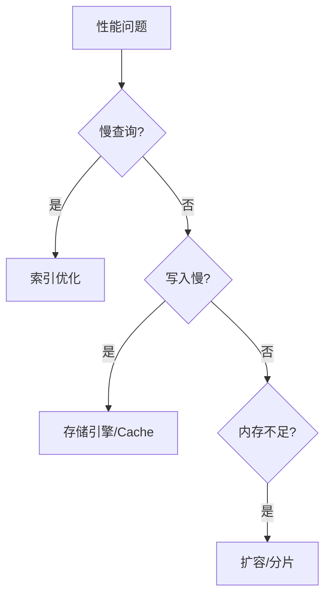

# MongoDB 性能优化

## 优化全景



## 1. 查询性能诊断

### 慢查询日志

```javascript
// 开启慢查询分析 (记录超过 100ms 的查询)
db.setProfilingLevel(1, { slowms: 100 })

// 查看最近的慢查询
db.system.profile.find()
  .sort({ ts: -1 })
  .limit(10)
  .pretty()

// 临时开启（不持久化）
db.setProfilingLevel(2)  // 记录所有查询
// 分析完后关闭
db.setProfilingLevel(0)
```

### explain 分析

```javascript
// 分析查询执行计划
db.orders.find({ userId: "u1", status: "completed" })
  .explain("executionStats")

// 关注指标:
// - executionTimeMillis: 执行时间
// - totalDocsExamined: 扫描文档数 (越大越差)
// - totalKeysExamined: 扫描索引条目
// - stage: IXSCAN ✅  /  COLLSCAN ❌
```

## 2. 索引优化

### 缺失索引检测

```javascript
// 找出没有索引支持的查询 (全表扫描)
db.aggregate([
  { $currentOp: { allUsers: true, idleConnections: false } },
  { $match: {
      "command.find": { $exists: true },
      "planSummary": { $regex: /COLLSCAN/ }
  }}
])
```

### 索引优化策略

```javascript
// ❌ 低效索引 — 选择性差
{ status: 1 }  // status 只有几个值

// ✅ 高效索引 — 选择性好
{ email: 1 }   // email 几乎唯一

// ❌ 索引前缀不匹配 — 跳过了前导字段
db.orders.createIndex({ userId: 1, status: 1, createTime: -1 })
db.orders.find({ status: "completed" })  // 跳过了 userId!

// ✅ 覆盖查询 — 查询字段全在索引中
db.users.createIndex({ name: 1, email: 1 })
db.users.find({ name: "张三" }, { name: 1, email: 1, _id: 0 })
// totalDocsExamined: 0 ← 覆盖查询!
```

### 索引创建原则

| 原则 | 说明 |
|------|------|
| 选择性优先 | 唯一值多的字段排前面 |
| 查询覆盖 | 常用查询的 projection 字段包含在索引中 |
| 避免过多索引 | 每个索引拖慢写入 5-10% |
| 监控未使用索引 | `$indexStats` 看哪些索引从未被用 |
| 后台创建 | 生产环境 `{ background: true }` |
| 定期重建 | 碎片化严重时重建索引 |

## 3. Schema 优化

```javascript
// ❌ 频繁增长的数组 → 文档膨胀
{ _id: 1, history: [...10000 items...] } // 16MB 限制!

// ✅ 桶模式 — 每天一个文档
{ _id: 1, date: "2025-06-01", events: [...500 items...] }
{ _id: 2, date: "2025-06-02", events: [...450 items...] }

// ❌ 查询总是返回全部字段
db.articles.find({ status: "published" })

// ✅ 只查询需要的字段
db.articles.find({ status: "published" }, 
  { title: 1, summary: 1, author: 1, _id: 0 })
```

## 4. 写入优化

```javascript
// 1. 批量写入代替逐条写入
db.orders.insertMany(largeBatch)  // ✅
// vs 10000 次 insertOne()  // ❌

// 2. 非关键数据降低 Write Concern
db.logs.insertOne(log, { w: 1 })          // 日志: 放松
db.orders.insertOne(order, { w: "majority" }) // 订单: 严格

// 3. 更新时只改变化的字段
db.users.updateOne({ _id: 1 }, { $set: { age: 29 } })   // ✅
// vs 替换整个文档  // ❌
```

## 5. 内存与 Cache

```javascript
// 查看 WiredTiger Cache 命中率
db.serverStatus().wiredTiger.cache

// 关键指标:
{
  "bytes currently in the cache": 3865470566,   // 当前 Cache 使用
  "maximum bytes configured": 4294967296,        // Cache 最大值
  "pages read into cache": 124567,               // 读入页数
  "pages written from cache": 34567,             // 写出页数
  "tracked dirty bytes in the cache": 123456     // 脏页大小
}

// 计算 Cache 命中率
// 命中率 = 1 - (pages read from disk / total requests)
// 目标: > 95%
```

## 6. 连接池配置

```yaml
spring:
  data:
    mongodb:
      uri: mongodb://localhost:27017/shop
        ?maxPoolSize=100          # 默认 100
        &minPoolSize=10           # 默认 0
        &maxIdleTimeMS=60000      # 连接空闲 60s 关闭
        &maxLifeTimeMS=600000     # 连接最大存活 10min
        &waitQueueTimeoutMS=5000  # 等待连接超时 5s
```

## 性能检查清单

| 检查项 | 目标 |
|--------|------|
| COLLSCAN 占比 | 0% |
| Cache 命中率 | > 95% |
| 索引数量 | 3-8 个/集合 |
| 慢查询 (>100ms) | < 1 个/分钟 |
| 磁盘 IO | < 70% 利用率 |
| 连接数 | 在连接池范围内 |

::: tip 优化优先级
1. **加索引** → 最快见效 (秒级)
2. **优化查询** → 调整查询条件/字段投影
3. **优化 Schema** → 嵌入代替 Join
4. **扩容** → 加内存/分片 (最后手段)
:::
