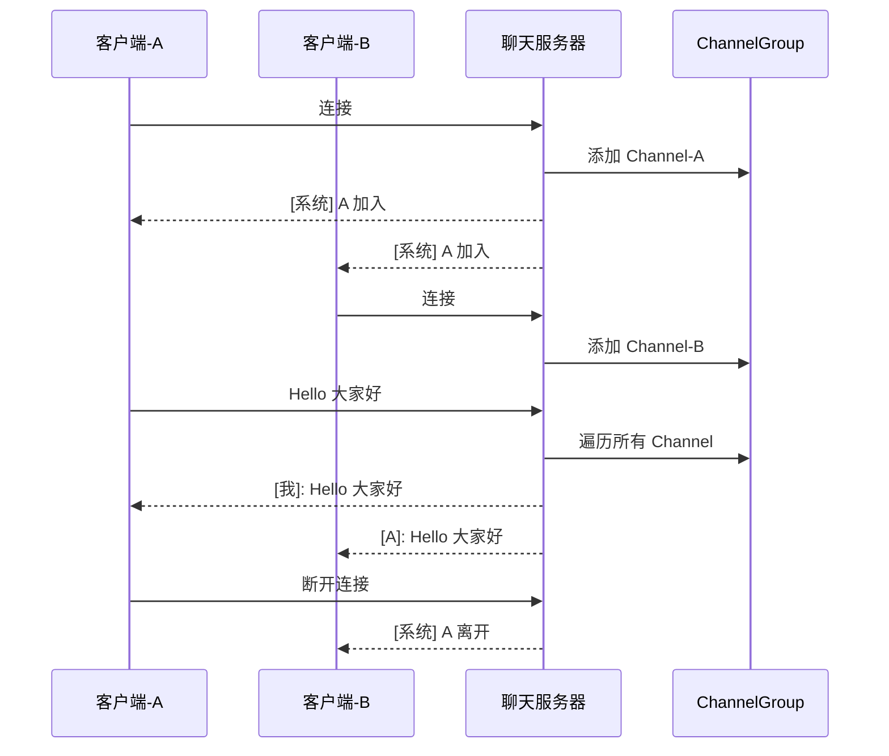

# 多人群聊系统

本章构建一个多人群聊系统：任意客户端发送消息，所有在线客户端都能收到。

## 核心知识点

- **ChannelGroup** — 管理所有连接的 Channel
- **广播** — 向所有客户端推送消息
- **连接管理** — 上线/下线提醒

## 服务端实现

### ChatServer.java

```java
public class ChatServer {
    private final int port;

    public ChatServer(int port) {
        this.port = port;
    }

    public void start() throws Exception {
        EventLoopGroup bossGroup = new NioEventLoopGroup(1);
        EventLoopGroup workerGroup = new NioEventLoopGroup();

        try {
            ServerBootstrap bootstrap = new ServerBootstrap();
            bootstrap.group(bossGroup, workerGroup)
                     .channel(NioServerSocketChannel.class)
                     .childHandler(new ChannelInitializer<SocketChannel>() {
                         @Override
                         protected void initChannel(SocketChannel ch) {
                             ch.pipeline()
                                 .addLast(new StringDecoder())
                                 .addLast(new StringEncoder())
                                 .addLast(new ChatServerHandler());
                         }
                     });

            ChannelFuture future = bootstrap.bind(port).sync();
            System.out.println("聊天室启动，端口: " + port);
            future.channel().closeFuture().sync();
        } finally {
            bossGroup.shutdownGracefully();
            workerGroup.shutdownGracefully();
        }
    }

    public static void main(String[] args) throws Exception {
        new ChatServer(8080).start();
    }
}
```

### ChatServerHandler.java

```java
public class ChatServerHandler extends SimpleChannelInboundHandler<String> {

    // 线程安全的 Channel 集合，管理所有连接
    private static final ChannelGroup channels = new DefaultChannelGroup(
        GlobalEventExecutor.INSTANCE);

    @Override
    public void handlerAdded(ChannelHandlerContext ctx) {
        Channel incoming = ctx.channel();

        // 广播上线消息
        channels.writeAndFlush("[系统] " + incoming.remoteAddress() + " 加入聊天室\n");

        channels.add(incoming);  // 加入管理
    }

    @Override
    public void handlerRemoved(ChannelHandlerContext ctx) {
        Channel outgoing = ctx.channel();

        // 广播下线消息（ChannelGroup 会自动移除断开的 Channel）
        channels.writeAndFlush("[系统] " + outgoing.remoteAddress() + " 离开聊天室\n");
    }

    @Override
    protected void channelRead0(ChannelHandlerContext ctx, String msg) {
        Channel sender = ctx.channel();

        // 广播消息给除发送者之外的所有人
        for (Channel channel : channels) {
            if (channel != sender) {
                channel.writeAndFlush(
                    "[" + sender.remoteAddress() + "]: " + msg + "\n");
            } else {
                channel.writeAndFlush("[我]: " + msg + "\n");
            }
        }
    }

    @Override
    public void channelActive(ChannelHandlerContext ctx) {
        System.out.println(ctx.channel().remoteAddress() + " 上线");
    }

    @Override
    public void channelInactive(ChannelHandlerContext ctx) {
        System.out.println(ctx.channel().remoteAddress() + " 下线");
    }
}
```

## 客户端实现

```java
public class ChatClient {
    private final String host;
    private final int port;
    private final String username;

    public ChatClient(String host, int port, String username) {
        this.host = host;
        this.port = port;
        this.username = username;
    }

    public void start() throws Exception {
        EventLoopGroup group = new NioEventLoopGroup();

        try {
            Bootstrap bootstrap = new Bootstrap();
            bootstrap.group(group)
                     .channel(NioSocketChannel.class)
                     .handler(new ChannelInitializer<SocketChannel>() {
                         @Override
                         protected void initChannel(SocketChannel ch) {
                             ch.pipeline()
                                 .addLast(new StringDecoder())
                                 .addLast(new StringEncoder())
                                 .addLast(new SimpleChannelInboundHandler<String>() {
                                     @Override
                                     protected void channelRead0(ChannelHandlerContext ctx, String msg) {
                                         System.out.print(msg);  // 接收并显示消息
                                     }
                                 });
                         }
                     });

            Channel channel = bootstrap.connect(host, port).sync().channel();

            // 从控制台读取，发送消息
            try (BufferedReader reader = new BufferedReader(
                     new InputStreamReader(System.in))) {
                String line;
                while ((line = reader.readLine()) != null) {
                    if ("/quit".equals(line)) break;
                    channel.writeAndFlush(line + "\n");
                }
            }
        } finally {
            group.shutdownGracefully();
        }
    }

    public static void main(String[] args) throws Exception {
        new ChatClient("localhost", 8080, "User").start();
    }
}
```

## 架构图



## 进阶：加入私聊功能

```java
// 在 ChatServerHandler 中添加命令处理
@Override
protected void channelRead0(ChannelHandlerContext ctx, String msg) {
    if (msg.startsWith("@")) {
        // 私聊格式: @host:port 消息内容
        int spaceIdx = msg.indexOf(' ');
        String target = msg.substring(1, spaceIdx);
        String content = msg.substring(spaceIdx + 1);
        
        for (Channel channel : channels) {
            if (channel.remoteAddress().toString().contains(target)) {
                channel.writeAndFlush(
                    "[私聊 " + ctx.channel().remoteAddress() + "]: " + content + "\n");
                return;
            }
        }
        ctx.writeAndFlush("[系统] 用户不在线\n");
    } else {
        // 群聊广播...
    }
}
```

::: tip 关键点
1. `ChannelGroup` 是线程安全的 Channel 集合
2. `channelRead0` 每个连接在自己的 EventLoop 线程中执行，天然线程安全
3. 广播时对发送者显示 `[我]`，对其他显示地址，增强体验
4. `handlerRemoved` 自动触发，ChannelGroup 自动清理断开连接
:::
