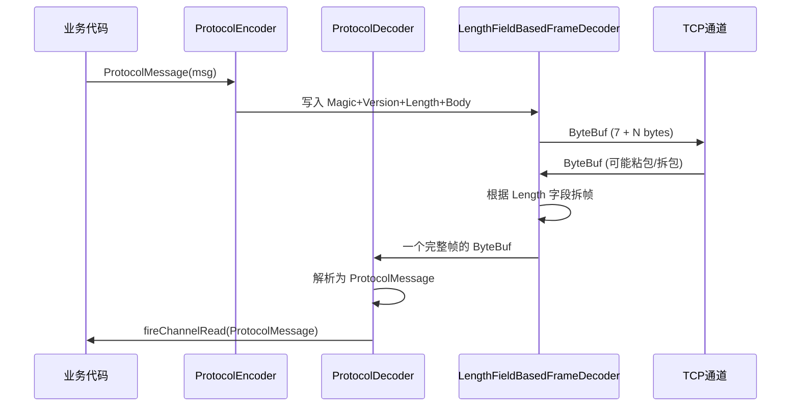

# 自定义协议

实际项目中，TCP 字节流需要定义**通信协议**。本章设计并实现一个完整的自定义二进制协议。

## 协议设计

### 数据帧格式

```
  0                   1                   2                   3
  0 1 2 3 4 5 6 7 8 9 0 1 2 3 4 5 6 7 8 9 0 1 2 3 4 5 6 7 8 9 0 1
 +---------------+---------------+-------------------------------+
 |     Magic     |    Version    |             Length            |
 |    (0xCAFE)   |     (0x01)    |        (body 长度)             |
 +---------------+---------------+-------------------------------+
 |                                                               |
 |                            Body                               |
 |                        (业务数据)                              |
 +---------------------------------------------------------------+
```

| 字段 | 偏移 | 长度 | 说明 |
|------|------|------|------|
| Magic | 0 | 2 | 魔数 `0xCAFE`，用于快速识别协议 |
| Version | 2 | 1 | 协议版本号 |
| Length | 3 | 4 | Body 的长度（大端序） |
| Body | 7 | 变长 | 实际业务数据（JSON） |

总头部大小：**7 字节**

## 数据模型

```java
public class ProtocolMessage {
    private static final short MAGIC = (short) 0xCAFE;
    private static final byte VERSION = 0x01;

    private byte messageType;
    private String body;

    public ProtocolMessage(byte messageType, String body) {
        this.messageType = messageType;
        this.body = body;
    }

    // getter/setter...
}

public class MessageType {
    public static final byte HEARTBEAT = 0x00;    // 心跳
    public static final byte REQUEST   = 0x01;    // 请求
    public static final byte RESPONSE  = 0x02;    // 响应
}
```

## 编码器实现

```java
public class ProtocolEncoder extends MessageToByteEncoder<ProtocolMessage> {

    @Override
    protected void encode(ChannelHandlerContext ctx, ProtocolMessage msg,
                          ByteBuf out) {
        byte[] body = msg.getBody().getBytes(StandardCharsets.UTF_8);

        // 写入协议头
        out.writeShort(0xCAFE);      // Magic (2 bytes)
        out.writeByte(0x01);         // Version (1 byte)
        out.writeInt(body.length);   // Length (4 bytes)

        // 写入消息体
        out.writeByte(msg.getMessageType());  // 消息类型 (1 byte)
        out.writeBytes(body);                 // 实际数据
    }
}
```

## 解码器实现

```java
public class ProtocolDecoder extends ByteToMessageDecoder {

    private static final int HEADER_SIZE = 7;  // 2 + 1 + 4
    private static final short MAGIC = (short) 0xCAFE;

    @Override
    protected void decode(ChannelHandlerContext ctx, ByteBuf in,
                          List<Object> out) {
        // 1. 检查是否有足够的数据读取头部
        if (in.readableBytes() < HEADER_SIZE) {
            return;  // 数据不足，等待更多数据
        }

        // 2. 标记读位置（如果 Magic 不匹配可以回退）
        in.markReaderIndex();

        // 3. 读取并验证 Magic
        short magic = in.readShort();
        if (magic != MAGIC) {
            in.resetReaderIndex();  // 魔数不匹配，回退
            throw new CorruptedFrameException("无效的魔数: " +
                Integer.toHexString(magic & 0xFFFF));
        }

        // 4. 读取 Version 和 Length
        byte version = in.readByte();
        int length = in.readInt();

        // 5. 检查是否有完整的消息体
        if (in.readableBytes() < length + 1) {  // +1 for messageType
            in.resetReaderIndex();
            return;  // 包体不完整，等待更多数据
        }

        // 6. 读取消息类型和消息体
        byte messageType = in.readByte();
        byte[] bodyBytes = new byte[length - 1];  // 减去 messageType 的 1 字节
        in.readBytes(bodyBytes);
        String body = new String(bodyBytes, StandardCharsets.UTF_8);

        // 7. 组装为 ProtocolMessage
        out.add(new ProtocolMessage(messageType, body));
    }
}
```

## 也可以使用 LengthFieldBasedFrameDecoder

```java
// 更简洁的方案：使用 Netty 内置的 LengthFieldBasedFrameDecoder
public class ProtocolPipelineInitializer extends ChannelInitializer<SocketChannel> {
    @Override
    protected void initChannel(SocketChannel ch) {
        ch.pipeline()
            // === 帧封装（处理粘包/拆包）===
            .addLast(new LengthFieldBasedFrameDecoder(
                1024 * 1024,  // maxFrameLength: 1MB
                3,            // lengthFieldOffset: Magic(2) + Version(1) = 3
                4,             // lengthFieldLength: 4 bytes
                0,             // lengthAdjustment: 0
                0              // initialBytesToStrip: 0 (保留 Header)
            ))

            // === 协议编解码 ===
            .addLast(new ProtocolDecoder())   // 自定义解码
            .addLast(new ProtocolEncoder())   // 自定义编码

            // === 业务处理 ===
            .addLast(new ProtocolServerHandler());
    }
}
```

## 服务端 Handler

```java
public class ProtocolServerHandler
        extends SimpleChannelInboundHandler<ProtocolMessage> {

    @Override
    protected void channelRead0(ChannelHandlerContext ctx, ProtocolMessage msg) {
        byte type = msg.getMessageType();

        switch (type) {
            case MessageType.HEARTBEAT:
                // 心跳处理：原样回复
                ProtocolMessage pong = new ProtocolMessage(
                    MessageType.HEARTBEAT, "PONG");
                ctx.writeAndFlush(pong);
                break;

            case MessageType.REQUEST:
                // 业务处理
                System.out.println("收到请求: " + msg.getBody());
                String result = processRequest(msg.getBody());
                ProtocolMessage response = new ProtocolMessage(
                    MessageType.RESPONSE, result);
                ctx.writeAndFlush(response);
                break;

            default:
                System.err.println("未知消息类型: " + type);
        }
    }

    private String processRequest(String body) {
        // 模拟业务处理
        return "{\"status\": \"ok\", \"echo\": \"" + body + "\"}";
    }

    @Override
    public void exceptionCaught(ChannelHandlerContext ctx, Throwable cause) {
        cause.printStackTrace();
        ctx.close();
    }
}
```

## 客户端测试

```java
public class ProtocolClient {
    public static void main(String[] args) throws Exception {
        EventLoopGroup group = new NioEventLoopGroup();

        try {
            Bootstrap bootstrap = new Bootstrap();
            bootstrap.group(group)
                     .channel(NioSocketChannel.class)
                     .handler(new ChannelInitializer<SocketChannel>() {
                         @Override
                         protected void initChannel(SocketChannel ch) {
                             ch.pipeline()
                                 .addLast(new ProtocolEncoder())
                                 .addLast(new ProtocolDecoder())
                                 .addLast(new SimpleChannelInboundHandler<ProtocolMessage>() {
                                     @Override
                                     protected void channelRead0(ChannelHandlerContext ctx,
                                                                  ProtocolMessage msg) {
                                         System.out.println("收到响应: " + msg.getBody());
                                     }
                                 });
                         }
                     });

            Channel channel = bootstrap.connect("localhost", 8080).sync().channel();

            // 发送心跳
            channel.writeAndFlush(new ProtocolMessage(MessageType.HEARTBEAT, "PING"));

            // 发送业务请求
            channel.writeAndFlush(new ProtocolMessage(MessageType.REQUEST,
                "{\"cmd\": \"getUser\", \"id\": 123}"));

            channel.closeFuture().sync();
        } finally {
            group.shutdownGracefully();
        }
    }
}
```

## 完整消息流程



::: tip 协议设计要点
1. **魔数**：帮助快速判断数据是否合法，避免解析垃圾数据
2. **版本号**：方便协议升级时做兼容处理
3. **Length 字段**：配合 `LengthFieldBasedFrameDecoder` 解决粘包/拆包
4. **消息类型**：区分心跳、请求、响应等不同消息
5. **推荐使用 Protobuf** 替代 JSON 作为 Body，效率更高
:::
