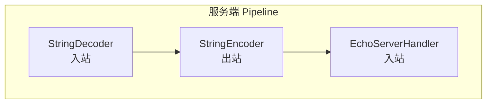

# Echo 服务器

Echo 是最简单的 Netty 应用 — 客户端发什么，服务端回什么。这是学习 Netty 的最佳起点。

## 项目结构

```
echo-server/
├── EchoServer.java      // 服务端
├── EchoServerHandler.java  // 服务端 Handler
├── EchoClient.java      // 客户端
└── EchoClientHandler.java  // 客户端 Handler
```

## 服务端实现

### EchoServer.java

```java
public class EchoServer {
    private final int port;

    public EchoServer(int port) {
        this.port = port;
    }

    public void start() throws Exception {
        EventLoopGroup bossGroup = new NioEventLoopGroup(1);
        EventLoopGroup workerGroup = new NioEventLoopGroup();

        try {
            ServerBootstrap bootstrap = new ServerBootstrap();
            bootstrap.group(bossGroup, workerGroup)
                     .channel(NioServerSocketChannel.class)
                     .option(ChannelOption.SO_BACKLOG, 128)
                     .childOption(ChannelOption.SO_KEEPALIVE, true)
                     .childHandler(new ChannelInitializer<SocketChannel>() {
                         @Override
                         protected void initChannel(SocketChannel ch) {
                             ch.pipeline()
                                 .addLast(new StringDecoder())      // ByteBuf → String
                                 .addLast(new StringEncoder())      // String → ByteBuf
                                 .addLast(new EchoServerHandler()); // 业务处理
                         }
                     });

            ChannelFuture future = bootstrap.bind(port).sync();
            System.out.println("Echo 服务器启动，端口: " + port);

            future.channel().closeFuture().sync();
        } finally {
            bossGroup.shutdownGracefully();
            workerGroup.shutdownGracefully();
        }
    }

    public static void main(String[] args) throws Exception {
        new EchoServer(8080).start();
    }
}
```

### EchoServerHandler.java

```java
@ChannelHandler.Sharable  // 标记为线程安全，可被多个 Channel 共享
public class EchoServerHandler extends SimpleChannelInboundHandler<String> {

    @Override
    protected void channelRead0(ChannelHandlerContext ctx, String msg) {
        System.out.println("收到消息: " + msg);
        // 原样返回（Echo 的核心逻辑）
        ctx.writeAndFlush("Echo: " + msg + "\n");
    }

    @Override
    public void channelActive(ChannelHandlerContext ctx) {
        System.out.println("客户端连接: " + ctx.channel().remoteAddress());
        ctx.writeAndFlush("欢迎使用 Echo 服务器!\n");
    }

    @Override
    public void channelInactive(ChannelHandlerContext ctx) {
        System.out.println("客户端断开: " + ctx.channel().remoteAddress());
    }

    @Override
    public void exceptionCaught(ChannelHandlerContext ctx, Throwable cause) {
        cause.printStackTrace();
        ctx.close();
    }
}
```

## 客户端实现

### EchoClient.java

```java
public class EchoClient {
    private final String host;
    private final int port;

    public EchoClient(String host, int port) {
        this.host = host;
        this.port = port;
    }

    public void start() throws Exception {
        EventLoopGroup group = new NioEventLoopGroup();

        try {
            Bootstrap bootstrap = new Bootstrap();
            bootstrap.group(group)
                     .channel(NioSocketChannel.class)
                     .handler(new ChannelInitializer<SocketChannel>() {
                         @Override
                         protected void initChannel(SocketChannel ch) {
                             ch.pipeline()
                                 .addLast(new StringDecoder())
                                 .addLast(new StringEncoder())
                                 .addLast(new EchoClientHandler());
                         }
                     });

            ChannelFuture future = bootstrap.connect(host, port).sync();
            Channel channel = future.channel();

            // 从控制台读取输入并发送
            try (BufferedReader reader = new BufferedReader(
                     new InputStreamReader(System.in))) {
                String line;
                while ((line = reader.readLine()) != null) {
                    if ("bye".equalsIgnoreCase(line)) {
                        break;
                    }
                    channel.writeAndFlush(line + "\n");
                }
            }
        } finally {
            group.shutdownGracefully();
        }
    }

    public static void main(String[] args) throws Exception {
        new EchoClient("localhost", 8080).start();
    }
}
```

### EchoClientHandler.java

```java
public class EchoClientHandler extends SimpleChannelInboundHandler<String> {

    @Override
    protected void channelRead0(ChannelHandlerContext ctx, String msg) {
        System.out.print(msg);  // 打印服务端返回的 Echo 消息
    }

    @Override
    public void exceptionCaught(ChannelHandlerContext ctx, Throwable cause) {
        cause.printStackTrace();
        ctx.close();
    }
}
```

## Pipeline 分析



## 运行结果

```bash
# 启动服务端
Echo 服务器启动，端口: 8080

# 客户端连接后
欢迎使用 Echo 服务器!

# 客户端输入 hello
Echo: hello

# 客户端输入 bye → 断开
```

::: tip 要点总结
1. EventLoopGroup 是线程池，Boss 负责 accept，Worker 负责读写
2. `@ChannelHandler.Sharable` 标记无状态 Handler 可共享
3. Pipeline 中编解码器的顺序很重要
4. `ctx.writeAndFlush()` 会从当前节点向前传播出站事件
:::
