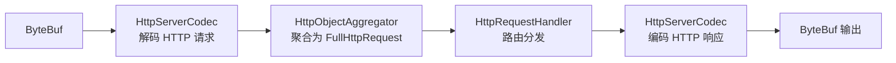

# HTTP 服务器

使用 Netty 搭建一个 HTTP 服务器，支持路由处理和静态资源。

## 核心组件

- `HttpServerCodec` — HTTP 协议的编解码
- `HttpObjectAggregator` — 聚合 HTTP 消息为完整的 FullHttpRequest
- `HttpServerExpectContinueHandler` — 处理 100-continue
- 自定义 Router — 简化路由分发

## HTTP Server 实现

```java
public class HttpServer {
    private final int port;

    public HttpServer(int port) {
        this.port = port;
    }

    public void start() throws Exception {
        EventLoopGroup bossGroup = new NioEventLoopGroup(1);
        EventLoopGroup workerGroup = new NioEventLoopGroup();

        try {
            ServerBootstrap bootstrap = new ServerBootstrap();
            bootstrap.group(bossGroup, workerGroup)
                     .channel(NioServerSocketChannel.class)
                     .childHandler(new ChannelInitializer<SocketChannel>() {
                         @Override
                         protected void initChannel(SocketChannel ch) {
                             ch.pipeline()
                                 .addLast(new HttpServerCodec())                    // 1. HTTP 编解码
                                 .addLast(new HttpObjectAggregator(65536))         // 2. 聚合(最大64KB)
                                 .addLast(new HttpServerExpectContinueHandler())   // 3. 处理 100-continue
                                 .addLast(new HttpRequestHandler());               // 4. 业务路由
                         }
                     });

            ChannelFuture future = bootstrap.bind(port).sync();
            System.out.println("HTTP 服务器启动: http://localhost:" + port);
            future.channel().closeFuture().sync();
        } finally {
            bossGroup.shutdownGracefully();
            workerGroup.shutdownGracefully();
        }
    }

    public static void main(String[] args) throws Exception {
        new HttpServer(8080).start();
    }
}
```

## 核心 Handler：路由处理

```java
public class HttpRequestHandler extends SimpleChannelInboundHandler<FullHttpRequest> {

    @Override
    protected void channelRead0(ChannelHandlerContext ctx, FullHttpRequest request) {
        String uri = request.uri();
        HttpMethod method = request.method();
        QueryStringDecoder decoder = new QueryStringDecoder(uri);

        String path = decoder.path();
        Map<String, List<String>> params = decoder.parameters();

        String responseBody;
        HttpResponseStatus status = HttpResponseStatus.OK;

        try {
            responseBody = route(method, path, params);
            if (responseBody == null) {
                responseBody = "{\"error\": \"Not Found\"}";
                status = HttpResponseStatus.NOT_FOUND;
            }
        } catch (Exception e) {
            responseBody = "{\"error\": \"" + e.getMessage() + "\"}";
            status = HttpResponseStatus.INTERNAL_SERVER_ERROR;
        }

        writeResponse(ctx, request, status, responseBody);
    }

    // === 路由表 ===
    private String route(HttpMethod method, String path,
                         Map<String, List<String>> params) {
        switch (path) {
            case "/":
                return "<h1>Netty HTTP Server</h1>" +
                       "<p>API 接口：</p>" +
                       "<ul>" +
                       "<li>GET /api/hello?name=xxx</li>" +
                       "<li>GET /api/time</li>" +
                       "<li>POST /api/echo</li>" +
                       "</ul>";

            case "/api/hello":
                String name = params.getOrDefault("name", List.of("World")).get(0);
                return "{\"message\": \"Hello, " + name + "!\"}";

            case "/api/time":
                return "{\"time\": \"" + LocalDateTime.now().format(
                    DateTimeFormatter.ISO_LOCAL_DATE_TIME) + "\"}";

            case "/api/echo":
                if (method == HttpMethod.POST) {
                    return "{\"status\": \"ok\"}";
                }
                return null;

            default:
                return null;
        }
    }

    // === 写响应 ===
    private void writeResponse(ChannelHandlerContext ctx, FullHttpRequest request,
                                HttpResponseStatus status, String body) {
        byte[] bytes = body.getBytes(StandardCharsets.UTF_8);
        FullHttpResponse response = new DefaultFullHttpResponse(
            HttpVersion.HTTP_1_1,
            status,
            Unpooled.copiedBuffer(bytes)
        );

        response.headers()
            .set(HttpHeaderNames.CONTENT_TYPE, 
                 body.startsWith("<") ? "text/html; charset=UTF-8"
                                      : "application/json; charset=UTF-8")
            .set(HttpHeaderNames.CONTENT_LENGTH, bytes.length);
        
        // 处理 Keep-Alive
        if (HttpUtil.isKeepAlive(request)) {
            response.headers().set(HttpHeaderNames.CONNECTION, HttpHeaderValues.KEEP_ALIVE);
        }

        ctx.writeAndFlush(response).addListener(ChannelFutureListener.CLOSE);
    }

    @Override
    public void exceptionCaught(ChannelHandlerContext ctx, Throwable cause) {
        cause.printStackTrace();
        ctx.close();
    }
}
```

## Pipeline 处理流程



## 测试

```bash
# 启动服务
HttpServer(8080).start()

# 浏览器访问：http://localhost:8080/

# 使用 curl 测试 API
curl http://localhost:8080/api/hello?name=Netty
# → {"message": "Hello, Netty!"}

curl http://localhost:8080/api/time
# → {"time": "2025-01-01T12:00:00"}

curl -X POST http://localhost:8080/api/echo
# → {"status": "ok"}
```

## Pipeline 组件详解

| 组件 | 必需? | 作用 |
|------|-------|------|
| `HttpServerCodec` | ✅ | HTTP 协议编解码 |
| `HttpObjectAggregator` | ✅ | 聚合分块的 HTTP 消息 |
| `ChunkedWriteHandler` | 可选 | 支持大文件分块传输 |
| `HttpContentCompressor` | 可选 | Gzip 压缩响应 |
| `WebSocketServerProtocolHandler` | 可选 | WebSocket 升级 |

::: tip
生产级 HTTP 服务器建议使用 Netty 的 `HttpServerCodec` + Spring WebFlux 的组合。
:::
